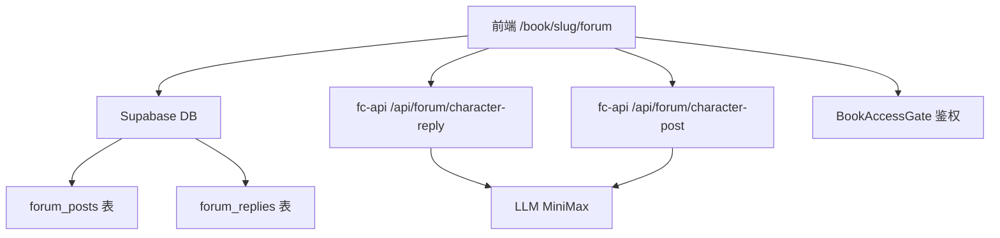

# 设计文档：书中角色论坛

## 概述

在每本书的页面下新增一个「论坛」tab，使用 Supabase 存储帖子和回复数据，fc-api 负责调用 LLM 以角色身份生成回复/发帖内容，前端复用现有的 BookAccessGate 鉴权体系。

---

## 架构



**数据流：**
1. 用户发帖/回复 → 直接写入 Supabase（前端调 Supabase SDK）
2. 角色回复/发帖 → 前端调 fc-api → fc-api 调 LLM → 写入 Supabase（server-side）
3. 帖子列表/详情 → 前端直接读 Supabase（实时订阅）

---

## 组件与接口

### 前端组件树

```
/book/[slug]/forum.tsx          页面入口
  └── BookAccessGate             鉴权包裹
      └── BookForum              论坛主体
          ├── ForumHeader        标题 + 「角色发帖」按钮
          ├── PostList           帖子列表
          │   └── PostCard       单条帖子预览
          └── PostDetail（弹层）  帖子详情 + 回复
              ├── ReplyList      回复列表
              │   └── ReplyItem  单条回复
              ├── ReplyInput     回复输入框（登录后可用）
              └── TypingIndicator  「角色输入中…」动画
```

### fc-api 新增接口

#### `POST /api/forum/character-reply`
触发某角色对帖子/回复作出 AI 回复，写入 Supabase。

请求体：
```json
{
  "bookSlug": "dao-gui-yi-xian",
  "postId": "uuid",
  "triggerContent": "用户刚刚说的话",
  "characterId": "li-huowang"   // 可选，不传则随机选
}
```
返回：
```json
{ "reply": { "id": "uuid", "content": "...", "characterId": "..." } }
```

#### `POST /api/forum/character-post`
触发某角色主动发一篇帖子，写入 Supabase。

请求体：
```json
{
  "bookSlug": "dao-gui-yi-xian",
  "characterId": "li-huowang"   // 可选，不传则随机选
}
```
返回：
```json
{ "post": { "id": "uuid", "title": "...", "content": "..." } }
```

---

## 数据模型

### Supabase 表结构

```sql
-- 帖子表
create table forum_posts (
  id           uuid primary key default gen_random_uuid(),
  book_slug    text not null,
  author_type  text not null check (author_type in ('user', 'character')),
  author_id    text not null,       -- user: uid, character: characterId
  author_name  text not null,
  author_avatar text,
  title        text not null,
  content      text not null,
  reply_count  int default 0,
  created_at   timestamptz default now(),
  last_reply_at timestamptz default now()
);

-- 回复表
create table forum_replies (
  id           uuid primary key default gen_random_uuid(),
  post_id      uuid references forum_posts(id) on delete cascade,
  book_slug    text not null,
  author_type  text not null check (author_type in ('user', 'character')),
  author_id    text not null,
  author_name  text not null,
  author_avatar text,
  content      text not null,
  created_at   timestamptz default now()
);
```

### TypeScript 类型

```ts
export interface ForumPost {
  id: string;
  bookSlug: string;
  authorType: 'user' | 'character';
  authorId: string;
  authorName: string;
  authorAvatar?: string;
  title: string;
  content: string;
  replyCount: number;
  createdAt: string;
  lastReplyAt: string;
}

export interface ForumReply {
  id: string;
  postId: string;
  bookSlug: string;
  authorType: 'user' | 'character';
  authorId: string;
  authorName: string;
  authorAvatar?: string;
  content: string;
  createdAt: string;
}
```

---

## 正确性属性

*属性是系统在所有有效执行中应保持为真的特征——对系统应做什么的形式化描述。*

**验收标准测试预分析：**

- 1.1 帖子列表倒序排列 → 可测：*对任意帖子列表，lastReplyAt 越新的排越前*
- 3.2 标题/正文为空阻止提交 → 可测：空字符串/纯空白字符串均应被拒绝
- 5.1 随机选择角色 → 可测：选出的角色 id 必须在该书角色列表中
- 5.4 LLM 失败静默 → 可测：调用报错时用户侧无错误弹出

**属性一：帖子排序不变性**
*对任意书的帖子列表，列表中相邻两条记录满足 posts[i].lastReplyAt >= posts[i+1].lastReplyAt*
**验证需求：1.1**

**属性二：空内容拒绝**
*对任意由纯空白字符组成的标题或正文，提交操作应返回验证错误，帖子数量不变*
**验证需求：3.2, 4.2**

**属性三：角色合法性**
*对任意触发角色回复的操作，选出的 characterId 必须存在于该 bookSlug 的角色配置文件中*
**验证需求：5.1**

---

## 错误处理

| 场景 | 处理方式 |
|------|---------|
| Supabase 写入失败 | toast 提示用户，不清空输入框 |
| LLM 角色回复失败 | 静默失败，不显示错误 |
| 未登录发帖 | 显示登录引导，不提交 |
| 网络超时（角色回复） | 超时后取消 typing indicator |

---

## 测试策略

- **单元测试**（TestAgent）：`forumLib.ts` 的帖子排序、空内容校验函数
- **属性测试**：用随机数据验证排序不变性
- **集成测试**：模拟发帖→触发角色回复的完整链路

