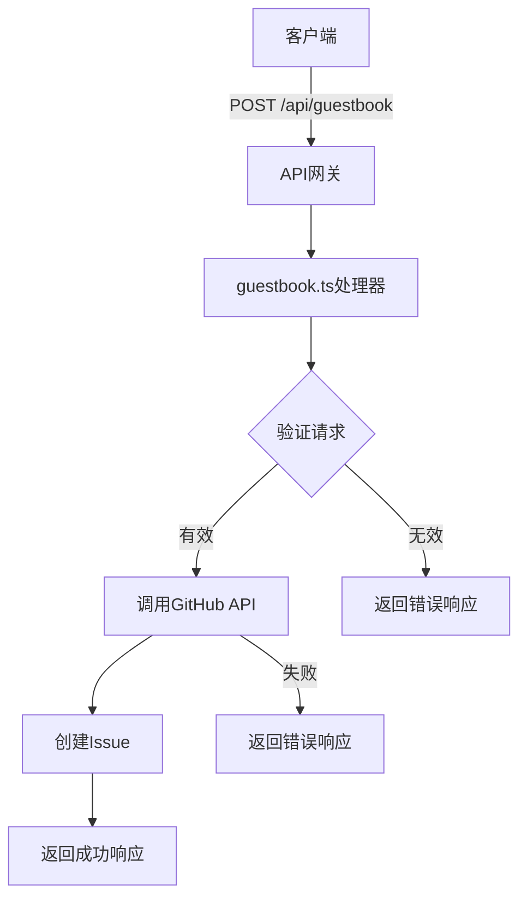
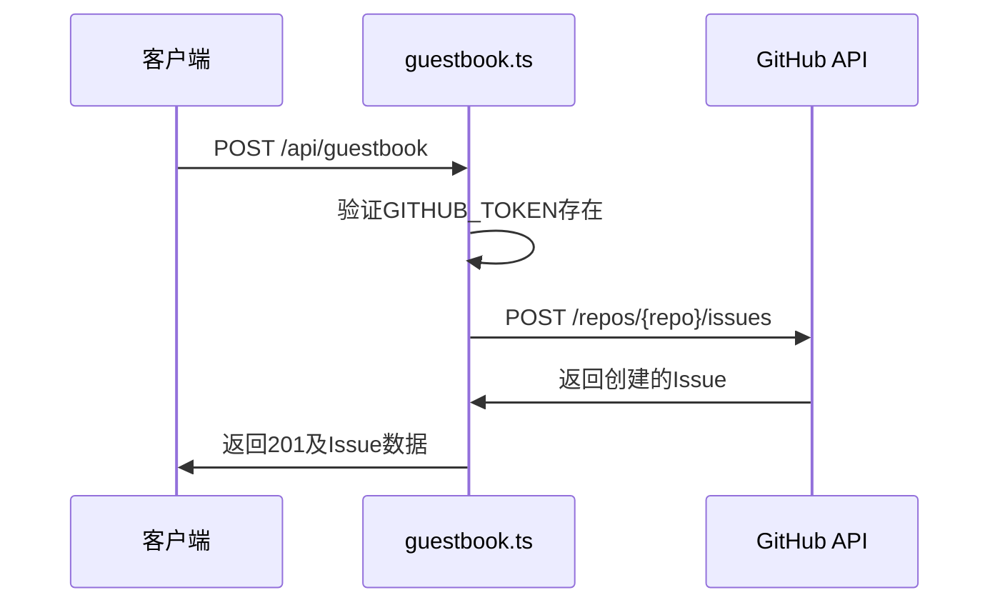
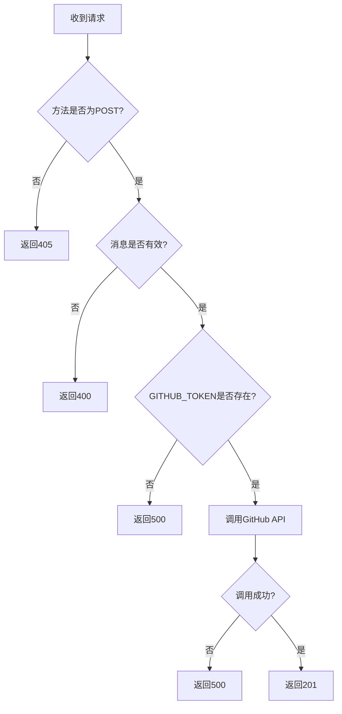

# API接口

<cite>
**Referenced Files in This Document**   
- [guestbook.ts](file://src/pages/api/guestbook.ts)
- [guestbook.ts](file://src/types/guestbook.ts)
- [GuestbookPage/index.tsx](file://src/components/GuestbookPage/index.tsx)
- [index.tsx](file://src/pages/guestbook/index.tsx)
- [Comments/index.tsx](file://src/components/Comments/index.tsx)
</cite>

## 目录
1. [简介](#简介)
2. [API端点](#api端点)
3. [请求与响应格式](#请求与响应格式)
4. [身份验证机制](#身份验证机制)
5. [错误处理](#错误处理)
6. [速率限制](#速率限制)
7. [前端交互](#前端交互)
8. [数据持久化](#数据持久化)
9. [API调用示例](#api调用示例)

## 简介
本API接口文档详细描述了my-blog项目中用于处理访客留言的API端点。该API允许用户提交新留言，并通过GitHub Issues API将留言数据持久化存储。API设计遵循RESTful原则，提供清晰的请求响应机制和错误处理。

**Section sources**
- [guestbook.ts](file://src/pages/api/guestbook.ts#L1-L54)

## API端点
该API提供单一端点用于处理访客留言操作：

- **端点路径**: `/api/guestbook`
- **支持的HTTP方法**: 
  - `POST`: 创建新留言
- **功能描述**: 该端点专门用于接收和处理用户提交的留言数据，通过GitHub API将留言作为Issue创建。



**Diagram sources**
- [guestbook.ts](file://src/pages/api/guestbook.ts#L1-L54)

**Section sources**
- [guestbook.ts](file://src/pages/api/guestbook.ts#L1-L54)

## 请求与响应格式
### 请求格式
- **HTTP方法**: POST
- **Content-Type**: application/json
- **请求体**: 包含留言内容的JSON对象

```json
{
  "message": "这是一条测试留言"
}
```

### 响应格式
#### 成功响应 (201 Created)
```json
{
  "message": "留言成功！",
  "issue": {
    "id": 123456789,
    "html_url": "https://github.com/woshidashuaibi-lsj/lusuijie-blog/issues/1",
    "title": "来自留言板的新留言",
    "user": {
      "login": "username",
      "avatar_url": "https://avatars.githubusercontent.com/u/123456?v=4",
      "html_url": "https://github.com/username"
    },
    "created_at": "2024-01-01T00:00:00Z",
    "body": "这是一条测试留言",
    "comments": 0
  }
}
```

#### 错误响应
```json
{
  "message": "错误描述信息"
}
```

**Section sources**
- [guestbook.ts](file://src/pages/api/guestbook.ts#L1-L54)
- [guestbook.ts](file://src/types/guestbook.ts#L1-L13)

## 身份验证机制
该API使用GitHub Token进行身份验证，确保只有授权的应用能够创建Issue。

- **认证方式**: Bearer Token
- **Token来源**: 通过环境变量`GITHUB_TOKEN`配置
- **验证流程**:
  1. API处理器检查环境变量中是否存在`GITHUB_TOKEN`
  2. 如果Token不存在，返回500错误
  3. 如果Token存在，在请求GitHub API时将其包含在Authorization头中



**Diagram sources**
- [guestbook.ts](file://src/pages/api/guestbook.ts#L1-L54)

**Section sources**
- [guestbook.ts](file://src/pages/api/guestbook.ts#L1-L54)

## 错误处理
API实现了全面的错误处理机制，针对不同场景返回相应的HTTP状态码和错误信息。

| HTTP状态码 | 错误类型 | 响应消息 | 触发条件 |
|-----------|---------|---------|---------|
| 400 | 客户端错误 | "留言内容不能为空" | 留言内容为空、非字符串或仅包含空白字符 |
| 405 | 方法不允许 | "Method Not Allowed" | 使用非POST方法访问端点 |
| 500 | 服务器错误 | "GitHub Token 未配置" | 环境变量中缺少GITHUB_TOKEN |
| 500 | 服务器错误 | "提交到 GitHub 失败" | GitHub API调用失败 |
| 500 | 服务器错误 | "服务器内部错误" | 网络请求异常或其他未预期错误 |



**Diagram sources**
- [guestbook.ts](file://src/pages/api/guestbook.ts#L1-L54)

**Section sources**
- [guestbook.ts](file://src/pages/api/guestbook.ts#L1-L54)

## 速率限制
当前API实现中未显式实现速率限制策略。速率限制主要依赖于GitHub API的默认限制：

- GitHub API对未认证请求有较低的速率限制
- 使用个人访问令牌（PAT）认证的请求享有更高的速率限制（通常为每小时5000次请求）
- 当达到速率限制时，GitHub API会返回403状态码，本API会将其转换为"提交到 GitHub 失败"的错误响应

**Section sources**
- [guestbook.ts](file://src/pages/api/guestbook.ts#L1-L54)

## 前端交互
该API与前端的GuestbookPage组件进行交互，实现完整的留言功能。

### 组件关系
- **GuestbookPage组件**: 主要的留言板UI组件，包含留言说明和Giscus评论系统
- **API端点**: 处理留言提交的后端逻辑

### 交互流程
1. 用户在前端界面填写留言内容
2. 前端通过fetch API向`/api/guestbook`端点发送POST请求
3. API处理请求并返回结果
4. 前端根据响应结果显示成功或错误消息

```mermaid
graph TB
A[GuestbookPage] --> |显示UI| B[用户界面]
B --> |提交留言| C[/api/guestbook]
C --> |返回结果| A
C --> |调用| D[GitHub API]
D --> |返回Issue| C
```

**Diagram sources**
- [guestbook.ts](file://src/pages/api/guestbook.ts#L1-L54)
- [GuestbookPage/index.tsx](file://src/components/GuestbookPage/index.tsx#L1-L68)

**Section sources**
- [guestbook.ts](file://src/pages/api/guestbook.ts#L1-L54)
- [GuestbookPage/index.tsx](file://src/components/GuestbookPage/index.tsx#L1-L68)

## 数据持久化
留言数据通过GitHub Issues API进行持久化存储，利用GitHub作为后端数据库。

### 存储机制
- **存储位置**: GitHub仓库 `woshidashuaibi-lsj/lusuijie-blog`
- **存储形式**: 作为Issue存储，每个留言对应一个Issue
- **元数据**: 
  - 标题: "来自留言板的新留言"
  - 标签: "guestbook"
  - 内容: 用户提交的留言内容

### 优势
- 无需维护独立的数据库
- 自动获得GitHub的高可用性和备份机制
- 可以利用GitHub的Issue管理功能进行留言审核和管理

**Section sources**
- [guestbook.ts](file://src/pages/api/guestbook.ts#L1-L54)

## API调用示例
以下示例展示了如何使用curl命令直接调用该API：

### 成功提交留言
```bash
curl -X POST https://your-blog.com/api/guestbook \
  -H "Content-Type: application/json" \
  -d '{"message": "这是一条测试留言，支持Markdown语法和Emoji! 🎉"}'
```

### 预期成功响应
```json
{
  "message": "留言成功！",
  "issue": {
    "id": 123456789,
    "html_url": "https://github.com/woshidashuaibi-lsj/lusuijie-blog/issues/1",
    "title": "来自留言板的新留言",
    "body": "这是一条测试留言，支持Markdown语法和Emoji! 🎉",
    "created_at": "2024-01-01T00:00:00Z"
  }
}
```

### 错误请求示例
```bash
# 提交空留言
curl -X POST https://your-blog.com/api/guestbook \
  -H "Content-Type: application/json" \
  -d '{"message": ""}'
```

**Section sources**
- [guestbook.ts](file://src/pages/api/guestbook.ts#L1-L54)