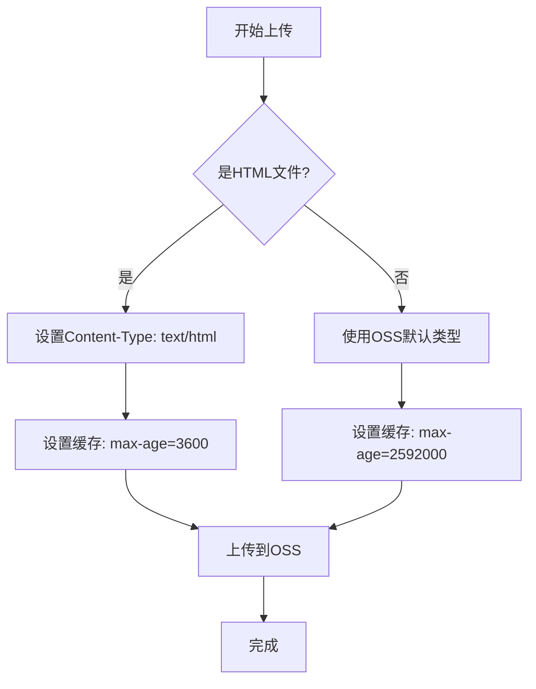

# 故障排除

<cite>
**本文档引用的文件**  
- [next.config.js](file://next.config.js)
- [upload-oss.js](file://scripts/upload-oss.js)
- [blog.ts](file://src/lib/blog.ts)
- [\[slug\].tsx](file://src/pages/blog/[slug].tsx)
- [index.tsx](file://src/pages/blog/index.tsx)
- [index.module.css](file://src/components/BlogItem/index.module.css)
- [_app.tsx](file://src/pages/_app.tsx)
- [README.md](file://README.md)
</cite>

## 目录
1. [开发阶段问题](#开发阶段问题)  
2. [部署阶段问题](#部署阶段问题)

## 开发阶段问题

### 页面样式不生效

**问题描述**：  
在开发过程中，CSS Modules 样式未正确应用到组件，导致页面显示异常。

**诊断步骤**：
1. 检查组件是否正确导入了 CSS Module 文件，例如：
   ```ts
   import styles from './BlogItem.module.css';
   ```
2. 确认类名是否通过 `styles` 对象正确引用，例如：
   ```tsx
   <div className={styles.blogItem}>...</div>
   ```
3. 检查文件命名是否符合 `*.module.css` 规范。
4. 查看浏览器开发者工具中的元素面板，确认类名是否生成，以及是否有 CSS 错误。

**修复方案**：
- 确保所有样式文件使用 `*.module.css` 后缀。
- 确保在 JSX 中通过 `styles.className` 的方式使用类名。
- 清除 Next.js 缓存（删除 `.next` 目录）并重启开发服务器。

**Section sources**  
- [index.module.css](file://src/components/BlogItem/index.module.css#L1-L57)
- [_app.tsx](file://src/pages/_app.tsx#L1-L21)

### 新增博客文章未显示

**问题描述**：  
在 `posts/` 目录下新增了 Markdown 文件，但博客列表或详情页未显示该文章。

**诊断步骤**：
1. 确认文章文件位于正确的分类目录下（如 `posts/tech/` 或 `posts/life/`）。
2. 检查文件扩展名是否为 `.md`。
3. 验证文件的 Front Matter 是否包含必要字段（如 `title`, `date`）。
4. 检查 `getStaticPaths` 是否重新生成路径。

**根本原因**：  
`getStaticPaths` 在构建时读取所有文章生成静态路径。若未重新构建，新文章不会被包含。

**修复方案**：
- 运行 `npm run dev` 重启开发服务器，触发重新构建。
- 或手动执行 `npm run build` 以确保路径重新生成。

**Section sources**  
- [blog.ts](file://src/lib/blog.ts#L10-L39)
- [\slug\].tsx](file://src/pages/blog/[slug].tsx#L32-L42)

### 环境变量未加载

**问题描述**：  
在代码中使用 `process.env` 读取环境变量时返回 `undefined`。

**诊断步骤**：
1. 检查环境变量文件名是否正确：
   - 本地开发：必须为 `.env.local`
   - 生产环境：必须为 `.env.production`
2. 确认变量名是否以 `NEXT_PUBLIC_` 开头（前端可访问的变量）。
3. 检查 `.env.local` 文件是否存在且格式正确（`KEY=VALUE`）。

**修复方案**：
- 将本地环境变量文件重命名为 `.env.local`。
- 确保敏感变量（如密钥）不以 `NEXT_PUBLIC_` 开头，仅在服务端使用。
- 重启开发服务器以重新加载环境变量。

**Section sources**  
- [README.md](file://README.md#L150-L170)

## 部署阶段问题

### 部署后访问404

**问题描述**：  
部署到阿里云 OSS 后，访问域名返回 404 错误。

**诊断步骤**：
1. 登录阿里云 OSS 控制台，进入对应 Bucket。
2. 检查“静态网站托管”是否已开启。
3. 确认“默认首页”是否设置为 `index.html`。
4. 检查 `out/` 目录中是否存在 `index.html` 文件。

**修复方案**：
- 在 OSS 控制台启用“静态网站托管”。
- 设置“默认首页”为 `index.html`。
- 确保构建命令 `npm run export` 正确生成 `out/index.html`。

**Section sources**  
- [next.config.js](file://next.config.js#L1-L14)
- [README.md](file://README.md#L250-L260)

### 自定义域名无法访问

**问题描述**：  
配置了自定义域名，但无法通过域名访问网站。

**诊断步骤**：
1. 检查 DNS 解析记录：
   - 类型：CNAME
   - 值：OSS 提供的外网访问域名（如 `xxx.oss-cn-beijing.aliyuncs.com`）
2. 验证域名是否已完成 ICP 备案（中国大陆地区必需）。
3. 检查 OSS 中是否已绑定自定义域名。
4. 使用 `ping` 或 `nslookup` 命令测试域名解析是否生效。

**修复方案**：
- 在 DNS 服务商处添加正确的 CNAME 记录。
- 确认备案状态，未备案需暂停使用国内服务器。
- 在 OSS 控制台完成域名绑定。

**Section sources**  
- [README.md](file://README.md#L260-L270)

### 静态资源（CSS/JS/图片）加载失败

**问题描述**：  
部署后，CSS、JS 或图片资源返回 404 或 MIME 类型错误。

**诊断步骤**：
1. 打开浏览器开发者工具，查看网络请求状态和响应头。
2. 检查资源文件是否存在于 `out/` 目录并已上传。
3. 验证 `upload-oss.js` 脚本是否为文件设置了正确的 `Content-Type`。

**根本原因**：  
OSS 需要正确的 `Content-Type` 才能正确解析文件类型。例如，CSS 文件应为 `text/css`。

**修复方案**：
- 确保 `scripts/upload-oss.js` 中根据文件扩展名设置 `Content-Type`。
- 当前脚本已为 HTML 文件设置 `text/html; charset=utf-8`，其他文件依赖 OSS 自动识别。
- 如需增强，可扩展 `uploadFile` 函数以支持更多 MIME 类型映射。



**Diagram sources**  
- [upload-oss.js](file://scripts/upload-oss.js#L15-L35)

**Section sources**  
- [upload-oss.js](file://scripts/upload-oss.js#L1-L85)
- [README.md](file://README.md#L230-L250)