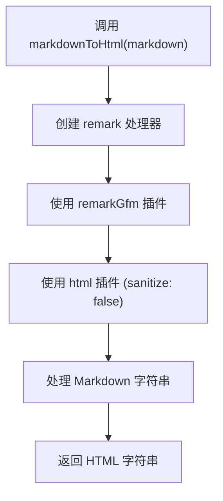
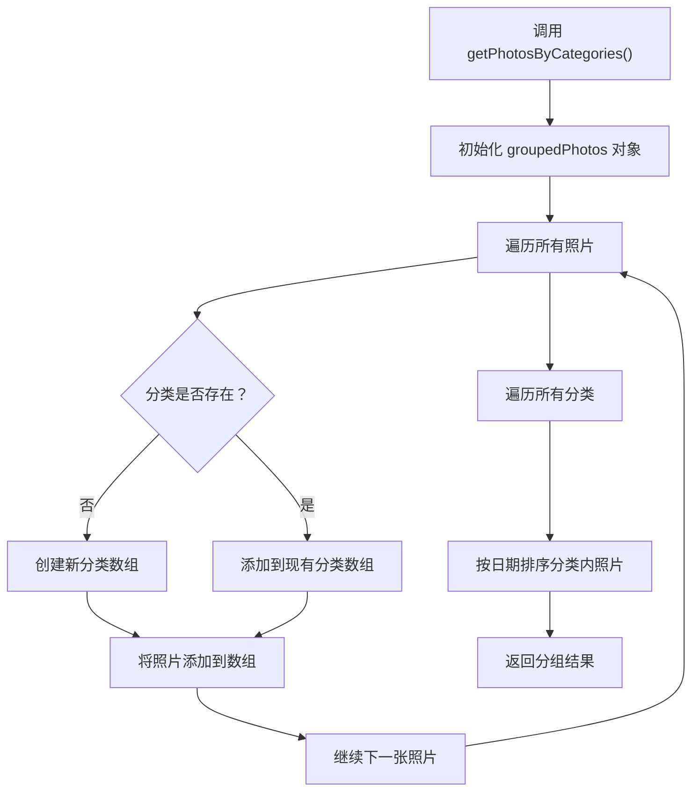
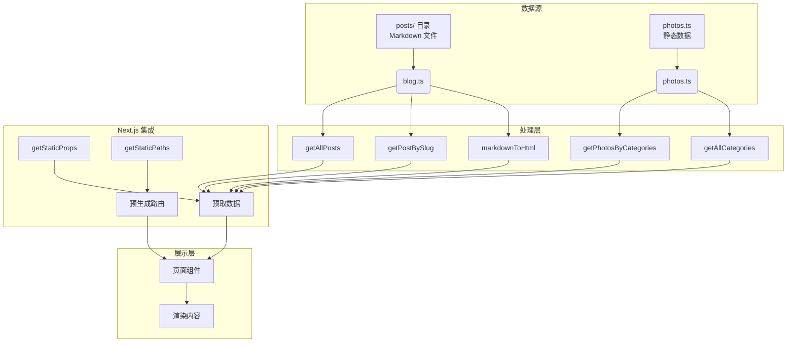

# 内容获取与处理流程

<cite>
**Referenced Files in This Document**   
- [blog.ts](file://src/lib/blog.ts)
- [photos.ts](file://src/lib/photos.ts)
- [blog/index.tsx](file://src/pages/blog/index.tsx)
- [photo/index.tsx](file://src/pages/photo/index.tsx)
- [blog/[slug].tsx](file://src/pages/blog/[slug].tsx)
</cite>

## 目录
1. [简介](#简介)
2. [博客内容处理机制](#博客内容处理机制)
3. [摄影作品数据管理](#摄影作品数据管理)
4. [数据处理与Next.js集成](#数据处理与nextjs集成)
5. [核心处理流程图](#核心处理流程图)
6. [结论](#结论)

## 简介
本文档全面解析my-blog项目的内容处理机制，重点阐述博客文章和摄影作品两类内容的数据获取、解析和渲染流程。文档详细说明了系统如何利用文件系统操作、Markdown解析和静态生成技术，在构建时预取和处理数据，为用户提供高效的内容展示体验。

## 博客内容处理机制

### 文件扫描与读取
`getAllPosts`函数是博客内容处理的核心入口。该函数通过`fs`模块递归扫描`posts/`目录下的所有Markdown文件。首先，函数检查`posts`目录是否存在，然后遍历目录下的所有子目录（代表文章分类），对每个分类目录中的`.md`文件进行处理。通过`fs.readdirSync`同步读取文件列表，并使用`path.join`构建完整的文件路径。

**Section sources**
- [blog.ts](file://src/lib/blog.ts#L10-L39)

### 元数据解析
`getPostBySlug`函数负责解析单个Markdown文件的内容。该函数利用`gray-matter`库解析Markdown文件的front matter部分，提取标题、日期、分类、标签等元数据。同时，函数读取文件内容体，并计算文章的阅读时间（基于每分钟200字的简单估算）。函数支持在指定分类中查找文章，也支持在所有分类中搜索特定slug的文章。

**Section sources**
- [blog.ts](file://src/lib/blog.ts#L41-L96)

### Markdown转HTML
`markdownToHtml`函数将Markdown内容转换为安全的HTML字符串。该函数使用`remark`和`remark-html`库进行转换，同时通过`remark-gfm`插件支持GitHub风格的Markdown语法（如表格、删除线等）。转换后的HTML字符串可用于在页面上直接渲染，确保内容格式的正确显示。

**Diagram sources**
- [blog.ts](file://src/lib/blog.ts#L98-L105)

## 摄影作品数据管理

### 数据组织
`photos.ts`模块定义了静态的摄影作品数据数组，每张照片包含ID、图片URL、分类、标题、描述、拍摄日期等属性。数据按分类组织，如"公园·春"、"庭园·夏"等，便于后续的分类展示。

### 分类管理
`getPhotosByCategories`函数将所有照片按分类分组，返回一个以分类名为键的对象。函数遍历照片数组，将每张照片添加到对应分类的数组中。分组完成后，函数对每个分类内的照片按日期进行降序排序，确保最新的照片排在前面。

`getAllCategories`函数统计所有照片分类及其数量。函数使用`Map`数据结构记录每个分类的照片数量，然后转换为包含分类名称和计数的对象数组，用于在页面上显示分类导航。

**Diagram sources**
- [photos.ts](file://src/lib/photos.ts#L89-L107)

**Section sources**
- [photos.ts](file://src/lib/photos.ts#L89-L107)
- [photos.ts](file://src/lib/photos.ts#L110-L127)

## 数据处理与Next.js集成

### 静态生成配置
系统通过Next.js的`getStaticProps`功能在构建时预取和处理数据。对于博客列表页面，`getStaticProps`调用`getAllPosts`函数获取所有文章数据，并将其作为props传递给页面组件。对于单篇文章页面，`getStaticProps`调用`getPostBySlug`获取特定文章，并使用`markdownToHtml`将Markdown内容转换为HTML。

### 路由预生成
`getStaticPaths`函数用于预生成动态路由。该函数调用`getAllPosts`获取所有文章，然后为每篇文章生成对应的路径参数（slug），确保所有文章页面在构建时都被生成，提高访问性能。

**Section sources**
- [blog/index.tsx](file://src/pages/blog/index.tsx#L20-L30)
- [photo/index.tsx](file://src/pages/photo/index.tsx#L20-L30)
- [blog/[slug].tsx](file://src/pages/blog/[slug].tsx#L40-L63)

## 核心处理流程图

**Diagram sources**
- [blog.ts](file://src/lib/blog.ts)
- [photos.ts](file://src/lib/photos.ts)
- [blog/index.tsx](file://src/pages/blog/index.tsx)
- [photo/index.tsx](file://src/pages/photo/index.tsx)
- [blog/[slug].tsx](file://src/pages/blog/[slug].tsx)

## 结论
my-blog项目通过精心设计的内容处理机制，实现了高效的内容管理和展示。系统利用Node.js的文件系统操作能力，结合Markdown解析库和Next.js的静态生成特性，在构建时完成数据的获取、处理和预生成，确保了最终用户能够获得快速、流畅的浏览体验。这种架构不仅提高了性能，还增强了内容的可维护性和扩展性。