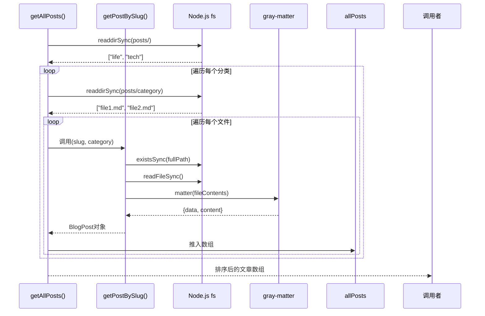
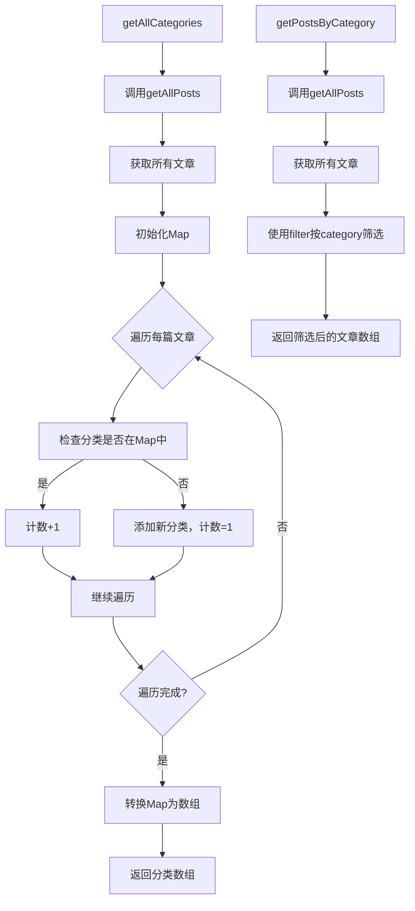

# 博客内容处理流程

<cite>
**Referenced Files in This Document**   
- [blog.ts](file://src/lib/blog.ts)
- [my-journey.md](file://posts/life/my-journey.md)
- [nextjs-blog.md](file://posts/tech/nextjs-blog.md)
- [index.tsx](file://src/pages/blog/index.tsx)
- [[slug].tsx](file://src/pages/blog/[slug].tsx)
- [blog.ts](file://src/types/blog.ts)
</cite>

## 目录
1. [简介](#简介)
2. [核心处理流程](#核心处理流程)
3. [文件遍历与元数据提取](#文件遍历与元数据提取)
4. [Markdown解析与HTML转换](#markdown解析与html转换)
5. [分类与过滤机制](#分类与过滤机制)
6. [Next.js静态生成集成](#nextjs静态生成集成)
7. [数据流与性能分析](#数据流与性能分析)
8. [结论](#结论)

## 简介
本文档深入解析`src/lib/blog.ts`模块中的博客内容处理机制。该模块构成了博客系统的核心数据处理层，负责从文件系统读取Markdown格式的博客文章，提取元数据，转换内容，并为前端页面提供结构化数据。系统通过递归遍历`posts/`目录下的分类文件夹，利用`gray-matter`解析front matter，使用`remark`和`remark-gfm`将Markdown转换为支持GFM语法的HTML，并通过Next.js的静态生成功能在构建时预渲染页面，确保了站点的高性能与SEO友好性。

## 核心处理流程
博客内容处理流程始于`getAllPosts`函数，该函数作为数据聚合的入口点，协调整个内容处理管道。流程从遍历`posts/`目录开始，识别`life`和`tech`等分类子目录，然后递归读取其中的所有`.md`文件。对于每个Markdown文件，系统调用`getPostBySlug`函数提取其元数据和原始内容。提取的数据经过处理后，由`markdownToHtml`函数转换为HTML格式，最终通过`getAllCategories`和`getPostsByCategory`等辅助函数组织成可供前端组件使用的结构化数据。

**Section sources**
- [blog.ts](file://src/lib/blog.ts#L10-L39)

## 文件遍历与元数据提取
`getAllPosts`函数负责遍历`posts/`目录下的所有分类和文章文件。它首先检查目录是否存在，然后同步读取所有子目录（即分类）。对于每个分类目录，它会读取其中的所有文件，并筛选出以`.md`结尾的Markdown文件。通过`fileName.replace(/\.md$/, "")`提取文件名作为文章的`slug`，并调用`getPostBySlug`函数获取文章的完整信息。

`getPostBySlug`函数是元数据提取的核心。它利用`gray-matter`库解析Markdown文件头部的front matter，提取`title`、`date`、`tags`、`description`和`cover`等字段。该函数支持两种调用模式：指定分类查找和全局查找。当未指定分类时，它会自动在所有分类中搜索匹配的`slug`，实现了分类的自动推断。此外，函数还计算了基于内容长度的阅读时间（估算为每200字1分钟），并包含完善的错误处理机制，捕获文件读取或解析过程中的任何异常，记录错误日志并返回`null`以保证程序的健壮性。



**Diagram sources**
- [blog.ts](file://src/lib/blog.ts#L10-L39)
- [blog.ts](file://src/lib/blog.ts#L41-L96)

**Section sources**
- [blog.ts](file://src/lib/blog.ts#L41-L96)

## Markdown解析与HTML转换
`markdownToHtml`函数负责将Markdown原始内容转换为浏览器可渲染的HTML。该函数基于`remark`框架构建，这是一个高度可扩展的Markdown处理器。它通过`.use(remarkGfm)`插件启用了GitHub Flavored Markdown (GFM) 语法支持，包括表格、任务列表、删除线和自动链接等特性。`remark-html`插件则将处理后的Markdown AST（抽象语法树）转换为HTML字符串。函数返回一个Promise，以支持异步处理，确保了在Next.js的`getStaticProps`中可以正确使用`await`进行调用。

**Section sources**
- [blog.ts](file://src/lib/blog.ts#L98-L105)

## 分类与过滤机制
系统提供了`getAllCategories`和`getPostsByCategory`两个函数来支持分类统计和文章过滤。`getAllCategories`函数通过调用`getAllPosts`获取所有文章，然后遍历结果，使用`Map`数据结构统计每个分类的文章数量，最终返回一个包含分类名称、slug和计数的`BlogCategory`对象数组。`getPostsByCategory`函数则更为直接，它同样基于`getAllPosts`的返回结果，使用`Array.filter`方法筛选出指定分类的所有文章。这种设计避免了重复的文件系统操作，通过缓存`getAllPosts`的结果来提高性能。



**Diagram sources**
- [blog.ts](file://src/lib/blog.ts#L107-L128)

**Section sources**
- [blog.ts](file://src/lib/blog.ts#L107-L128)

## Next.js静态生成集成
博客内容处理模块与Next.js的静态生成（SSG）功能深度集成，主要通过`getStaticProps`和`getStaticPaths`函数实现。在`src/pages/blog/index.tsx`中，`getStaticProps`调用`getAllPosts`获取所有文章数据，并将其作为`props`传递给`BlogListPage`组件，用于在构建时预渲染博客列表页。

在`src/pages/blog/[slug].tsx`中，集成更为复杂。`getStaticPaths`函数调用`getAllPosts`获取所有文章的`slug`，生成所有可能的静态路径，确保每篇博客文章都能被预渲染。`getStaticProps`函数则接收`slug`参数，调用`getPostBySlug`获取文章元数据，并使用`markdownToHtml`将Markdown内容转换为HTML，最后将`post`和`htmlContent`作为`props`传递给`BlogPostPage`组件。这种模式确保了博客详情页在部署时就是完全静态的HTML文件，无需服务器端渲染，极大提升了加载速度和SEO效果。

```mermaid
graph TB
subgraph BuildTime[构建时]
A[getStaticPaths] --> B[调用getAllPosts]
B --> C[获取所有文章]
C --> D[生成所有slug路径]
D --> E[paths: [{params: {slug: 'my-journey'}}, ...]]
F[getStaticProps] --> G[接收slug参数]
G --> H[调用getPostBySlug(slug)]
H --> I[获取文章元数据]
I --> J[调用markdownToHtml(content)]
J --> K[生成HTML字符串]
K --> L[返回props: {post, htmlContent}]
end
subgraph Runtime[运行时]
M[用户访问 /blog/my-journey]
M --> N[服务器返回预渲染的HTML]
N --> O[页面立即显示]
end
BuildTime --> Runtime
```

**Diagram sources**
- [index.tsx](file://src/pages/blog/index.tsx#L30-L41)
- [[slug].tsx](file://src/pages/blog/[slug].tsx#L32-L62)

**Section sources**
- [index.tsx](file://src/pages/blog/index.tsx#L30-L41)
- [[slug].tsx](file://src/pages/blog/[slug].tsx#L32-L62)

## 数据流与性能分析
数据从文件系统到前端组件的完整流动过程清晰且高效。数据流始于`posts/`目录中的Markdown文件，经由`getAllPosts`和`getPostBySlug`函数提取和结构化，再通过`markdownToHtml`转换为HTML，最终由`getStaticProps`注入到Next.js页面组件中。

潜在的性能瓶颈主要在于文件系统I/O操作。`getAllPosts`和`getPostBySlug`都使用了同步的`fs.readFileSync`，在文章数量庞大时可能导致构建时间显著增加。优化建议包括：
1.  **缓存机制**：在`getAllPosts`首次调用后缓存结果，避免在`getPostsByCategory`和`getAllCategories`中重复读取文件。
2.  **异步化**：将同步的`fs`调用替换为异步版本（如`fs.promises`），并使用`Promise.all`并行读取所有文件，可以显著缩短总I/O时间。
3.  **增量构建**：利用Next.js的增量静态再生（ISR）功能，仅在特定文章更新时重新生成相关页面，而非重建整个站点。

**Section sources**
- [blog.ts](file://src/lib/blog.ts)
- [index.tsx](file://src/pages/blog/index.tsx)
- [[slug].tsx](file://src/pages/blog/[slug].tsx)

## 结论
`src/lib/blog.ts`模块设计精良，实现了从文件系统到前端视图的完整博客内容处理管道。它通过清晰的函数职责划分（遍历、提取、转换、组织）和与Next.js SSG的无缝集成，构建了一个高性能、SEO友好的静态博客系统。其核心优势在于利用静态生成在构建时完成所有数据处理和页面渲染，确保了最终用户获得最快的加载体验。未来可通过引入异步I/O和缓存机制进一步优化构建性能，以应对更庞大的内容库。