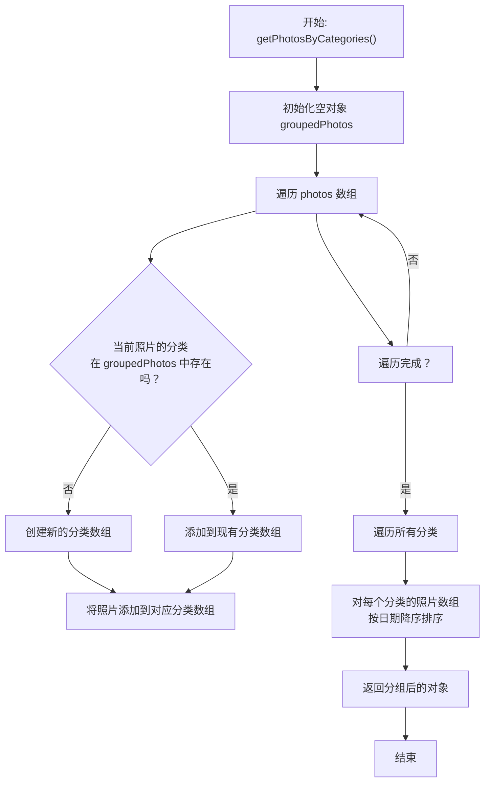
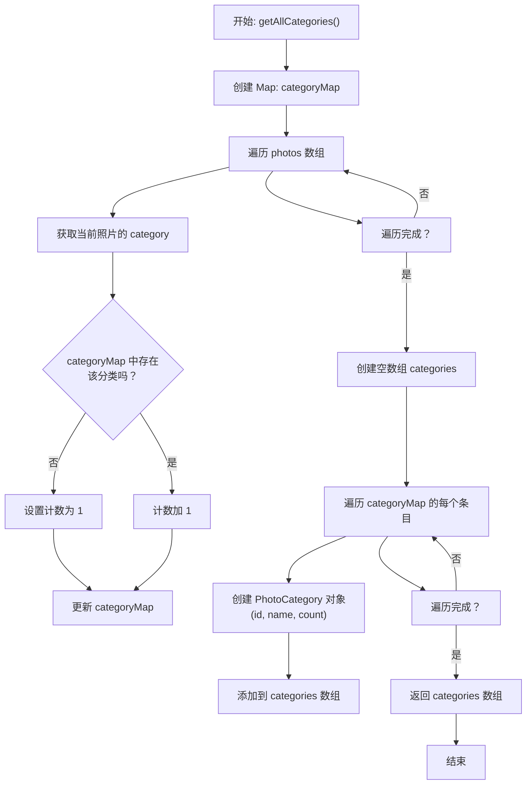
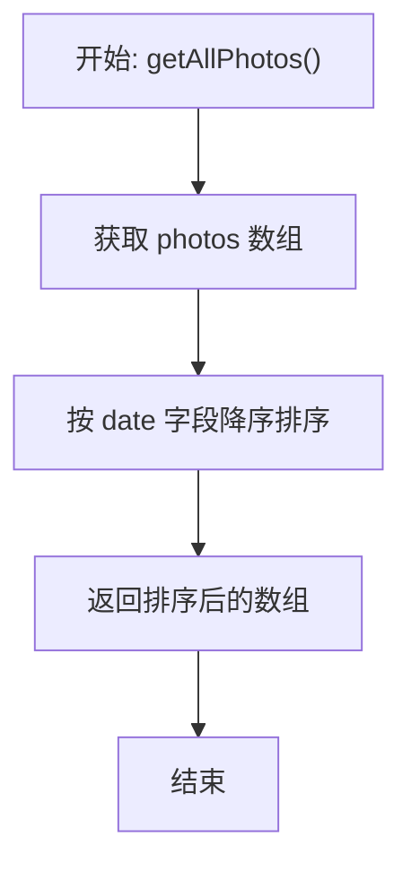
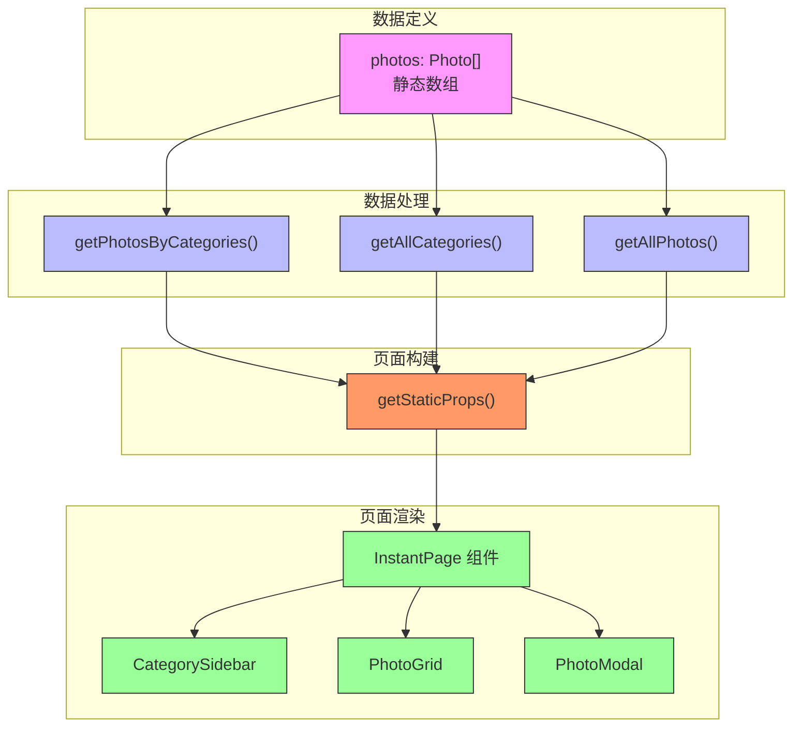

# 摄影作品数据处理流程

<cite>
**Referenced Files in This Document**   
- [photos.ts](file://src/lib/photos.ts)
- [photo.ts](file://src/types/photo.ts)
- [PhotoPage/index.tsx](file://src/pages/PhotoPage/index.tsx)
- [photo/index.tsx](file://src/pages/photo/index.tsx)
</cite>

## 目录
1. [引言](#引言)
2. [核心数据结构](#核心数据结构)
3. [静态数据存储](#静态数据存储)
4. [分类分组处理](#分类分组处理)
5. [分类统计功能](#分类统计功能)
6. [全局照片排序](#全局照片排序)
7. [页面集成与静态生成](#页面集成与静态生成)
8. [数据处理流程图](#数据处理流程图)
9. [总结与扩展性分析](#总结与扩展性分析)

## 引言

本文档全面解析`src/lib/photos.ts`模块中的摄影作品数据处理逻辑。该模块通过静态数据管理方式，实现了摄影作品的高效组织与展示。系统以静态数组形式存储所有摄影作品的元数据，并通过一系列数据处理函数，支持相册页面的分类展示、侧边栏导航和模态框图片切换等功能。这些功能在构建时被调用，实现静态生成，确保了快速加载和良好的用户体验。

## 核心数据结构

摄影作品数据处理基于两个核心类型定义：`Photo`和`PhotoCategory`。`Photo`接口定义了单张摄影作品的所有元数据，包括唯一标识、图片URL、分类、标题、描述、标签、拍摄日期、位置以及图片尺寸等信息。`PhotoCategory`接口则用于表示分类信息，包含分类ID、名称和该分类下照片数量。

**Section sources**
- [photo.ts](file://src/types/photo.ts#L1-L20)

## 静态数据存储

所有摄影作品的元数据以`photos`常量的形式，通过静态数组在`src/lib/photos.ts`文件中定义。该数组包含多张摄影作品对象，每张作品都具备完整的元数据信息。这种静态存储方式将数据直接嵌入代码中，避免了运行时的外部数据请求，提高了加载速度。

`photos`数组中的每个对象都包含`id`、`src`、`alt`、`category`、`title`、`date`、`tags`等关键字段。数据按分类逻辑组织，如"公园·春"、"庭园·夏"、"文西·秋"等，为后续的分类处理奠定了基础。

**Section sources**
- [photos.ts](file://src/lib/photos.ts#L3-L86)

## 分类分组处理

`getPhotosByCategories`函数负责将扁平的`photos`数组按`category`字段进行分组。该函数创建一个以分类名称为键的对象，遍历`photos`数组，将每张照片归入其对应的分类数组中。分组完成后，函数会对每个分类内的照片数组按拍摄日期进行降序排序，确保最新的照片排在最前面。

这一处理流程使得相册页面能够按分类展示照片，且每个分类内的照片都按时间倒序排列，符合用户浏览习惯。该函数的输出结构直接支持`PhotoGrid`组件的渲染需求。

**Diagram sources**
- [photos.ts](file://src/lib/photos.ts#L89-L107)

**Section sources**
- [photos.ts](file://src/lib/photos.ts#L89-L107)

## 分类统计功能

`getAllCategories`函数用于生成侧边栏分类导航所需的数据。该函数遍历`photos`数组，使用`Map`结构统计每个分类出现的次数。遍历完成后，将`Map`中的条目转换为`PhotoCategory`对象数组，每个对象包含分类的`id`、`name`和`count`（照片数量）字段。

此函数的输出为`CategorySidebar`组件提供了完整的分类列表和每个分类的照片数量，使用户能够清晰地了解各分类的内容规模，并方便地进行导航。

**Diagram sources**
- [photos.ts](file://src/lib/photos.ts#L110-L127)

**Section sources**
- [photos.ts](file://src/lib/photos.ts#L110-L127)

## 全局照片排序

`getAllPhotos`函数返回一个全局排序的照片列表，用于支持模态框中的图片切换功能。该函数直接对`photos`数组进行操作，按拍摄日期降序排序后返回。排序后的列表确保了在模态框中切换图片时，可以按照时间顺序进行浏览。

此函数的简洁实现体现了静态数据管理的优势，无需复杂的查询逻辑，即可快速获取排序后的全局数据集。

**Diagram sources**
- [photos.ts](file://src/lib/photos.ts#L130-L134)

**Section sources**
- [photos.ts](file://src/lib/photos.ts#L130-L134)

## 页面集成与静态生成

摄影作品数据处理函数在`src/pages/photo/index.tsx`页面中被集成。该页面使用Next.js的`getStaticProps`函数，在构建时调用`getPhotosByCategories`、`getAllCategories`和`getAllPhotos`，将处理后的数据作为`props`传递给`InstantPage`组件。

这种静态生成（Static Generation）策略确保了页面在部署时就已经包含了所有必要的数据，用户访问时无需等待数据加载，从而实现了极快的首屏加载速度和优秀的用户体验。`InstantPage`组件接收这些`props`，并将其传递给`CategorySidebar`、`PhotoGrid`和`PhotoModal`等子组件，完成整个相册页面的渲染。

**Section sources**
- [photo/index.tsx](file://src/pages/photo/index.tsx#L1-L41)
- [PhotoPage/index.tsx](file://src/pages/PhotoPage/index.tsx#L1-L84)

## 数据处理流程图

下图展示了从数据定义到页面渲染的完整数据处理流程。

**Diagram sources**
- [photos.ts](file://src/lib/photos.ts#L3-L134)
- [photo/index.tsx](file://src/pages/photo/index.tsx#L1-L41)

## 总结与扩展性分析

`src/lib/photos.ts`模块通过静态数据管理，高效地实现了摄影作品的组织与展示。其优点在于加载速度快、实现简单、可靠性高。然而，随着照片数量的增长，将所有数据硬编码在文件中会变得难以维护。

未来扩展性方面，可以考虑将数据存储迁移到外部JSON文件或数据库中，并通过构建脚本在编译时读取和处理数据。此外，可以引入更复杂的元数据和标签系统，支持多维度的分类和搜索功能，以满足更高级的用户需求。