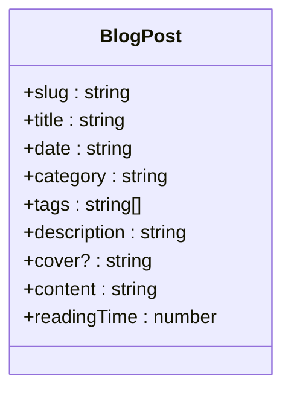
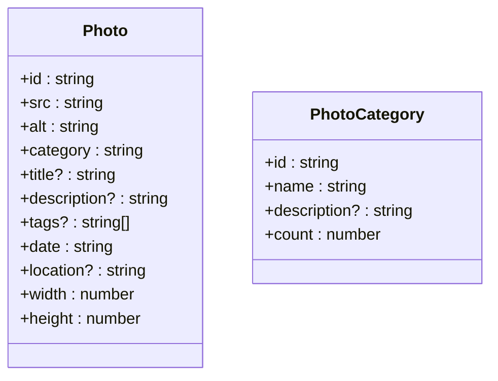
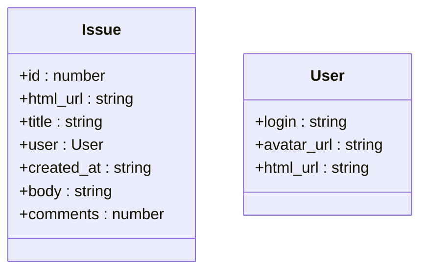

# 数据模型定义

<cite>
**本文档中引用的文件**  
- [blog.ts](file://src/types/blog.ts)
- [photo.ts](file://src/types/photo.ts)
- [guestbook.ts](file://src/types/guestbook.ts)
- [blog.ts](file://src/lib/blog.ts)
- [photos.ts](file://src/lib/photos.ts)
- [guestbook.ts](file://src/pages/api/guestbook.ts)
- [BlogPostPage/index.tsx](file://src/pages/BlogPostPage/index.tsx)
- [PhotoCard/index.tsx](file://src/pages/PhotoPage/components/PhotoCard/index.tsx)
</cite>

## 目录
1. [简介](#简介)
2. [博客文章数据模型](#博客文章数据模型)
3. [照片数据模型](#照片数据模型)
4. [留言板条目数据模型](#留言板条目数据模型)
5. [类型安全与实际应用](#类型安全与实际应用)
6. [总结](#总结)

## 简介
本项目 my-blog 使用 TypeScript 定义了清晰、结构化的数据模型，以确保前后端数据的一致性与类型安全。这些核心类型定义位于 `src/types/` 目录下，分别用于管理博客文章、摄影作品和留言板条目。通过强类型接口，开发者可以在编译阶段捕获潜在错误，提升代码可维护性和开发效率。

## 博客文章数据模型

`BlogPost` 接口是博客系统的核心数据结构，定义在 `src/types/blog.ts` 中，用于描述每篇博客文章的元信息和内容。该接口确保所有文章数据遵循统一格式，便于渲染和处理。

**图示来源**  
- [blog.ts](file://src/types/blog.ts#L0-L10)

### 字段详解
- **slug**：文章唯一标识符，通常由文件名生成，用于构建 URL 路由（如 `/blog/my-journey`）。
- **title**：文章标题，用于页面标题和列表展示。
- **date**：发布日期，格式为字符串（如 "2024-03-15"），用于排序和时间线展示。
- **category**：文章分类，用于归类和导航（如 "life" 或 "tech"）。
- **tags**：标签数组，支持多标签分类，增强内容可检索性。
- **description**：文章描述，用于 SEO 和社交分享的摘要信息。
- **cover**：封面图 URL，可选字段，用于文章预览图和 Open Graph 图像。
- **content**：原始 Markdown 内容，存储文章正文，后续通过 `remark` 转换为 HTML。
- **readingTime**：估算的阅读时间（单位：分钟），基于内容长度计算，提升用户体验。

这些字段在 `src/lib/blog.ts` 中通过读取 Markdown 文件的 front matter 和内容动态构建，并在 `BlogPostPage` 组件中被消费。

**本节来源**  
- [blog.ts](file://src/types/blog.ts#L0-L10)
- [blog.ts](file://src/lib/blog.ts#L0-L129)
- [BlogPostPage/index.tsx](file://src/pages/BlogPostPage/index.tsx#L0-L53)

## 照片数据模型

`Photo` 接口定义了摄影作品的数据结构，包含丰富的元信息，支持分类浏览和响应式展示。

**图示来源**  
- [photo.ts](file://src/types/photo.ts#L0-L12)
- [photo.ts](file://src/types/photo.ts#L14-L20)

### 字段详解
- **id**：照片唯一标识符，用于状态管理和模态框切换。
- **src**：图片源地址，支持远程或本地资源。
- **alt**：替代文本，用于无障碍访问和 SEO。
- **category**：图片分类（如 "公园·春"），用于组织和筛选。
- **title** 和 **description**：可选字段，提供更丰富的展示信息。
- **tags**：可选标签数组，支持多维度检索。
- **date**：拍摄日期，用于时间排序。
- **location**：拍摄地点，增强内容上下文。
- **width** 和 **height**：图片尺寸，用于预加载占位和响应式布局，避免布局偏移。

`PhotoCategory` 接口用于统计每个分类的照片数量，支持分类导航栏的动态生成。

在 `PhotoCard` 组件中，`Photo` 类型被直接用于渲染卡片内容，并结合 `Image` 组件实现懒加载和错误处理。

**本节来源**  
- [photo.ts](file://src/types/photo.ts#L0-L20)
- [photos.ts](file://src/lib/photos.ts#L0-L135)
- [PhotoCard/index.tsx](file://src/pages/PhotoPage/components/PhotoCard/index.tsx#L0-L72)

## 留言板条目数据模型

留言板功能通过 GitHub Issues API 实现，`Issue` 类型定义了从 GitHub 获取的评论数据结构。

**图示来源**  
- [guestbook.ts](file://src/types/guestbook.ts#L0-L12)

### 结构说明
- **id**：评论唯一 ID，用于标识和追踪。
- **html_url**：GitHub 上该 Issue 的链接。
- **title**：评论标题，通常为自动生成的“来自留言板的新留言”。
- **user**：用户对象，包含用户名、头像和主页链接，用于展示评论者信息。
- **created_at**：创建时间，用于排序和时间线展示。
- **body**：用户提交的留言内容。
- **comments**：回复数量，可用于显示互动热度。

该类型在 `src/pages/api/guestbook.ts` 中用于处理 POST 请求，并将留言作为 GitHub Issue 提交。前端通过 API 调用获取并渲染这些数据。

**本节来源**  
- [guestbook.ts](file://src/types/guestbook.ts#L0-L12)
- [guestbook.ts](file://src/pages/api/guestbook.ts#L0-L54)
- [guestbook/index.tsx](file://src/pages/guestbook/index.tsx#L0-L13)

## 类型安全与实际应用

TypeScript 的类型系统在本项目中发挥了关键作用。通过在 `src/types/` 中定义接口，所有组件和工具函数都能获得编译时类型检查。

例如，在 `BlogPostPage` 中，`post` 属性被明确标注为 `BlogPost` 类型，确保在使用 `post.title` 或 `post.cover` 时不会出现拼写错误或访问不存在的字段。同样，在 `PhotoCard` 中，`photo` 参数的类型约束保证了 `photo.src` 和 `photo.alt` 的可用性。

这种类型安全机制不仅减少了运行时错误，还提升了代码可读性和开发体验。IDE 能够提供准确的自动补全和错误提示，使开发者能够更高效地构建和维护应用。

**本节来源**  
- [BlogPostPage/index.tsx](file://src/pages/BlogPostPage/index.tsx#L8-L11)
- [PhotoCard/index.tsx](file://src/pages/PhotoPage/components/PhotoCard/index.tsx#L7-L10)
- [blog.ts](file://src/types/blog.ts)
- [photo.ts](file://src/types/photo.ts)

## 总结
my-blog 项目通过精心设计的 TypeScript 接口，实现了对博客文章、照片和留言板条目的结构化管理。这些数据模型不仅定义了数据的形状，还通过类型安全机制保障了应用的健壮性和可维护性。结合 Next.js 的服务端渲染能力，这些类型在前后端之间无缝传递，构建了一个类型安全、易于扩展的现代化博客系统。