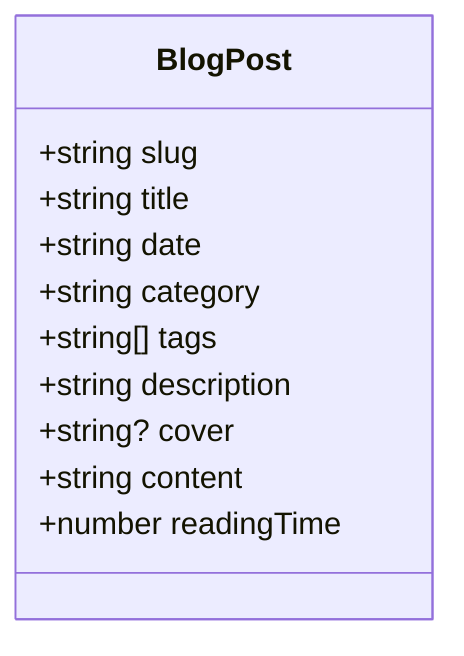
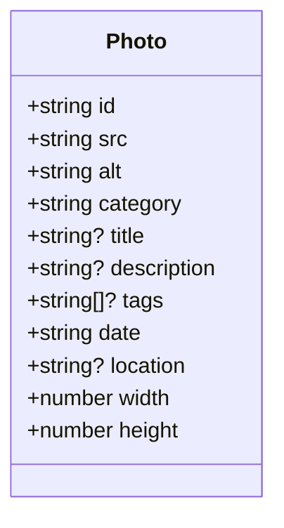
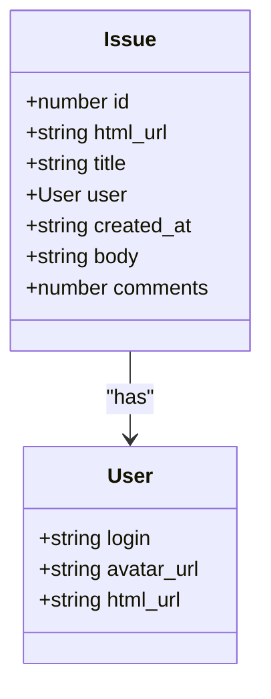
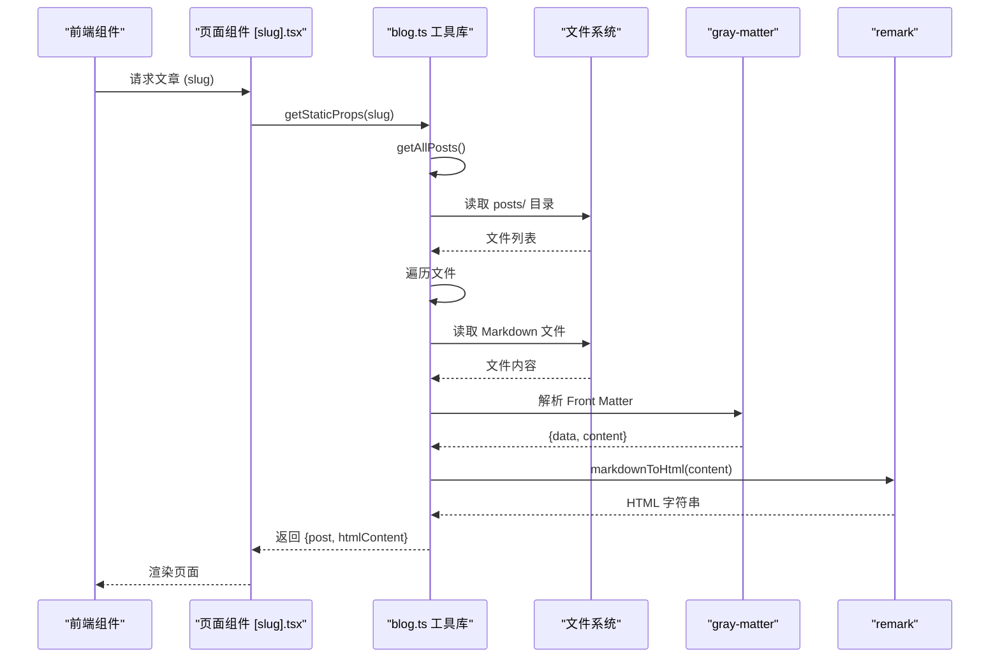
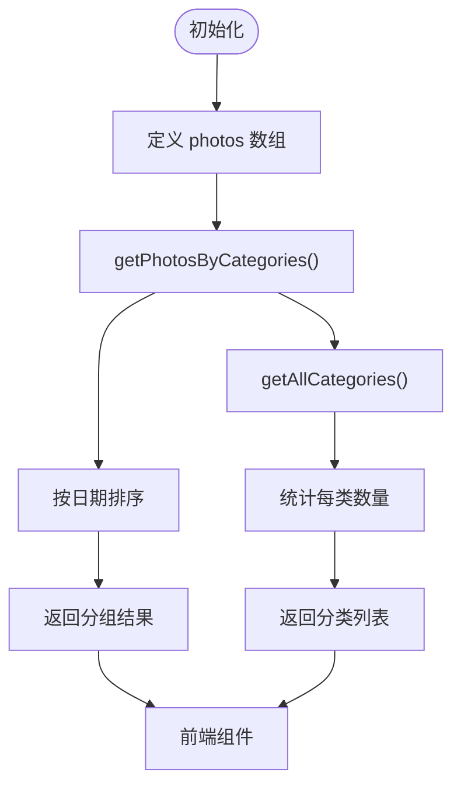

# 数据管理

<cite>
**Referenced Files in This Document**   
- [blog.ts](file://src/types/blog.ts)
- [photo.ts](file://src/types/photo.ts)
- [guestbook.ts](file://src/types/guestbook.ts)
- [blog.ts](file://src/lib/blog.ts)
- [photos.ts](file://src/lib/photos.ts)
- [nextjs-blog.md](file://posts/tech/nextjs-blog.md)
- [slug].tsx](file://src/pages/blog/[slug].tsx)
- [index.tsx](file://src/pages/PhotoPage/index.tsx)
</cite>

## 目录
1. [数据模型定义](#数据模型定义)
2. [内容获取与处理流程](#内容获取与处理流程)
3. [类型安全与错误预防](#类型安全与错误预防)

## 数据模型定义

本项目通过 TypeScript 接口在 `src/types/` 目录下定义了核心数据模型，确保了数据结构的清晰和类型安全。

### 博客文章模型 (BlogPost)

`BlogPost` 接口定义了博客文章的核心属性，包括唯一标识、元信息、内容和统计信息。

**Diagram sources**
- [blog.ts](file://src/types/blog.ts#L1-L10)

**Section sources**
- [blog.ts](file://src/types/blog.ts#L1-L10)

### 图片模型 (Photo)

`Photo` 接口定义了图片的元数据，包含技术属性（尺寸）、描述性信息和分类标签。

**Diagram sources**
- [photo.ts](file://src/types/photo.ts#L1-L12)

**Section sources**
- [photo.ts](file://src/types/photo.ts#L1-L12)

### 留言簿条目模型 (Issue)

`Issue` 类型定义了从外部 API 获取的留言条目结构，包含用户信息和内容。

**Diagram sources**
- [guestbook.ts](file://src/types/guestbook.ts#L1-L12)

**Section sources**
- [guestbook.ts](file://src/types/guestbook.ts#L1-L12)

## 内容获取与处理流程

项目通过 `src/lib/` 目录下的工具库实现了从原始文件到前端可用数据的完整转换流程。

### 博客内容处理 (src/lib/blog.ts)

博客内容的处理流程分为三个核心步骤：读取、解析和转换。

**Diagram sources**
- [blog.ts](file://src/lib/blog.ts#L10-L124)
- [slug].tsx](file://src/pages/blog/[slug].tsx#L30-L63)

**Section sources**
- [blog.ts](file://src/lib/blog.ts#L10-L124)
- [slug].tsx](file://src/pages/blog/[slug].tsx#L30-L63)
- [nextjs-blog.md](file://posts/tech/nextjs-blog.md#L1-L37)

### 图片数据管理 (src/lib/photos.ts)

图片数据通过静态数组 `photos` 进行组织，并通过工具函数提供按分类分组和排序的功能。

**Diagram sources**
- [photos.ts](file://src/lib/photos.ts#L89-L127)

**Section sources**
- [photos.ts](file://src/lib/photos.ts#L3-L86)
- [photos.ts](file://src/lib/photos.ts#L89-L127)
- [index.tsx](file://src/pages/PhotoPage/index.tsx#L1-L84)

## 类型安全与错误预防

项目通过 TypeScript 的静态类型检查和严谨的错误处理机制，有效预防了运行时错误。

### 类型安全实践

1. **接口定义**：所有数据模型均通过接口明确定义，确保数据结构一致性。
2. **函数签名**：工具函数明确指定输入输出类型，如 `getPostBySlug(slug: string): BlogPost | null`。
3. **空值处理**：对可选字段（如 `cover?: string`）进行安全访问，避免 `undefined` 错误。

### 错误处理机制

1. **文件系统检查**：在读取文件前检查目录和文件是否存在。
2. **异常捕获**：使用 `try-catch` 捕获文件读取和解析过程中的异常。
3. **默认值提供**：为缺失的 front matter 字段提供默认值（如 `data.title || ""`）。

这些实践共同构建了一个健壮的数据处理管道，确保了应用的稳定性和可维护性。

**Section sources**
- [blog.ts](file://src/lib/blog.ts#L41-L96)
- [blog.ts](file://src/lib/blog.ts#L98-L105)
- [photos.ts](file://src/lib/photos.ts#L89-L107)