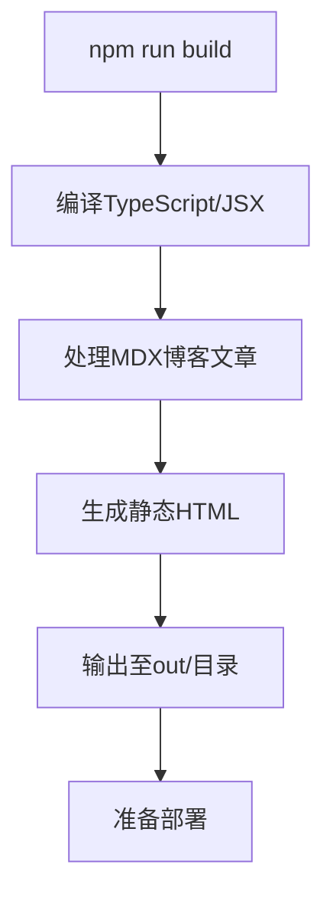
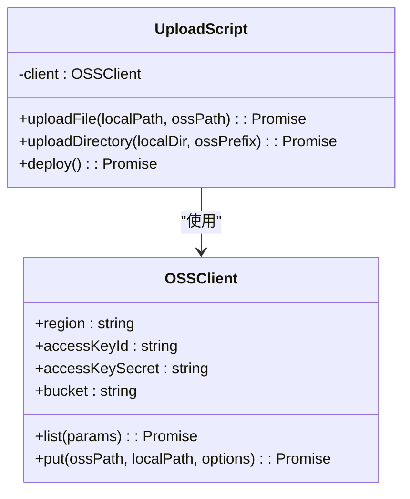
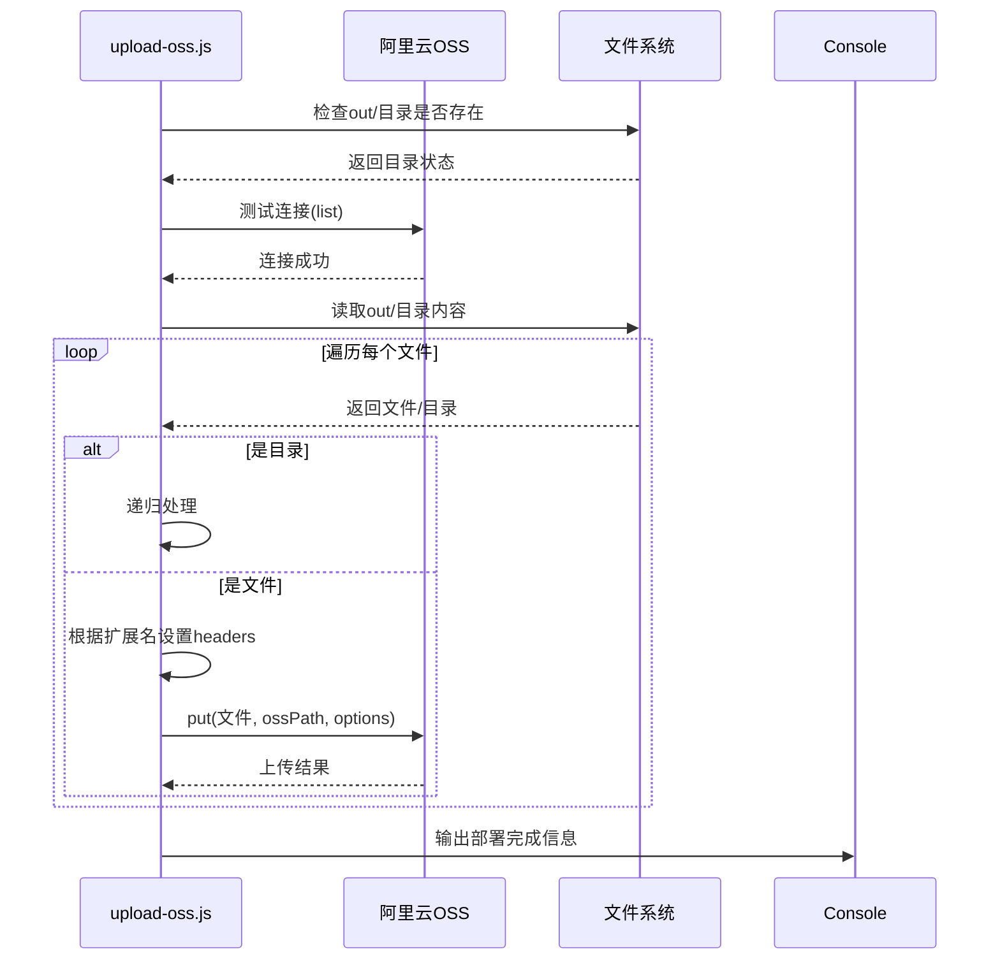

# 构建与部署

<cite>
**Referenced Files in This Document**   
- [next.config.js](file://next.config.js)
- [package.json](file://package.json)
- [scripts/upload-oss.js](file://scripts/upload-oss.js)
- [serverless.yml](file://serverless.yml)
- [.env.production](file://.env.production)
- [scripts/upload-images.js](file://scripts/upload-images.js)
</cite>

## 目录
1. [构建与部署流程概述](#构建与部署流程概述)
2. [静态导出配置详解](#静态导出配置详解)
3. [部署脚本实现分析](#部署脚本实现分析)
4. [Serverless 部署配置](#serverless-部署配置)
5. [环境变量安全实践](#环境变量安全实践)
6. [部署验证步骤](#部署验证步骤)

## 构建与部署流程概述

本项目采用Next.js静态导出模式，通过`npm run build`和`npm run export`命令协同工作，将应用编译并导出为静态文件，最终通过`npm run deploy`命令自动化部署至阿里云OSS。整个流程实现了从源码到生产环境的无缝衔接。

**Section sources**
- [package.json](file://package.json#L1-L49)

## 静态导出配置详解

`next.config.js`文件中的`output: 'export'`配置是实现静态站点生成的核心。此配置指示Next.js构建系统在`npm run build`过程中生成静态HTML文件，并将所有页面预渲染为静态内容，输出至`out/`目录。同时，`trailingSlash: true`配置确保所有路径以斜杠结尾，符合静态服务器的路由要求。

**Diagram sources**
- [next.config.js](file://next.config.js#L1-L13)

**Section sources**
- [next.config.js](file://next.config.js#L1-L13)

## 部署脚本实现分析

`scripts/upload-oss.js`脚本是自动化部署的核心组件，负责将构建生成的静态文件上传至阿里云OSS。脚本通过`ali-oss` SDK建立与OSS的连接，并递归遍历`out/`目录，根据文件类型设置相应的HTTP头信息。

**Diagram sources**
- [scripts/upload-oss.js](file://scripts/upload-oss.js#L1-L84)

**Section sources**
- [scripts/upload-oss.js](file://scripts/upload-oss.js#L1-L84)

### 文件上传逻辑

脚本实现了智能的文件处理逻辑：对于HTML文件，设置`Content-Type: text/html; charset=utf-8`和`Cache-Control: public, max-age=3600`（1小时缓存）；对于其他静态资源，设置更长的缓存时间`public, max-age=2592000`（30天），以优化CDN性能。

**Diagram sources**
- [scripts/upload-oss.js](file://scripts/upload-oss.js#L1-L84)

## Serverless 部署配置

`serverless.yml`文件定义了项目在Serverless Framework中的部署配置。该配置指定了使用Next.js组件进行部署，目标区域为广州(ap-guangzhou)，运行时环境为Node.js 18.x，并配置了HTTP/HTTPS协议支持。此配置与静态导出模式协同工作，确保应用能够在Serverless环境中正确运行。

**Section sources**
- [serverless.yml](file://serverless.yml#L1-L13)

## 环境变量安全实践

项目通过`.env.production`文件管理生产环境的敏感配置，包括OSS访问密钥、存储桶名称和CDN域名。这些环境变量在部署时被`upload-oss.js`脚本读取，用于建立与阿里云OSS的安全连接。为保障安全，访问密钥应具有最小权限原则，并定期轮换。

**Section sources**
- [.env.production](file://.env.production#L1-L26)
- [scripts/upload-oss.js](file://scripts/upload-oss.js#L4-L8)

## 部署验证步骤

部署完成后，可通过以下步骤验证部署结果：首先检查控制台输出的"部署完成"信息和访问地址；然后访问`http://${OSS_DOMAIN}`确认网站正常加载；最后验证博客文章、图片等静态资源是否正确显示。此外，项目还提供了`scripts/upload-images.js`脚本用于单独管理图片资源的上传。

**Section sources**
- [scripts/upload-oss.js](file://scripts/upload-oss.js#L75-L84)
- [scripts/upload-images.js](file://scripts/upload-images.js#L1-L244)
- [README.md](file://README.md#L52-L143)