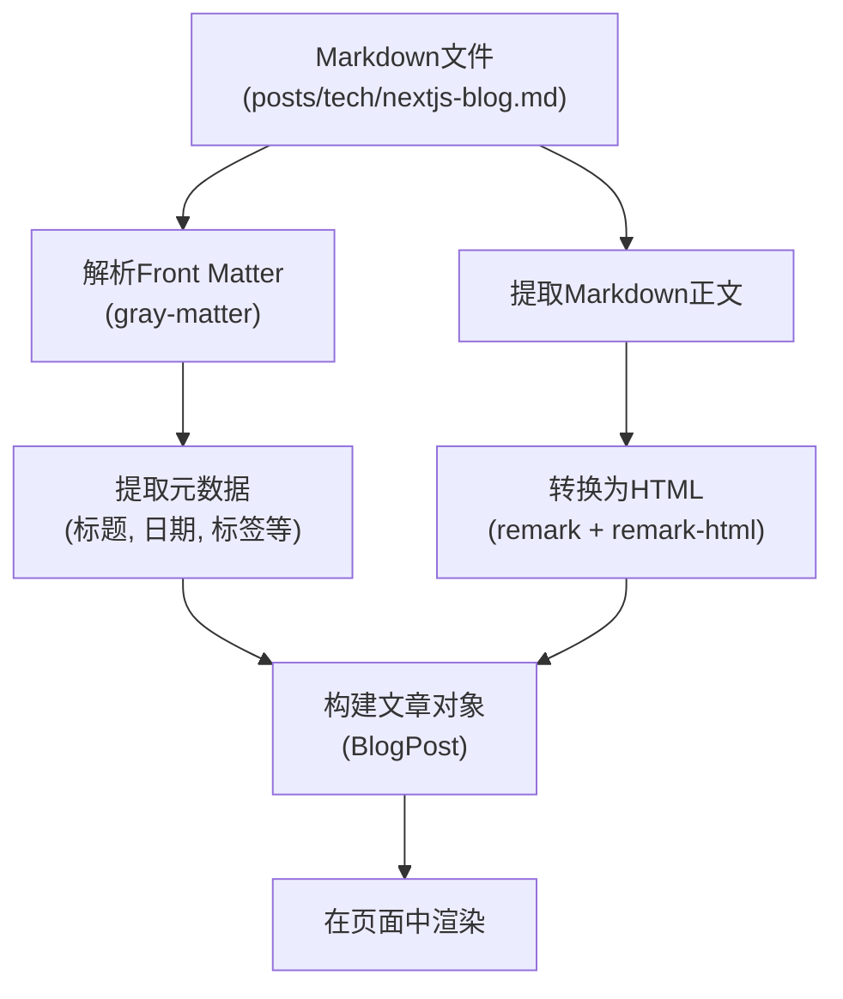
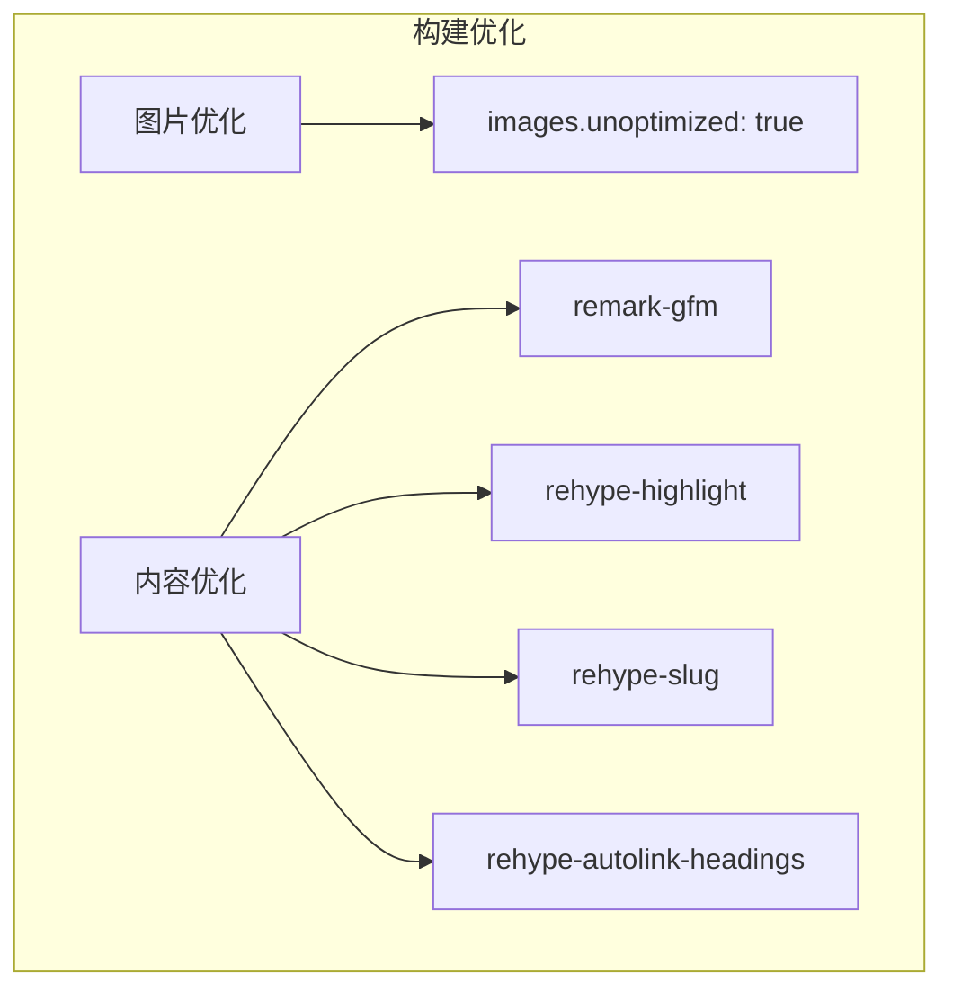

# 构建流程

<cite>
**Referenced Files in This Document**   
- [package.json](file://package.json)
- [next.config.js](file://next.config.js)
- [src/lib/blog.ts](file://src/lib/blog.ts)
- [posts/life/my-journey.md](file://posts/life/my-journey.md)
- [posts/tech/nextjs-blog.md](file://posts/tech/nextjs-blog.md)
- [src/pages/blog/index.tsx](file://src/pages/blog/index.tsx)
- [src/pages/blog/[slug].tsx](file://src/pages/blog/[slug].tsx)
</cite>

## 目录
1. [构建脚本分析](#构建脚本分析)
2. [静态导出配置](#静态导出配置)
3. [内容处理流程](#内容处理流程)
4. [构建输出结构](#构建输出结构)
5. [构建优化策略](#构建优化策略)
6. [常见构建问题排查](#常见构建问题排查)

## 构建脚本分析

项目中的`package.json`文件定义了多个构建相关的脚本命令。`npm run build`脚本直接调用`next build`命令，这是Next.js应用的标准构建命令，负责编译和优化应用代码。值得注意的是，`npm run export`脚本实际上也执行`next build`命令，这表明该项目的构建过程本身就包含了静态导出功能，无需额外的导出步骤。

`npm run deploy`脚本展示了完整的部署流程，它首先执行`npm run export`（即`next build`）来构建应用，然后运行`node scripts/upload-oss.js`脚本将构建输出上传到OSS（对象存储服务）。这种设计将构建和部署流程紧密结合，确保了生产环境的一致性。

**Section sources**
- [package.json](file://package.json#L6-L15)

## 静态导出配置

`next.config.js`文件中的`output: 'export'`配置是实现静态站点生成（SSG）的核心。当此选项设置为`'export'`时，Next.js会将整个应用编译为静态HTML文件，而不是一个需要Node.js服务器运行的动态应用。这意味着构建后的应用可以部署到任何静态文件托管服务上，如GitHub Pages、Vercel或OSS。

`trailingSlash: true`配置项确保所有路由都以斜杠结尾，这有助于保持URL的一致性并避免重复内容问题。`images.unoptimized: true`配置则禁用了Next.js的内置图片优化功能，这在使用外部图片CDN或自定义图片处理流程时非常有用，可以避免不必要的图片处理开销。

**Section sources**
- [next.config.js](file://next.config.js#L2-L13)

## 内容处理流程

博客内容的处理流程始于`src/lib/blog.ts`文件，该文件提供了处理Markdown文章的核心功能。`getAllPosts`函数遍历`posts`目录下的所有子目录（代表文章分类），读取每个`.md`文件，并通过`getPostBySlug`函数解析其内容。

`getPostBySlug`函数使用`gray-matter`库解析Markdown文件的front matter（文件头部的YAML元数据），提取文章的标题、日期、分类、标签等信息。同时，它将Markdown正文内容作为字符串返回。`markdownToHtml`函数则使用`remark`和`remark-html`库将Markdown内容转换为HTML字符串，这是在页面中渲染文章内容的关键步骤。

在页面组件中，`getStaticProps`和`getStaticPaths`函数利用这些工具函数在构建时预生成页面。例如，`[slug].tsx`页面使用`getStaticPaths`生成所有文章的路径，并使用`getStaticProps`获取每篇文章的数据和HTML内容，从而实现静态站点生成。

**Diagram sources**
- [src/lib/blog.ts](file://src/lib/blog.ts#L10-L105)
- [src/pages/blog/[slug].tsx](file://src/pages/blog/[slug].tsx#L44-L62)

**Section sources**
- [src/lib/blog.ts](file://src/lib/blog.ts#L10-L105)
- [src/pages/blog/[slug].tsx](file://src/pages/blog/[slug].tsx#L44-L62)

## 构建输出结构

执行`npm run build`后，Next.js会生成一个`out`目录（由`next.config.js`中的`output: 'export'`配置决定），该目录包含所有静态文件。目录结构反映了应用的路由结构，例如`blog/nextjs-blog/index.html`对应`/blog/nextjs-blog`路由。

`out`目录中的每个HTML文件都是完全静态的，包含了页面的所有内容和必要的JavaScript代码。CSS文件被提取到单独的文件中，并通过link标签引入。图片和其他静态资源被复制到`out`目录的相应位置。这种扁平化的静态文件结构使得应用可以轻松部署到任何静态文件服务器上。

**Section sources**
- [next.config.js](file://next.config.js#L2-L3)

## 构建优化策略

项目的构建优化策略主要体现在对图片和内容的处理上。通过设置`images.unoptimized: true`，项目避免了Next.js对图片的自动优化，这在图片已经通过`scripts/manage-images.js`等脚本进行过优化或存储在CDN上时非常合理，可以显著减少构建时间。

内容层面的优化通过`remark`插件实现。`remark-gfm`支持GitHub风格的Markdown语法（如表格、任务列表），`rehype-highlight`提供代码语法高亮，`rehype-slug`和`rehype-autolink-headings`则为标题自动生成ID和锚点链接，极大地提升了文章的可读性和用户体验。

**Diagram sources**
- [next.config.js](file://next.config.js#L7-L9)
- [src/lib/blog.ts](file://src/lib/blog.ts#L98-L105)

**Section sources**
- [next.config.js](file://next.config.js#L7-L9)
- [src/lib/blog.ts](file://src/lib/blog.ts#L98-L105)

## 常见构建问题排查

构建过程中可能遇到的常见问题包括：`posts`目录不存在或路径错误、Markdown文件front matter格式错误、缺少必要的依赖库等。由于`getAllPosts`和`getPostBySlug`函数中包含了错误处理逻辑，当读取文件失败时会返回`null`或空数组，而不是导致构建失败，这提高了构建的健壮性。

如果构建失败，应首先检查`package.json`中的依赖是否完整，然后确认`posts`目录的结构和文件内容是否符合预期。对于`getStaticProps`或`getStaticPaths`相关的错误，应检查相关函数的返回值是否符合Next.js的要求，例如`paths`数组的格式是否正确，`props`对象是否包含了所有必需的属性。

**Section sources**
- [src/lib/blog.ts](file://src/lib/blog.ts#L41-L96)
- [src/pages/blog/[slug].tsx](file://src/pages/blog/[slug].tsx#L32-L42)