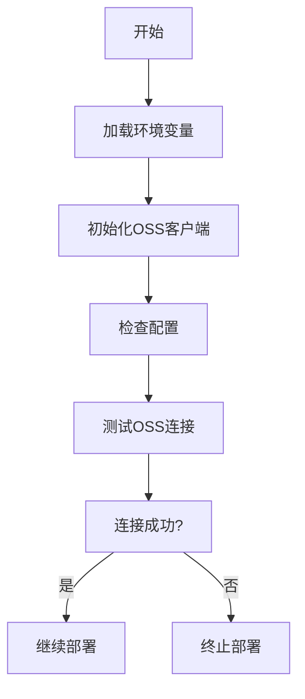
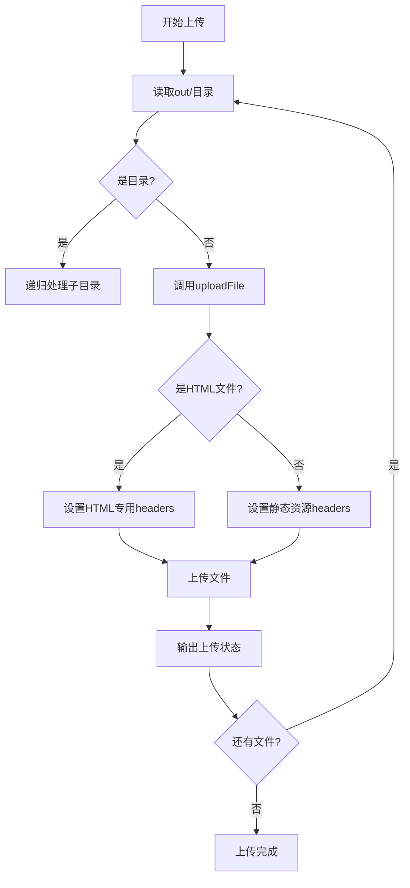

# 部署流程

<cite>
**本文档引用的文件**
- [upload-oss.js](file://scripts/upload-oss.js)
- [.env.production](file://.env.production)
- [serverless.yml](file://serverless.yml)
- [README.md](file://README.md)
</cite>

## 目录
1. [项目概述](#项目概述)
2. [部署脚本分析](#部署脚本分析)
3. [OSS客户端配置](#oss客户端配置)
4. [文件上传机制](#文件上传机制)
5. [Serverless部署配置](#serverless部署配置)
6. [错误处理与日志](#错误处理与日志)
7. [部署验证](#部署验证)

## 项目概述
my-blog项目是一个基于Next.js的现代化个人博客网站，采用静态站点生成（SSG）技术，部署在阿里云OSS上。项目通过自动化脚本实现一键构建和部署，支持响应式设计和SEO优化。生产环境配置通过.env.production文件管理，部署流程由scripts/upload-oss.js脚本控制，确保代码变更能够可靠地发布到生产环境。

**Section sources**
- [README.md](file://README.md#L1-L50)

## 部署脚本分析
部署脚本scripts/upload-oss.js是整个自动化部署流程的核心，负责将构建后的静态文件上传到阿里云OSS。脚本首先加载生产环境配置，初始化OSS客户端，然后递归遍历out/目录中的所有文件并上传。脚本设计了完整的错误处理机制，确保部署过程的可靠性。通过命令行直接执行时，脚本会自动触发deploy函数，实现一键部署。

**Section sources**
- [upload-oss.js](file://scripts/upload-oss.js#L1-L10)

## OSS客户端配置
OSS客户端的配置是部署流程的基础。脚本通过dotenv库加载.env.production文件中的环境变量，包括OSS_REGION、OSS_ACCESS_KEY_ID、OSS_ACCESS_KEY_SECRET和OSS_BUCKET等关键配置。客户端初始化时，使用这些环境变量创建OSS实例，确保敏感信息不会硬编码在代码中。部署前，脚本会输出配置摘要，包括区域、存储桶和访问密钥ID的前8位，便于部署人员确认配置正确性。

**Diagram sources**
- [upload-oss.js](file://scripts/upload-oss.js#L3-L15)
- [.env.production](file://.env.production#L1-L10)

## 文件上传机制
文件上传机制采用递归方式处理out/目录下的所有文件。uploadDirectory函数负责遍历目录结构，对每个文件调用uploadFile函数进行上传。对于HTML文件，设置Content-Type为"text/html; charset=utf-8"和Cache-Control为"public, max-age=3600"（1小时缓存）；对于其他静态资源，使用默认Content-Type和"public, max-age=2592000"（30天缓存）的缓存策略。这种差异化配置优化了网站性能，确保HTML内容及时更新，同时充分利用静态资源的长期缓存。

**Diagram sources**
- [upload-oss.js](file://scripts/upload-oss.js#L17-L51)

## Serverless部署配置
Next.js应用在Serverless框架下的部署配置由serverless.yml文件定义。配置指定了应用名称为my-blog，源码路径为项目根目录，部署区域为ap-guangzhou（广州），运行时环境为Nodejs18.x。API网关配置支持HTTP和HTTPS协议，环境设置为release。这些配置确保应用在阿里云Serverless环境中正确运行，提供高可用性和可扩展性。

**Section sources**
- [serverless.yml](file://serverless.yml#L1-L11)

## 错误处理与日志
部署流程设计了完善的错误处理和日志输出机制。脚本在关键步骤输出状态信息，使用不同符号标识成功（✅）、失败（❌）和警告（⚠️）。如果构建目录不存在，脚本会输出错误信息并退出。OSS连接测试失败或文件上传异常时，会捕获错误并输出详细信息。所有操作都有相应的日志记录，便于部署人员监控过程和排查问题。这种设计确保了部署过程的透明性和可靠性。

**Section sources**
- [upload-oss.js](file://scripts/upload-oss.js#L53-L84)

## 部署验证
部署完成后，脚本会输出访问地址http://${process.env.OSS_DOMAIN}，便于快速验证部署结果。生产环境要求OSS已开启静态网站托管，设置默认首页为index.html，404页面为404.html，读写权限为公共读，并绑定已备案的自定义域名。部署验证应检查网站功能完整性、资源加载情况和页面性能，确保所有链接正常工作，静态资源正确加载，页面响应符合预期。

**Section sources**
- [README.md](file://README.md#L100-L120)