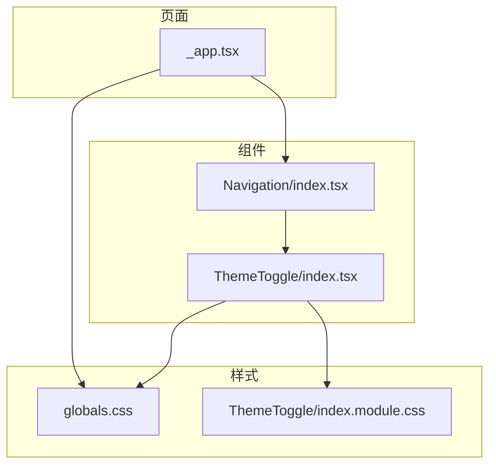
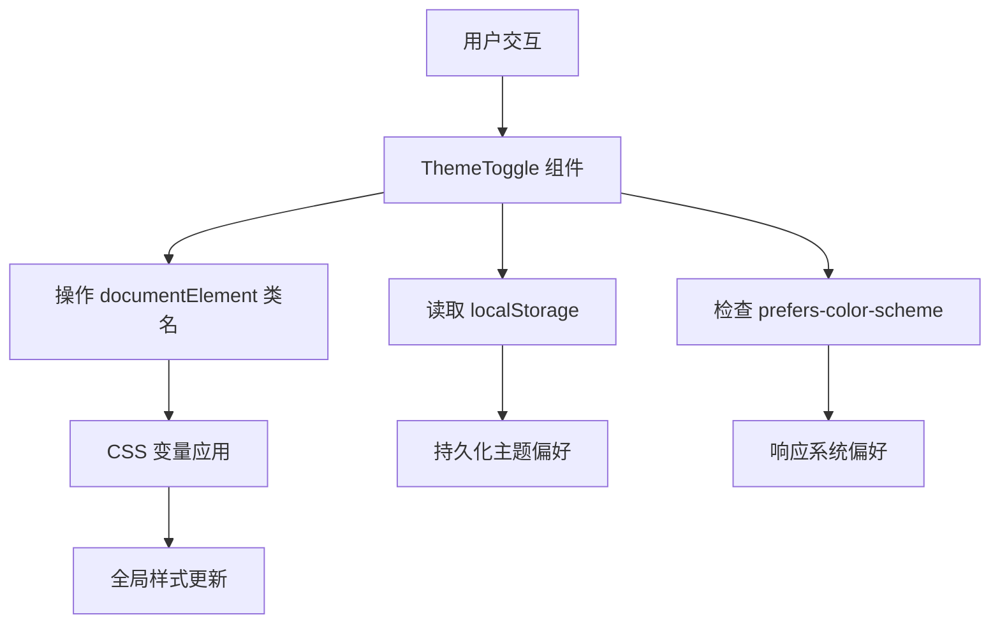
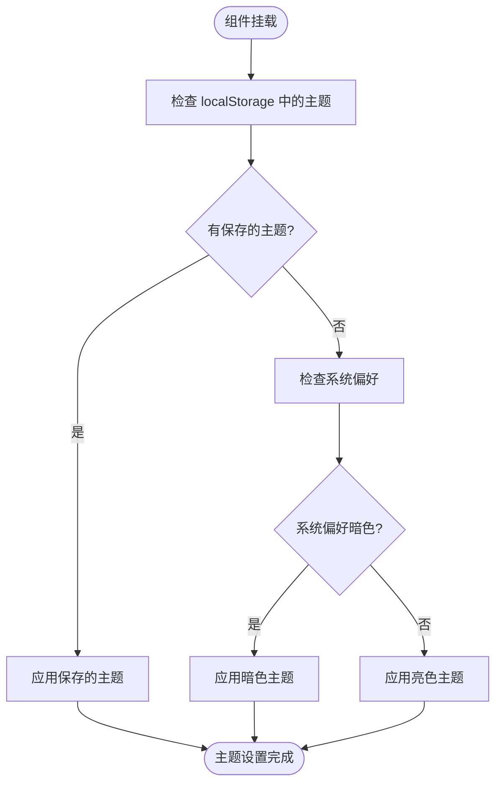
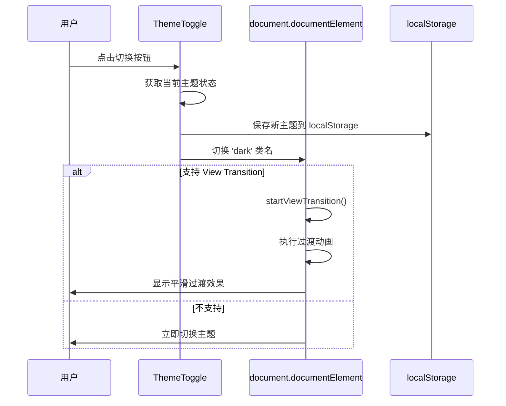

# 主题切换

<cite>
**本文档中引用的文件**
- [ThemeToggle/index.tsx](file://src/components/ThemeToggle/index.tsx)
- [ThemeToggle/index.module.css](file://src/components/ThemeToggle/index.module.css)
- [_app.tsx](file://src/pages/_app.tsx)
- [globals.css](file://src/styles/globals.css)
</cite>

## 目录
1. [简介](#简介)
2. [项目结构](#项目结构)
3. [核心组件](#核心组件)
4. [架构概述](#架构概述)
5. [详细组件分析](#详细组件分析)
6. [依赖分析](#依赖分析)
7. [性能考虑](#性能考虑)
8. [故障排除指南](#故障排除指南)
9. [结论](#结论)

## 简介
本文档深入解析博客系统中主题切换功能的技术实现。该功能允许用户在明暗主题之间切换，并通过CSS自定义属性实现样式动态变化。系统优先使用用户偏好设置，并将选择持久化至localStorage以实现跨会话记忆。主题切换过程包含平滑的视觉过渡效果，提升用户体验。

## 项目结构
主题切换功能涉及多个关键文件，分布在不同的目录中。核心组件位于`src/components/ThemeToggle/`目录下，包含React组件和CSS模块。全局样式定义在`src/styles/globals.css`中，而页面布局由`src/pages/_app.tsx`统一管理。导航组件`src/components/Navigation/index.tsx`负责集成主题切换按钮。



**图示来源**
- [ThemeToggle/index.tsx](file://src/components/ThemeToggle/index.tsx)
- [Navigation/index.tsx](file://src/components/Navigation/index.tsx)
- [_app.tsx](file://src/pages/_app.tsx)
- [globals.css](file://src/styles/globals.css)
- [ThemeToggle/index.module.css](file://src/components/ThemeToggle/index.module.css)

**本节来源**
- [src/components/ThemeToggle/index.tsx](file://src/components/ThemeToggle/index.tsx)
- [src/pages/_app.tsx](file://src/pages/_app.tsx)
- [src/styles/globals.css](file://src/styles/globals.css)

## 核心组件
主题切换功能的核心是`ThemeToggle`组件，它使用React的`useState`和`useEffect`钩子来管理组件状态和副作用。组件通过操作DOM元素的类名来触发主题变化，并利用CSS变量实现样式的动态切换。初始化时，组件会检查本地存储中的主题偏好或系统级暗色模式设置，以确定初始主题状态。

**本节来源**
- [ThemeToggle/index.tsx](file://src/components/ThemeToggle/index.tsx#L5-L108)

## 架构概述
主题切换系统采用分层架构，将状态管理、UI渲染和样式定义分离。`ThemeToggle`组件负责用户交互和状态持久化，`globals.css`定义了主题相关的CSS变量，而`_app.tsx`作为应用的入口点，确保主题设置在整个应用中一致应用。这种架构实现了关注点分离，便于维护和扩展。



**图示来源**
- [ThemeToggle/index.tsx](file://src/components/ThemeToggle/index.tsx#L5-L108)
- [globals.css](file://src/styles/globals.css#L1-L114)

## 详细组件分析

### ThemeToggle 组件分析
`ThemeToggle`组件使用客户端渲染，通过`useState`管理组件的挂载状态，避免服务端与客户端渲染不一致的问题。组件在挂载时通过`useEffect`执行初始化逻辑，检查本地存储和系统偏好来设置初始主题。

#### 状态管理流程


**图示来源**
- [ThemeToggle/index.tsx](file://src/components/ThemeToggle/index.tsx#L10-L25)

#### 主题切换逻辑


**图示来源**
- [ThemeToggle/index.tsx](file://src/components/ThemeToggle/index.tsx#L27-L108)

### 样式系统分析
主题样式系统基于CSS自定义属性（CSS Variables），通过`:root`和`:root.dark`选择器定义两套主题变量。这种设计使得主题切换只需更改根元素的类名，所有使用CSS变量的样式会自动更新。

#### CSS 变量组织结构
| 变量名 | 亮色主题值 | 暗色主题值 | 用途 |
|--------|------------|------------|------|
| --background | #ffffff | #0a0a0a | 背景颜色 |
| --foreground | #171717 | #ededed | 前景颜色 |
| --primary-color | #2c3e50 | #4a90e2 | 主要颜色 |
| --secondary-color | #3498db | #64b5f6 | 次要颜色 |
| --text-color | #2c3e50 | #ededed | 文本颜色 |
| --border-color | #e1e8ed | #333333 | 边框颜色 |
| --hover-color | #f8f9fa | #1a1a1a | 悬停背景 |
| --card-bg | #ffffff | #111111 | 卡片背景 |
| --nav-bg | #ffffff | #111111 | 导航背景 |
| --shadow | rgba(0,0,0,0.1) | rgba(255,255,255,0.1) | 阴影颜色 |

**图示来源**
- [globals.css](file://src/styles/globals.css#L8-L58)

**本节来源**
- [ThemeToggle/index.tsx](file://src/components/ThemeToggle/index.tsx#L5-L108)
- [globals.css](file://src/styles/globals.css#L1-L114)
- [ThemeToggle/index.module.css](file://src/components/ThemeToggle/index.module.css#L1-L32)

## 依赖分析
主题切换功能依赖于多个系统API和框架特性。组件使用`localStorage`进行持久化存储，利用`window.matchMedia`检测系统偏好，并通过`document.documentElement`访问DOM根元素。对于支持View Transition API的浏览器，组件提供平滑的过渡动画效果。

```mermaid
graph LR
ThemeToggle --> React["React Hooks"]
ThemeToggle --> DOM["DOM API"]
ThemeToggle --> Storage["localStorage"]
ThemeToggle --> Media["matchMedia"]
ThemeToggle --> ViewTransition["View Transition API"]
React --> useState
React --> useEffect
DOM --> classList
DOM --> documentElement
ViewTransition -.-> "浏览器支持检测"
```

**图示来源**
- [ThemeToggle/index.tsx](file://src/components/ThemeToggle/index.tsx#L2-L108)

**本节来源**
- [ThemeToggle/index.tsx](file://src/components/ThemeToggle/index.tsx#L5-L108)

## 性能考虑
主题切换功能在设计时考虑了性能优化。通过在`useEffect`中仅执行一次初始化，避免了不必要的重复计算。CSS变量的使用确保了样式更新的高效性，浏览器可以快速应用新的主题。View Transition API的渐进式增强确保了在不支持的浏览器中仍能正常工作，只是缺少动画效果。

## 故障排除指南
### 常见问题及解决方案
- **主题不持久**: 检查浏览器是否禁用了`localStorage`，或确保没有清除本地数据。
- **样式闪烁(FOUC)**: 确保`_app.tsx`在渲染前已应用正确的主题类名，避免服务端与客户端不一致。
- **动画不工作**: 检查浏览器是否支持View Transition API，目前仅在较新版本的Chrome中支持。
- **系统偏好不生效**: 确认操作系统已正确设置暗色模式偏好。

**本节来源**
- [ThemeToggle/index.tsx](file://src/components/ThemeToggle/index.tsx#L5-L108)
- [globals.css](file://src/styles/globals.css#L1-L114)

## 结论
主题切换功能通过React状态管理、CSS变量和本地存储的结合，实现了高效且用户友好的主题切换体验。系统优先考虑用户偏好，支持系统级暗色模式，并通过View Transition API提供现代化的视觉反馈。该实现具有良好的可维护性和扩展性，便于未来添加更多主题或自定义选项。