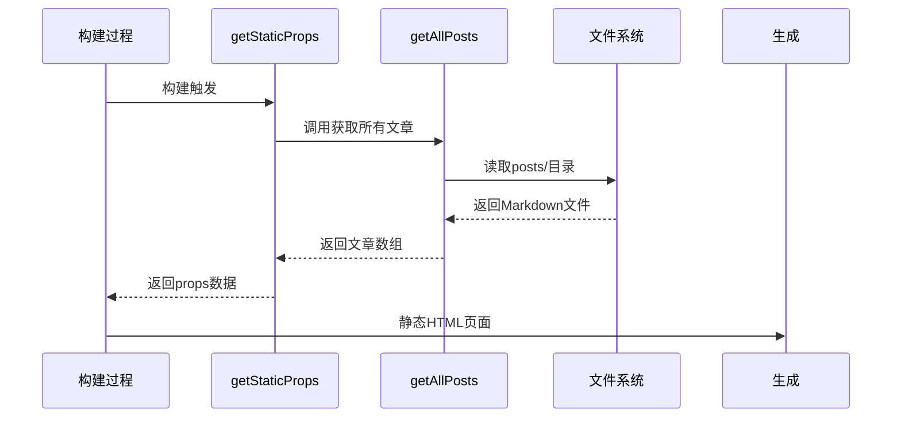
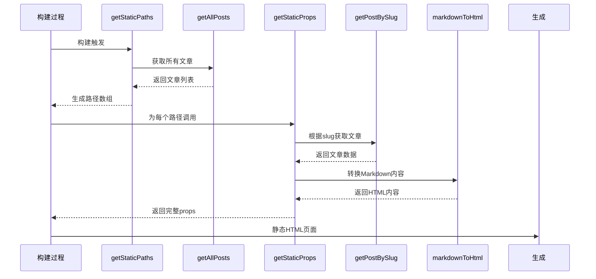
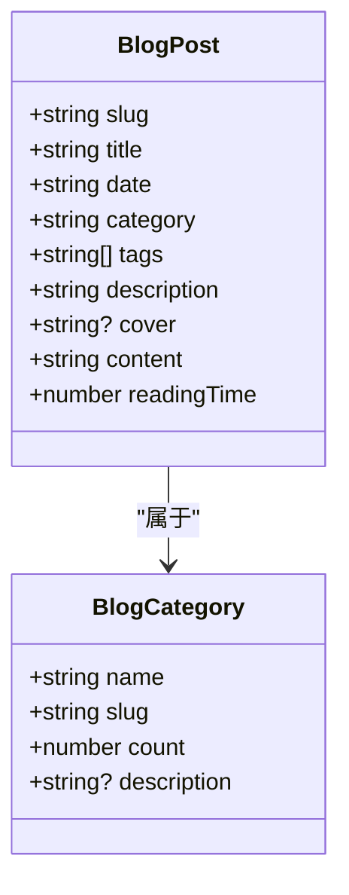
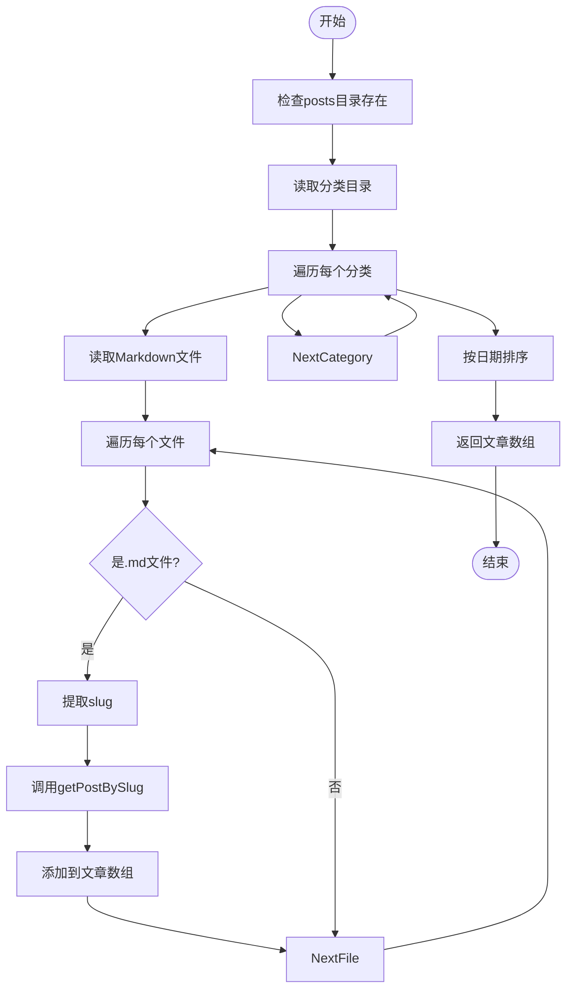
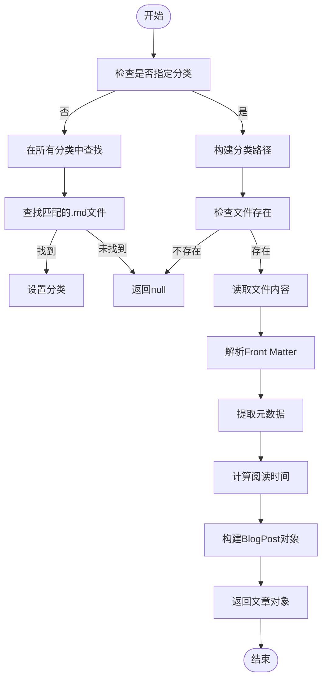
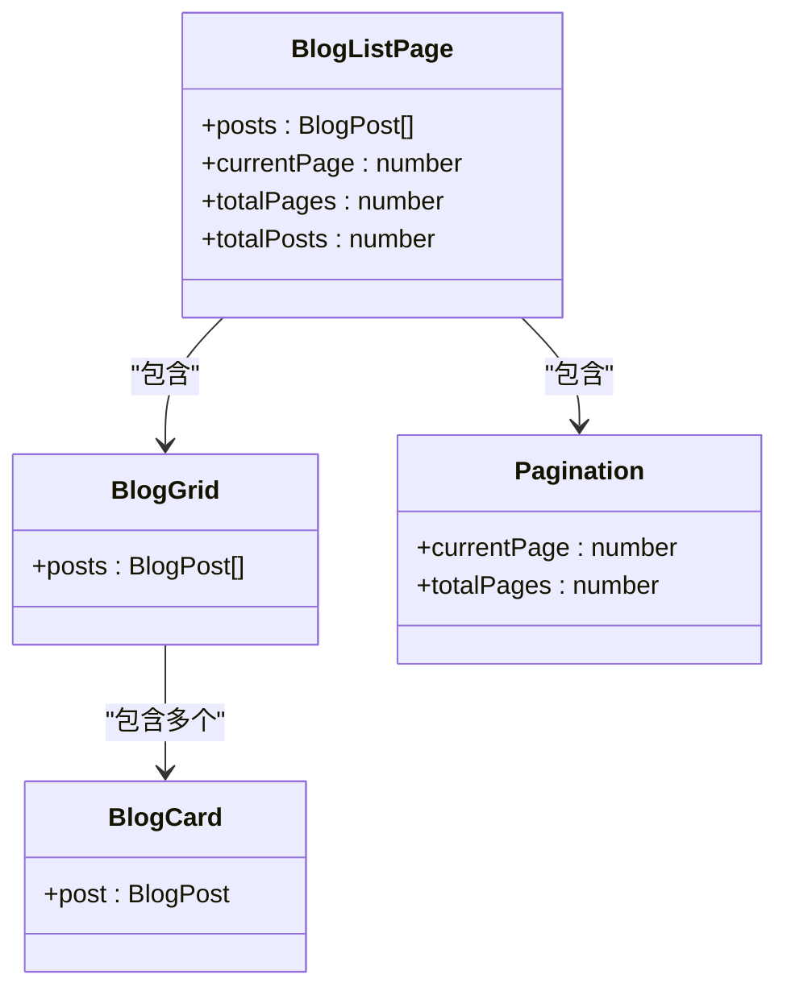
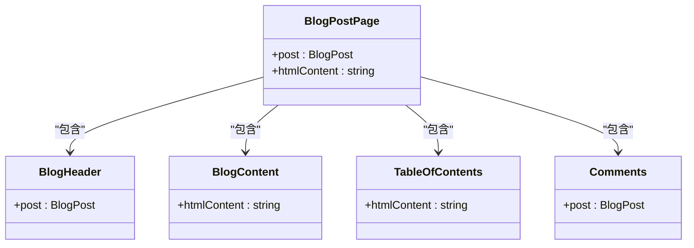
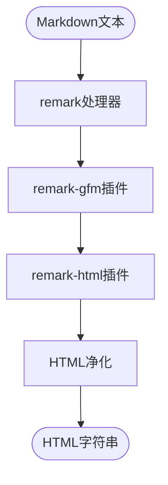
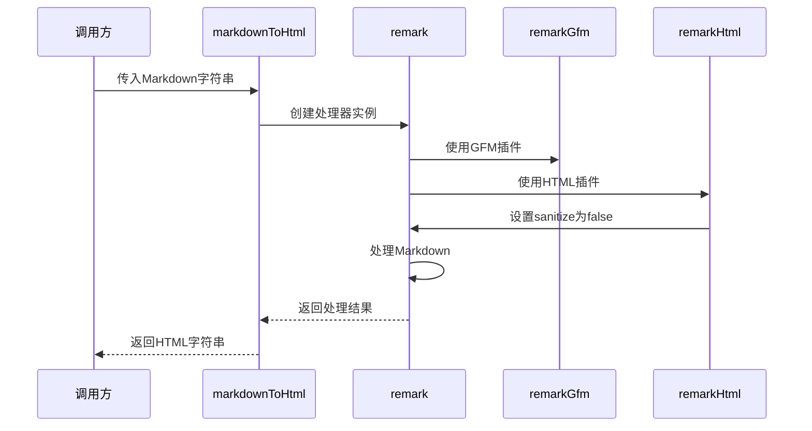

# 博客系统

<cite>
**本文档引用的文件**   
- [blog.ts](file://src/lib/blog.ts)
- [index.tsx](file://src/pages/blog/index.tsx)
- [\[slug\].tsx](file://src/pages/blog/[slug].tsx)
- [BlogListPage.tsx](file://src/pages/BlogListPage/index.tsx)
- [BlogPostPage.tsx](file://src/pages/BlogPostPage/index.tsx)
- [blog.ts](file://src/types/blog.ts)
- [nextjs-blog.md](file://posts/tech/nextjs-blog.md)
- [my-journey.md](file://posts/life/my-journey.md)
</cite>

## 目录
1. [项目结构](#项目结构)
2. [静态生成机制](#静态生成机制)
3. [数据处理流程](#数据处理流程)
4. [页面组件实现](#页面组件实现)
5. [Markdown内容转换](#markdown内容转换)
6. [新增博客指南](#新增博客指南)
7. [常见问题与解决方案](#常见问题与解决方案)

## 项目结构

项目采用模块化设计，主要目录结构如下：
- `posts/`：存放所有Markdown格式的博客文章，按分类组织
- `src/lib/`：核心工具函数，包含博客数据处理逻辑
- `src/pages/`：Next.js页面路由，包含博客列表和详情页
- `src/components/`：可复用的UI组件

```mermaid
graph TD
A[posts/] --> B[life/]
A --> C[tech/]
D[src/] --> E[lib/blog.ts]
D --> F[pages/blog/]
D --> G[components/]
E --> H[getAllPosts]
E --> I[getPostBySlug]
E --> J[markdownToHtml]
F --> K[index.tsx]
F --> L[[slug].tsx]
```

**图示来源**
- [blog.ts](file://src/lib/blog.ts)
- [index.tsx](file://src/pages/blog/index.tsx)
- [\[slug\].tsx](file://src/pages/blog/[slug].tsx)

**本节来源**
- [blog.ts](file://src/lib/blog.ts)
- [index.tsx](file://src/pages/blog/index.tsx)

## 静态生成机制

博客系统采用Next.js的静态生成（SSG）策略，在构建时预渲染所有页面。通过`getStaticProps`和`getStaticPaths`实现：

### 博客列表页
使用`getStaticProps`在构建时获取所有博客文章数据，生成静态HTML。



**图示来源**
- [index.tsx](file://src/pages/blog/index.tsx)
- [blog.ts](file://src/lib/blog.ts)

### 博客详情页
使用`getStaticPaths`生成所有文章的路径，`getStaticProps`获取具体文章数据。



**图示来源**
- [\[slug\].tsx](file://src/pages/blog/[slug].tsx)
- [blog.ts](file://src/lib/blog.ts)

**本节来源**
- [index.tsx](file://src/pages/blog/index.tsx)
- [\[slug\].tsx](file://src/pages/blog/[slug].tsx)

## 数据处理流程

### 核心数据结构


**图示来源**
- [blog.ts](file://src/types/blog.ts)

### 数据获取函数
`src/lib/blog.ts`中的核心函数工作流程：

#### getAllPosts函数


**图示来源**
- [blog.ts](file://src/lib/blog.ts#L10-L39)

#### getPostBySlug函数


**图示来源**
- [blog.ts](file://src/lib/blog.ts#L41-L96)

**本节来源**
- [blog.ts](file://src/lib/blog.ts)
- [blog.ts](file://src/types/blog.ts)

## 页面组件实现

### 博客列表组件
`BlogListPage`组件接收预渲染的文章数据，进行展示：



**图示来源**
- [BlogListPage.tsx](file://src/pages/BlogListPage/index.tsx)
- [blog.ts](file://src/types/blog.ts)

### 博客详情组件
`BlogPostPage`组件展示单篇文章的完整内容：



**图示来源**
- [BlogPostPage.tsx](file://src/pages/BlogPostPage/index.tsx)
- [blog.ts](file://src/types/blog.ts)

**本节来源**
- [BlogListPage.tsx](file://src/pages/BlogListPage/index.tsx)
- [BlogPostPage.tsx](file://src/pages/BlogPostPage/index.tsx)

## Markdown内容转换

### 转换流程


### markdownToHtml函数


**图示来源**
- [blog.ts](file://src/lib/blog.ts#L98-L105)

**本节来源**
- [blog.ts](file://src/lib/blog.ts)

## 新增博客指南

### 文件命名规范
- 文件位于`posts/分类名/`目录下
- 文件扩展名为`.md`
- 文件名即为文章slug，不含扩展名
- 推荐使用小写字母、数字和连字符

### Front Matter格式
每篇Markdown文章需包含YAML格式的Front Matter：

```yaml
---
title: "文章标题"
date: "YYYY-MM-DD"
description: "文章描述"
cover: "/images/封面图片.jpg"
tags: ["标签1", "标签2", "标签3"]
---
```

### 必填字段
- `title`：文章标题
- `date`：发布日期
- `description`：文章摘要

### 可选字段
- `cover`：封面图片路径
- `tags`：文章标签数组

**本节来源**
- [nextjs-blog.md](file://posts/tech/nextjs-blog.md)
- [my-journey.md](file://posts/life/my-journey.md)

## 常见问题与解决方案

### Slug冲突
当两个文章使用相同文件名时会产生slug冲突。

**解决方案**：
- 确保同一分类下文件名唯一
- 使用更具描述性的文件名
- 在不同分类下可以使用相同文件名

### 元数据缺失
缺少必要的Front Matter字段会导致文章显示异常。

**解决方案**：
- 检查YAML格式是否正确
- 确保必填字段都已填写
- 使用默认值处理缺失字段

### 构建失败
当Markdown文件格式错误时可能导致构建失败。

**解决方案**：
- 检查Markdown语法
- 验证Front Matter格式
- 确保文件编码为UTF-8

**本节来源**
- [blog.ts](file://src/lib/blog.ts)
- [nextjs-blog.md](file://posts/tech/nextjs-blog.md)