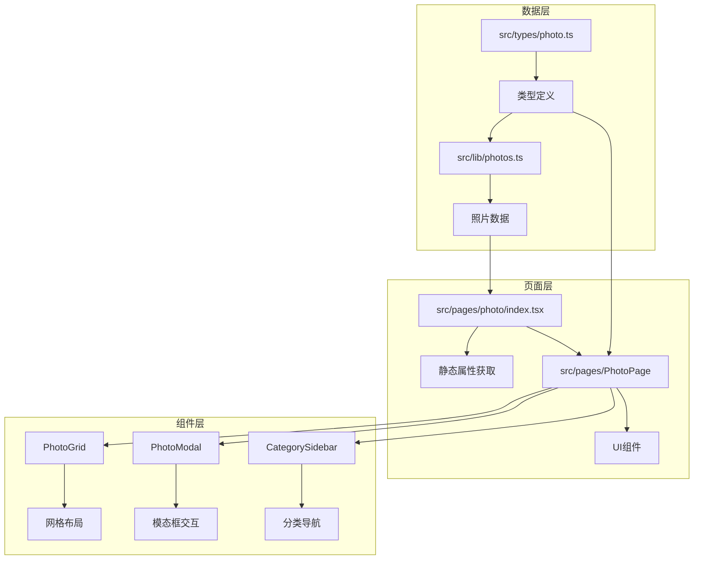
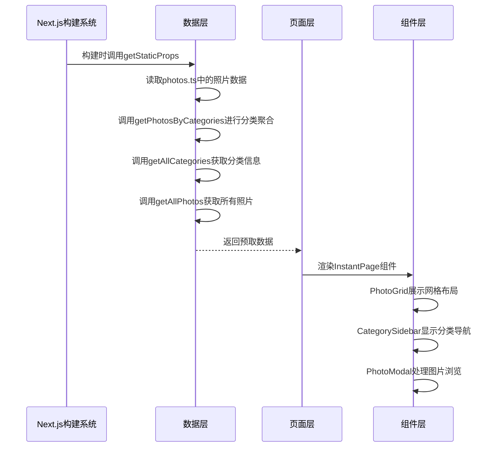
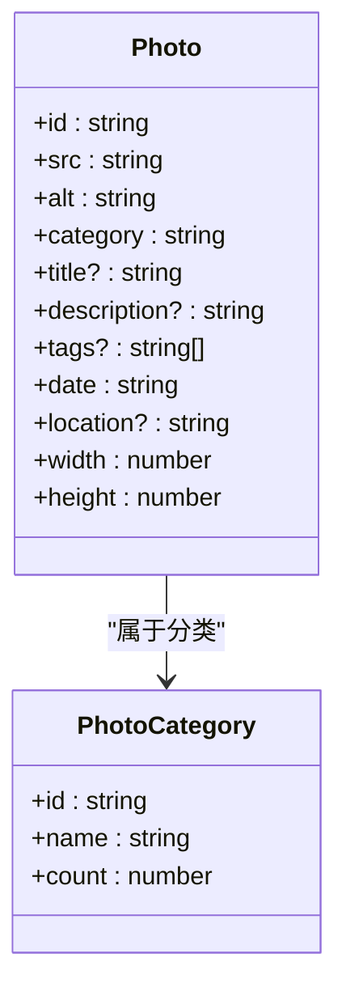
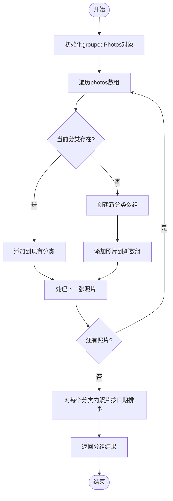
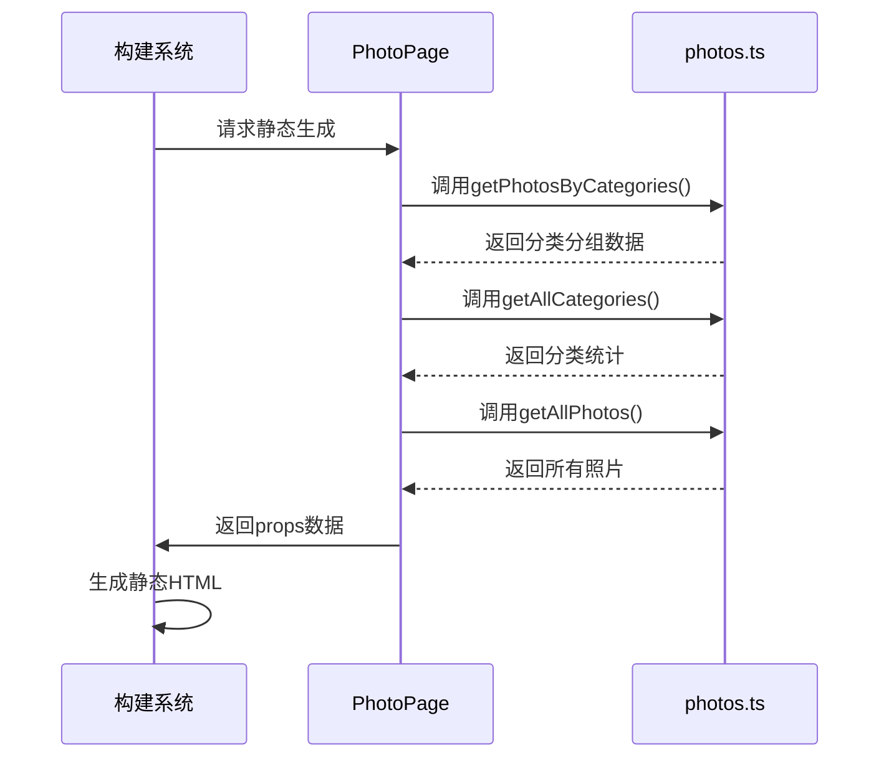
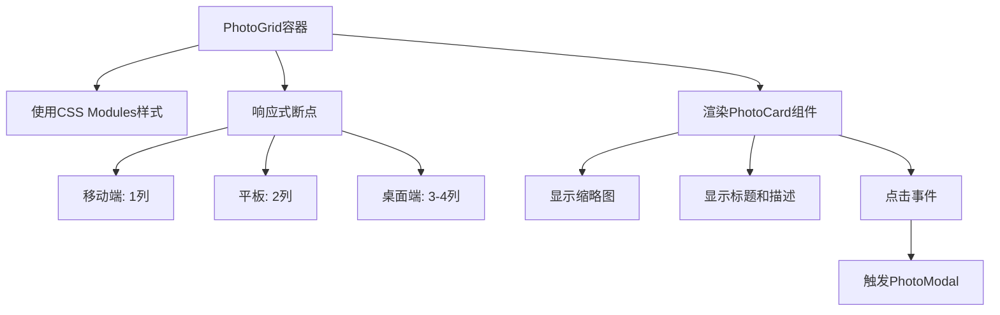
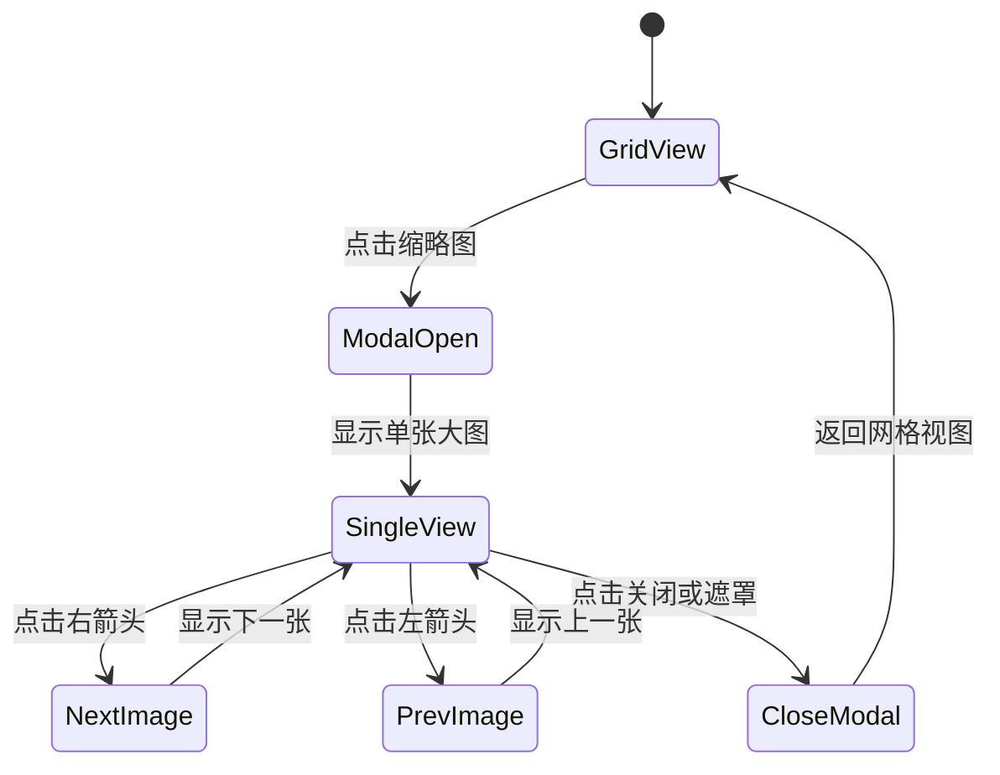
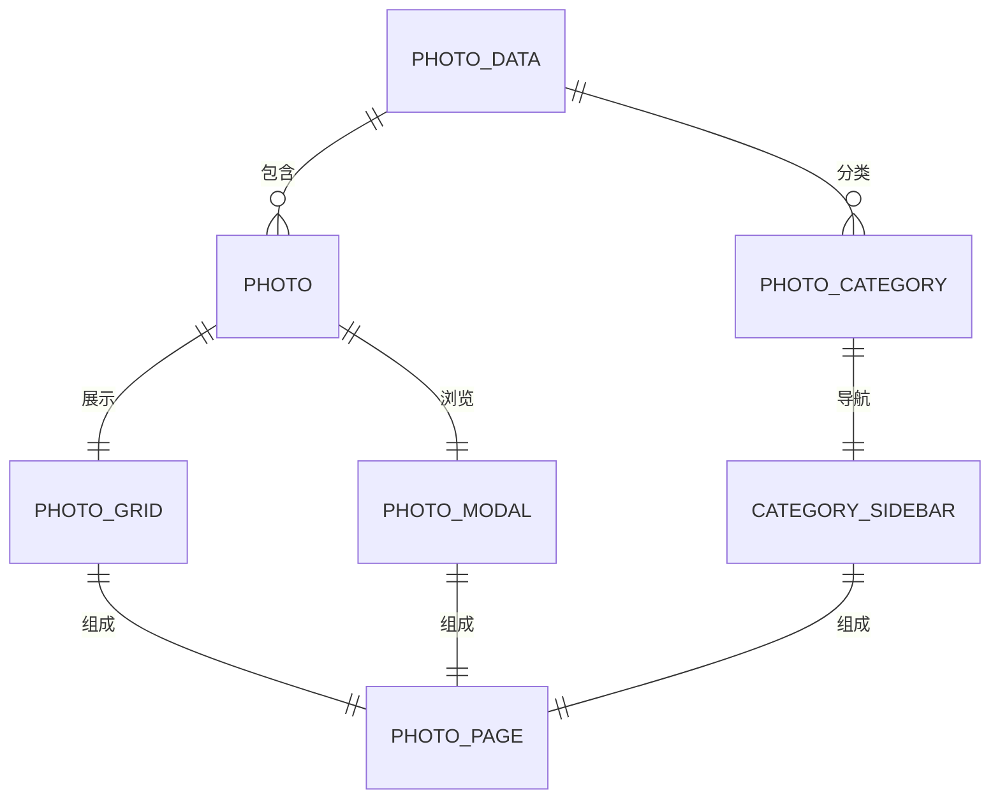

# 相册功能

<cite>
**本文档引用的文件**   
- [photos.ts](file://src/lib/photos.ts)
- [index.tsx](file://src/pages/photo/index.tsx)
- [photo.ts](file://src/types/photo.ts)
- [PhotoGrid/index.tsx](file://src/components/PhotoPage/components/PhotoGrid/index.tsx)
- [PhotoModal/index.tsx](file://src/components/PhotoPage/components/PhotoModal/index.tsx)
- [CategorySidebar/index.tsx](file://src/components/PhotoPage/components/CategorySidebar/index.tsx)
</cite>

## 目录
1. [简介](#简介)
2. [项目结构](#项目结构)
3. [核心组件](#核心组件)
4. [架构概览](#架构概览)
5. [详细组件分析](#详细组件分析)
6. [依赖分析](#依赖分析)
7. [性能考虑](#性能考虑)
8. [故障排除指南](#故障排除指南)
9. [结论](#结论)

## 简介
本文档全面介绍博客系统中相册功能的设计与实现。重点解析摄影作品数据的组织方式、前端展示逻辑、交互行为实现以及样式隔离策略。同时提供向相册添加新图片的完整流程指导，涵盖文件存放路径、数据结构定义和分类管理的最佳实践。

## 项目结构
相册功能相关代码分布在多个目录中，采用模块化组织方式：

**Diagram sources**
- [photos.ts](file://src/lib/photos.ts#L1-L135)
- [index.tsx](file://src/pages/photo/index.tsx#L1-L41)
- [photo.ts](file://src/types/photo.ts#L1-L20)

**Section sources**
- [photos.ts](file://src/lib/photos.ts#L1-L135)
- [index.tsx](file://src/pages/photo/index.tsx#L1-L41)

## 核心组件
相册功能由数据处理、页面渲染和UI组件三大部分构成。`src/lib/photos.ts`负责数据组织与分类聚合，`getStaticProps`实现数据预取，`PhotoGrid`完成响应式布局展示，`PhotoModal`提供图片浏览交互。

**Section sources**
- [photos.ts](file://src/lib/photos.ts#L1-L135)
- [index.tsx](file://src/pages/photo/index.tsx#L1-L41)
- [PhotoGrid/index.tsx](file://src/components/PhotoPage/components/PhotoGrid/index.tsx)
- [PhotoModal/index.tsx](file://src/components/PhotoPage/components/PhotoModal/index.tsx)

## 架构概览
相册功能采用Next.js静态生成(SSG)模式，结合类型安全的数据结构和模块化UI组件。

**Diagram sources**
- [photos.ts](file://src/lib/photos.ts#L89-L107)
- [index.tsx](file://src/pages/photo/index.tsx#L28-L40)

## 详细组件分析

### 数据组织与分类聚合

#### 照片数据结构

**Diagram sources**
- [photo.ts](file://src/types/photo.ts#L1-L20)

#### 分类聚合逻辑

**Diagram sources**
- [photos.ts](file://src/lib/photos.ts#L89-L107)

### 页面数据预取

#### getStaticProps执行流程

**Diagram sources**
- [index.tsx](file://src/pages/photo/index.tsx#L28-L40)

### 前端展示与交互

#### 响应式网格布局

**Diagram sources**
- [PhotoGrid/index.tsx](file://src/components/PhotoPage/components/PhotoGrid/index.tsx)

#### 图片浏览交互

**Diagram sources**
- [PhotoModal/index.tsx](file://src/components/PhotoPage/components/PhotoModal/index.tsx)

## 依赖分析
相册功能各组件之间的依赖关系清晰，实现了良好的关注点分离。

**Diagram sources**
- [photos.ts](file://src/lib/photos.ts#L1-L135)
- [index.tsx](file://src/pages/photo/index.tsx#L1-L41)

## 性能考虑
相册功能通过静态生成和数据预取优化性能，避免运行时数据获取延迟。图片使用外部CDN链接，减少服务器负载。CSS Modules实现样式隔离，避免全局样式冲突。

## 故障排除指南
常见问题及解决方案：

1. **新图片未显示**：检查`photos.ts`中数据格式是否正确，确保id唯一
2. **分类统计错误**：确认`getAllCategories`函数正确统计每个分类的照片数量
3. **模态框无法切换图片**：验证`getAllPhotos`返回的数据是否按日期排序
4. **样式冲突**：检查CSS Modules的类名绑定是否正确

**Section sources**
- [photos.ts](file://src/lib/photos.ts#L1-L135)
- [index.tsx](file://src/pages/photo/index.tsx#L1-L41)

## 结论
相册功能通过清晰的数据结构、高效的静态生成和模块化的UI组件，实现了摄影作品的优雅展示。采用TypeScript确保类型安全，CSS Modules实现样式隔离，为用户提供流畅的图片浏览体验。该设计易于维护和扩展，支持便捷地添加新图片和分类。