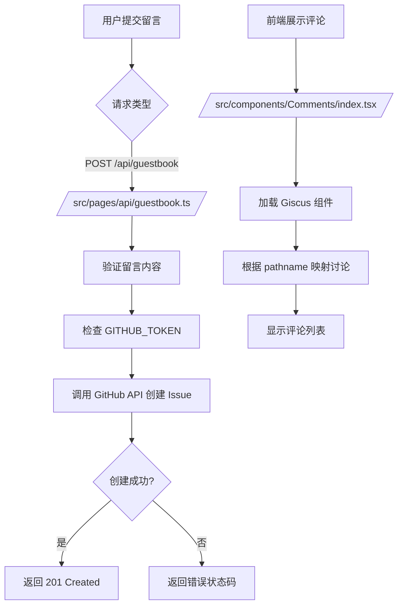
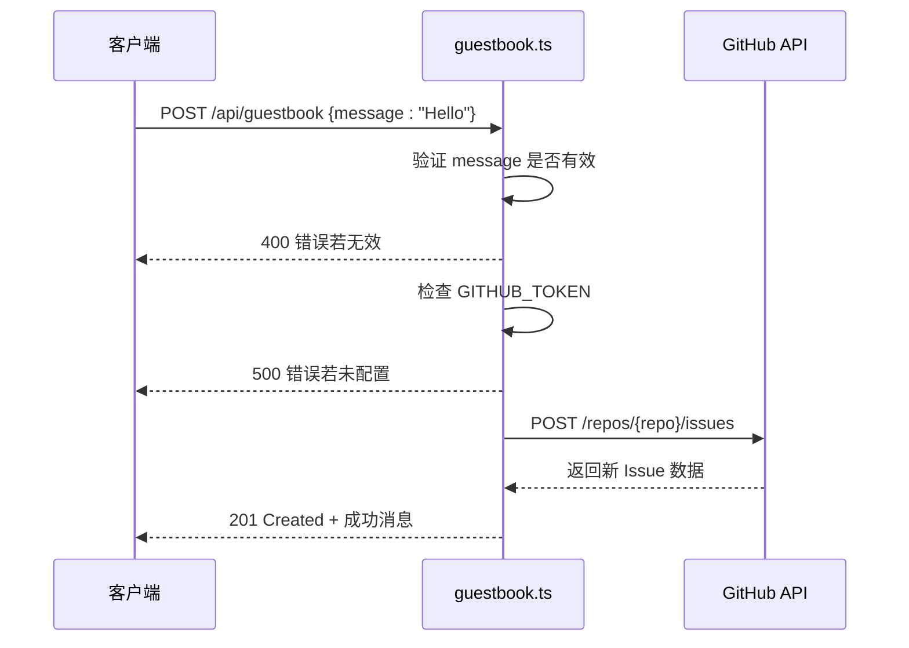
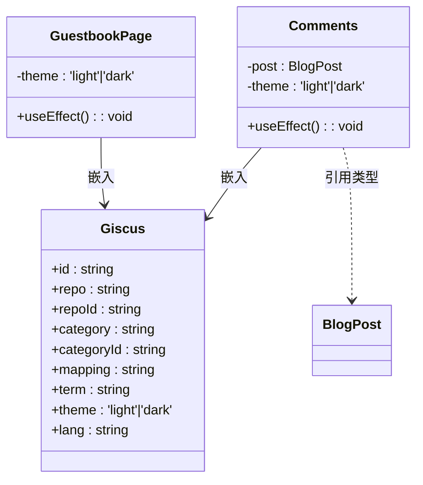

# 访客留言

<cite>
**本文档引用的文件**   
- [guestbook.ts](file://src/pages/api/guestbook.ts)
- [Comments/index.tsx](file://src/components/Comments/index.tsx)
- [guestbook.ts](file://src/types/guestbook.ts)
- [GuestbookPage/index.tsx](file://src/components/GuestbookPage/index.tsx)
</cite>

## 目录
1. [简介](#简介)
2. [项目结构](#项目结构)
3. [核心组件](#核心组件)
4. [架构概览](#架构概览)
5. [详细组件分析](#详细组件分析)
6. [依赖分析](#依赖分析)
7. [性能考虑](#性能考虑)
8. [故障排除指南](#故障排除指南)
9. [结论](#结论)

## 简介
本文档详细说明了访客留言系统的集成与运作机制。重点解析基于 API 路由 `/src/pages/api/guestbook.ts` 的请求处理逻辑，包括 POST 方法接收留言数据、数据验证与存储流程。阐述 `src/components/Comments/index.tsx` 如何嵌入 Giscus 评论组件，通过配置 repo、repoId、category 等参数实现 GitHub Issues 驱动的评论系统。说明 `guestbook.ts` 类型定义中留言条目结构，并指导开发者如何自定义评论主题、语言设置及权限控制。同时提供调试技巧，如检查浏览器控制台错误、验证环境变量配置正确性，以及处理跨域问题的方案。

## 项目结构
访客留言系统主要由以下几个部分构成：
- API 接口：`/src/pages/api/guestbook.ts`，用于处理留言提交请求。
- 评论组件：`/src/components/Comments/index.tsx` 和 `/src/components/GuestbookPage/index.tsx`，分别用于博客文章评论和独立留言板页面。
- 类型定义：`/src/types/guestbook.ts`，定义了从 GitHub Issues 获取的留言数据结构。
- 页面路由：`/src/pages/guestbook/index.tsx`，提供访客留言页面的入口。

该结构遵循 Next.js 的标准项目布局，将 API 路由、组件、类型和页面分离，便于维护和扩展。

**Section sources**
- [guestbook.ts](file://src/pages/api/guestbook.ts)
- [Comments/index.tsx](file://src/components/Comments/index.tsx)
- [GuestbookPage/index.tsx](file://src/components/GuestbookPage/index.tsx)
- [guestbook.ts](file://src/types/guestbook.ts)

## 核心组件
本系统的核心功能由 API 处理器和 Giscus 组件共同实现。API 处理器负责接收客户端提交的留言内容，进行基本验证后通过 GitHub API 创建 Issue；Giscus 组件则负责在前端渲染基于 GitHub Issues 的评论界面，支持主题适配、语言设置和交互功能。

**Section sources**
- [guestbook.ts](file://src/pages/api/guestbook.ts)
- [Comments/index.tsx](file://src/components/Comments/index.tsx)

## 架构概览
访客留言系统采用前后端分离架构，前端通过 Giscus 组件直接与 GitHub 的评论系统集成，而后端 API 用于支持自定义留言提交逻辑。整体流程如下：



**Diagram sources**
- [guestbook.ts](file://src/pages/api/guestbook.ts)
- [Comments/index.tsx](file://src/components/Comments/index.tsx)

## 详细组件分析

### API 路由处理逻辑分析
`/src/pages/api/guestbook.ts` 是处理留言提交的核心 API 路由。它仅接受 POST 请求，确保安全性。

当收到请求时，首先对请求体中的 `message` 字段进行验证，确保其存在、为字符串类型且非空。若验证失败，则返回 400 错误。

随后检查环境变量 `GITHUB_TOKEN` 是否配置。该 token 用于授权 GitHub API 调用，若未配置则返回 500 错误。

验证通过后，系统向 `https://api.github.com/repos/{repo}/issues` 发起 POST 请求，创建一个新的 Issue，标题为“来自留言板的新留言”，正文为用户输入的内容，并自动添加 `guestbook` 标签。

若 GitHub API 调用成功，返回 201 状态码及成功消息；否则捕获错误并返回相应状态码。



**Diagram sources**
- [guestbook.ts](file://src/pages/api/guestbook.ts#L1-L54)

**Section sources**
- [guestbook.ts](file://src/pages/api/guestbook.ts#L1-L54)

### Giscus 评论组件集成分析
`/src/components/Comments/index.tsx` 和 `/src/components/GuestbookPage/index.tsx` 均使用 `@giscus/react` 组件实现评论功能。

组件通过以下关键参数与 GitHub 仓库集成：
- `repo`: GitHub 仓库名称（如 woshidashuaibi-lsj/lusuijie-blog）
- `repoId`: 仓库唯一 ID，用于 Giscus 识别
- `category` 和 `categoryId`: 指定 Issue 所属分类，便于组织讨论
- `mapping`: 决定讨论与页面的映射方式，博客使用 `pathname`，留言板使用 `specific`
- `term`: 固定讨论主题，确保所有留言集中在一个讨论中
- `theme`: 动态适配系统明暗主题
- `lang`: 设置界面语言为中文（zh-CN）

此外，组件监听系统偏好主题变化，实现无缝的主题切换体验。



**Diagram sources**
- [Comments/index.tsx](file://src/components/Comments/index.tsx#L1-L45)
- [GuestbookPage/index.tsx](file://src/components/GuestbookPage/index.tsx#L1-L68)

**Section sources**
- [Comments/index.tsx](file://src/components/Comments/index.tsx#L1-L45)
- [GuestbookPage/index.tsx](file://src/components/GuestbookPage/index.tsx#L1-L68)

### 留言数据结构定义
`/src/types/guestbook.ts` 定义了从 GitHub API 获取的 Issue 数据结构，包含：
- `id`: Issue 唯一标识
- `html_url`: 访问链接
- `title`: 标题
- `user`: 发布用户信息（登录名、头像、主页）
- `created_at`: 创建时间
- `body`: 留言正文
- `comments`: 评论数量

该类型可用于前端展示留言列表或用户信息。

**Section sources**
- [guestbook.ts](file://src/types/guestbook.ts#L1-L14)

## 依赖分析
系统依赖关系如下：

```mermaid
graph LR
A[/src/pages/api/guestbook.ts/] --> B[GITHUB_TOKEN]
A --> C[GitHub API]
D[/src/components/Comments/index.tsx/] --> E[@giscus/react]
F[/src/components/GuestbookPage/index.tsx/] --> E
D --> G[window.matchMedia]
F --> G
E --> H[React]
E --> I[GitHub Issues]
```

**Diagram sources**
- [guestbook.ts](file://src/pages/api/guestbook.ts)
- [Comments/index.tsx](file://src/components/Comments/index.tsx)
- [GuestbookPage/index.tsx](file://src/components/GuestbookPage/index.tsx)

**Section sources**
- [guestbook.ts](file://src/pages/api/guestbook.ts)
- [Comments/index.tsx](file://src/components/Comments/index.tsx)
- [GuestbookPage/index.tsx](file://src/components/GuestbookPage/index.tsx)

## 性能考虑
- Giscus 组件使用 `loading="lazy"` 实现懒加载，提升首屏性能。
- 前端主题监听使用 `matchMedia` API，避免轮询开销。
- API 路由无数据库依赖，直接转发至 GitHub，响应速度快。
- 建议为 GitHub Token 设置适当的权限（如只读 Issues），提升安全性。

## 故障排除指南
常见问题及解决方案：

| 问题现象 | 可能原因 | 解决方案 |
|--------|--------|--------|
| 留言提交失败 | GITHUB_TOKEN 未配置或过期 | 检查 `.env` 文件中 `GITHUB_TOKEN` 是否正确 |
| 评论不显示 | repo 或 repoId 配置错误 | 登录 giscus.app 核对仓库信息 |
| 主题不跟随系统 | `matchMedia` 未正确监听 | 确保浏览器支持该 API 并检查事件绑定 |
| 跨域问题 | 部署域名与 giscus 配置不匹配 | 在 giscus.app 中添加部署域名到允许列表 |
| 提交返回 403 | GitHub Token 权限不足 | 为 Token 添加 `public_repo` 或 `repo` 权限 |

**Section sources**
- [guestbook.ts](file://src/pages/api/guestbook.ts)
- [Comments/index.tsx](file://src/components/Comments/index.tsx)

## 结论
访客留言系统通过集成 Giscus 和自定义 API 路由，实现了基于 GitHub Issues 的高效、安全的评论功能。系统结构清晰，易于维护和扩展。开发者可根据需求自定义主题、语言和权限设置，并通过完善的错误处理机制保障系统稳定性。