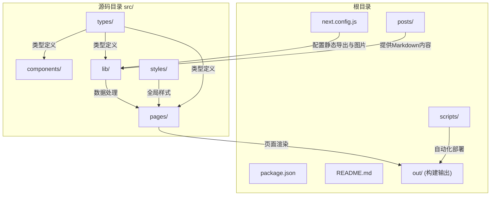
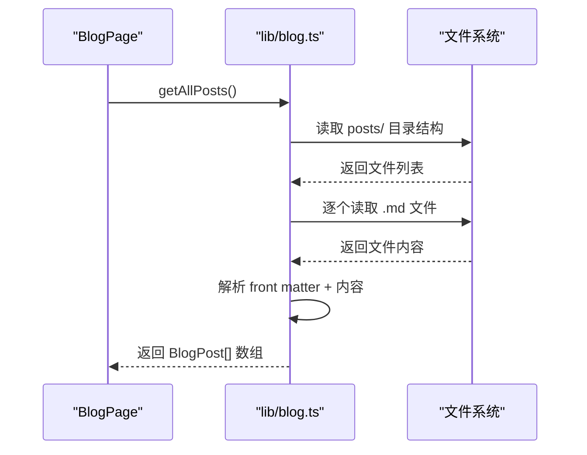
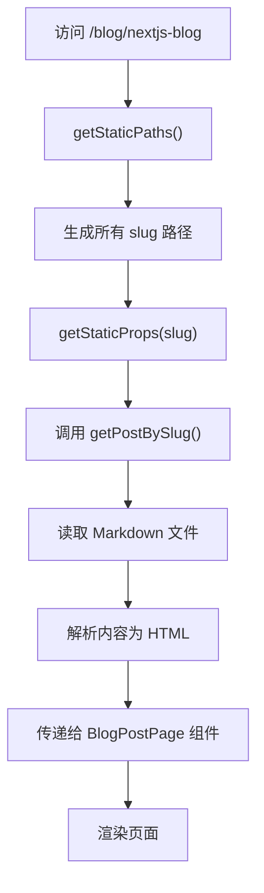
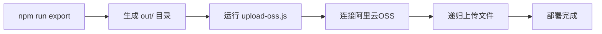

# 目录结构详解

<cite>
**本文档中引用的文件**  
- [next.config.js](file://next.config.js)
- [blog.ts](file://src/lib/blog.ts)
- [photos.ts](file://src/lib/photos.ts)
- [upload-oss.js](file://scripts/upload-oss.js)
- [_app.tsx](file://src/pages/_app.tsx)
- [blog.ts](file://src/types/blog.ts)
- [photo.ts](file://src/types/photo.ts)
- [Navigation/index.tsx](file://src/components/Navigation/index.tsx)
- [ThemeToggle/index.tsx](file://src/components/ThemeToggle/index.tsx)
- [index.tsx](file://src/pages/blog/index.tsx)
- [[slug].tsx](file://src/pages/blog/[slug].tsx)
- [PhotoPage/index.tsx](file://src/pages/PhotoPage/index.tsx)
- [BlogPostPage/index.tsx](file://src/pages/BlogPostPage/index.tsx)
- [BlogListPage/index.tsx](file://src/pages/BlogListPage/index.tsx)
- [BlogList/index.tsx](file://src/components/BlogList/index.tsx)
- [BlogItem/index.tsx](file://src/components/BlogItem/index.tsx)
</cite>

## 目录结构

本项目采用模块化、分层清晰的目录结构，支持功能分离与可维护性。整体结构分为内容源、源代码、脚本、构建输出和配置文件等主要部分。



**Diagram sources**  
- [next.config.js](file://next.config.js#L1-L13)
- [src/lib/blog.ts](file://src/lib/blog.ts#L1-L130)

## src/ 目录结构解析

`src/` 目录是项目的核心源码所在，按照职责划分为多个子目录，确保代码组织清晰、职责分明。

### components/：可复用UI组件

该目录存放所有可复用的React组件，如导航栏、主题切换按钮等。这些组件不依赖具体页面逻辑，可在多个页面间共享。

例如：
- `Navigation/`：实现网站主导航菜单，集成路由链接与外部链接（如GitHub）。
- `ThemeToggle/`：实现深色/浅色主题切换功能，利用`localStorage`保存用户偏好，并结合CSS类控制全局样式。

```mermaid
classDiagram
class Navigation {
+navItems : Array<{href, label}>
+externalLinks : Array<{href, label, icon}>
+render() : JSX.Element
}
class ThemeToggle {
-mounted : boolean
+toggleTheme(event) : void
+render() : JSX.Element
}
Navigation --> ThemeToggle : "包含"
```

**Diagram sources**  
- [Navigation/index.tsx](file://src/components/Navigation/index.tsx#L1-L73)
- [ThemeToggle/index.tsx](file://src/components/ThemeToggle/index.tsx#L1-L109)

**Section sources**  
- [Navigation/index.tsx](file://src/components/Navigation/index.tsx#L1-L73)
- [ThemeToggle/index.tsx](file://src/components/ThemeToggle/index.tsx#L1-L109)

### lib/：业务逻辑与数据处理

`lib/` 目录封装核心业务逻辑和数据处理函数，实现与UI解耦。

- `blog.ts`：负责从 `posts/` 目录读取Markdown文件，解析元数据（front matter），生成HTML内容，并提供文章列表、分类统计等功能。
- `photos.ts`：管理照片数据，包括静态照片集合、分类组织、排序等逻辑。

`blog.ts` 中的关键函数：
- `getAllPosts()`：遍历 `posts/` 下所有分类目录，提取每篇文章的元信息并返回排序后的文章列表。
- `getPostBySlug(slug, category)`：根据slug和分类查找并返回单篇文章对象。
- `markdownToHtml(markdown)`：将Markdown内容转换为HTML字符串，支持GFM语法。
- `getAllCategories()`：统计所有文章的分类及数量。



**Diagram sources**  
- [blog.ts](file://src/lib/blog.ts#L1-L130)
- [photos.ts](file://src/lib/photos.ts#L1-L135)

**Section sources**  
- [blog.ts](file://src/lib/blog.ts#L1-L130)
- [photos.ts](file://src/lib/photos.ts#L1-L135)

### pages/：Next.js页面与路由

`pages/` 目录实现Next.js的文件系统路由机制，每个`.tsx`文件对应一个URL路径。

关键页面结构：
- `index.tsx`：首页入口。
- `blog/`：文章列表页（`index.tsx`）和动态文章页（`[slug].tsx`）。
- `photo/`：照片墙页面。
- `_app.tsx`：自定义App组件，用于全局样式加载和布局共享。
- `_document.tsx`：自定义HTML文档结构。

动态路由 `[slug].tsx` 使用 `getStaticPaths` 和 `getStaticProps` 预生成所有文章页面，提升性能与SEO。



**Diagram sources**  
- [index.tsx](file://src/pages/blog/index.tsx#L1-L42)
- [[slug].tsx](file://src/pages/blog/[slug].tsx#L1-L63)

**Section sources**  
- [index.tsx](file://src/pages/blog/index.tsx#L1-L42)
- [[slug].tsx](file://src/pages/blog/[slug].tsx#L1-L63)

### styles/：全局样式管理

`styles/` 目录集中管理全局CSS样式，当前仅包含 `globals.css`，用于定义基础样式、重置默认样式及暗色主题变量。

通过 `_app.tsx` 引入，确保所有页面共享统一视觉风格。

**Section sources**  
- [globals.css](file://src/styles/globals.css)
- [_app.tsx](file://src/pages/_app.tsx#L1-L20)

### types/：TypeScript类型定义

`types/` 目录集中定义项目中使用的TypeScript接口，增强类型安全。

主要类型：
- `blog.ts`：定义 `BlogPost` 和 `BlogCategory` 接口，用于文章数据结构。
- `photo.ts`：定义 `Photo` 和 `PhotoCategory` 接口。
- `guestbook.ts`：定义GitHub Issues评论数据结构。

这些类型被 `lib/` 和 `pages/` 广泛引用，确保数据传递一致性。

**Section sources**  
- [blog.ts](file://src/types/blog.ts#L1-L31)
- [photo.ts](file://src/types/photo.ts#L1-L20)
- [guestbook.ts](file://src/types/guestbook.ts#L1-L13)

## posts/：内容源目录

`posts/` 目录作为博客内容的源文件存储区，采用Markdown格式编写文章，支持元数据（front matter）定义标题、日期、分类、标签等。

目录结构按分类组织：
```
posts/
├── life/
│   └── my-journey.md
└── tech/
    └── nextjs-blog.md
```

每篇Markdown文件示例如下：
```markdown
---
title: "我的旅程"
date: "2024-01-01"
category: "life"
tags: ["成长", "反思"]
description: "记录个人成长历程"
cover: "/images/cover.jpg"
---

正文内容...
```

`lib/blog.ts` 通过 `gray-matter` 解析front matter，并结合文件路径确定分类，实现内容与逻辑的解耦。

**Section sources**  
- [my-journey.md](file://posts/life/my-journey.md)
- [nextjs-blog.md](file://posts/tech/nextjs-blog.md)
- [blog.ts](file://src/lib/blog.ts#L1-L130)

## scripts/：自动化脚本与CI/CD

`scripts/` 目录包含自动化任务脚本，支持CI/CD流程。

核心脚本：
- `upload-oss.js`：将构建输出（`out/`）上传至阿里云OSS，实现静态网站部署。
  - 读取 `.env.production` 中的OSS配置。
  - 遍历 `out/` 目录，递归上传所有文件。
  - 为HTML文件设置UTF-8编码和缓存策略。
  - 支持连接测试与错误处理。

该脚本通常在CI环境中执行，作为部署流水线的最后一步。



**Diagram sources**  
- [upload-oss.js](file://scripts/upload-oss.js#L1-L84)

**Section sources**  
- [upload-oss.js](file://scripts/upload-oss.js#L1-L84)

## 构建与输出目录

### out/：静态导出目录

当执行 `next build && next export` 时，Next.js将应用预渲染为静态HTML文件，输出至 `out/` 目录。该目录内容可直接部署到CDN或对象存储服务（如OSS）。

### public/：静态资源（隐含）

虽然当前项目未显式列出 `public/`，但Next.js默认支持该目录存放静态资源（如图片、字体、favicon等），可通过根路径直接访问。

## next.config.js：构建配置核心

`next.config.js` 定义了关键构建行为：

- `output: 'export'`：启用静态导出模式，生成纯静态站点。
- `trailingSlash: true`：所有路由以斜杠结尾，提升一致性。
- `images.unoptimized: true`：禁用Next.js图像优化，因静态导出不支持动态图像处理。
- `pageExtensions`：扩展页面文件类型，支持 `.md` 等。

此配置确保项目可完全静态化，适合部署在OSS等静态托管服务上。

**Section sources**  
- [next.config.js](file://next.config.js#L1-L13)