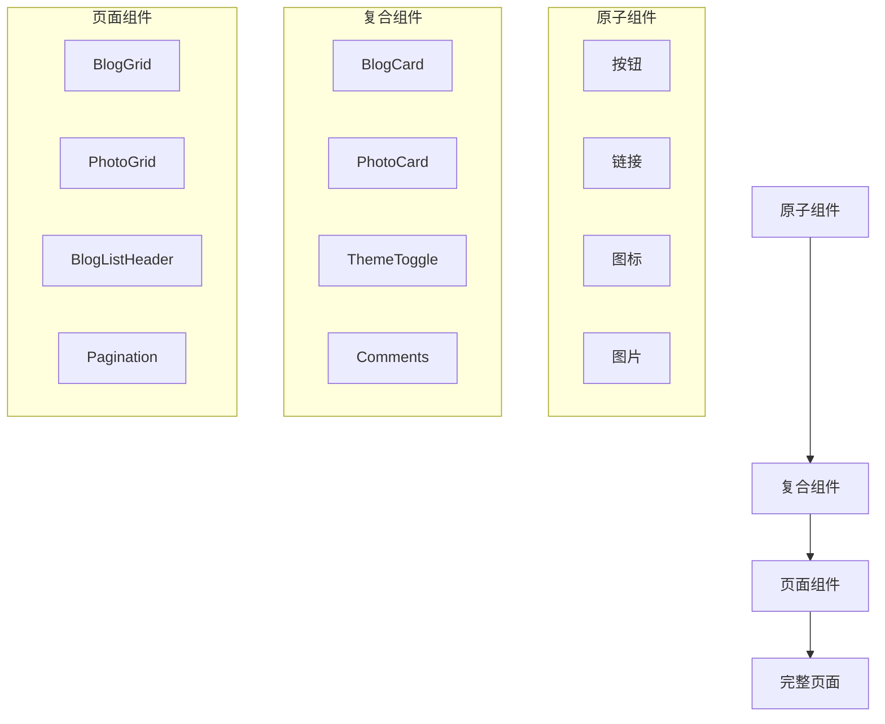
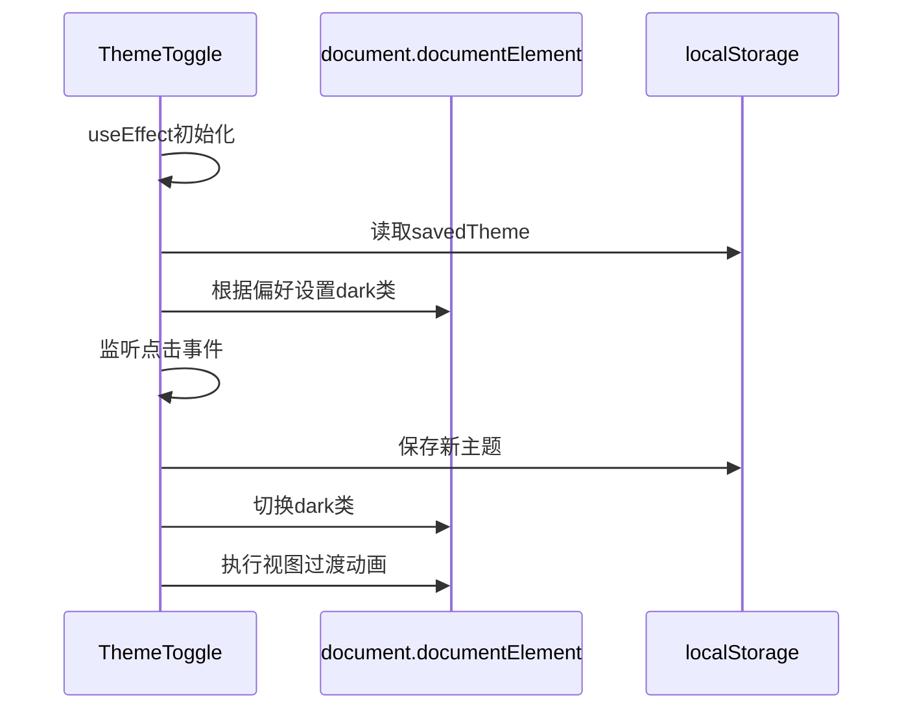
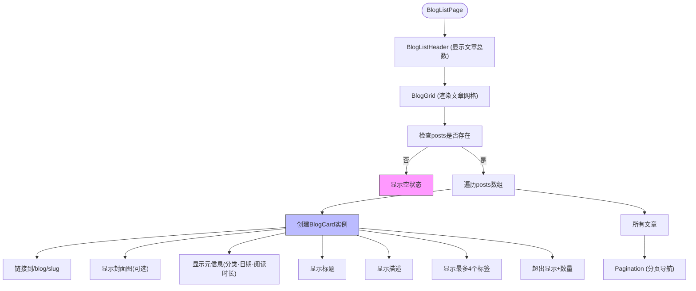
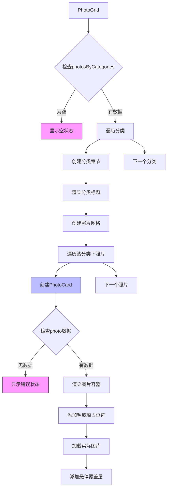
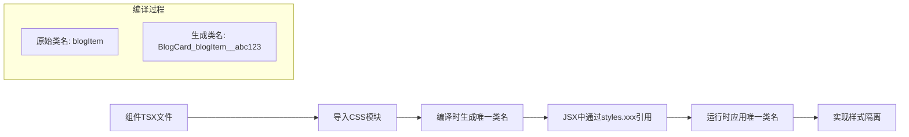
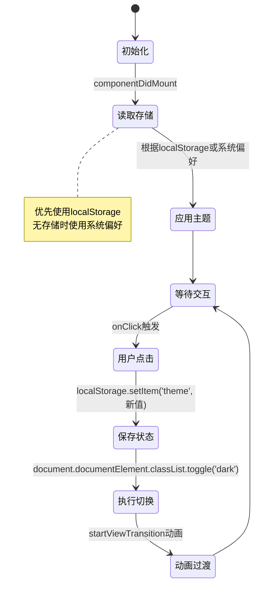
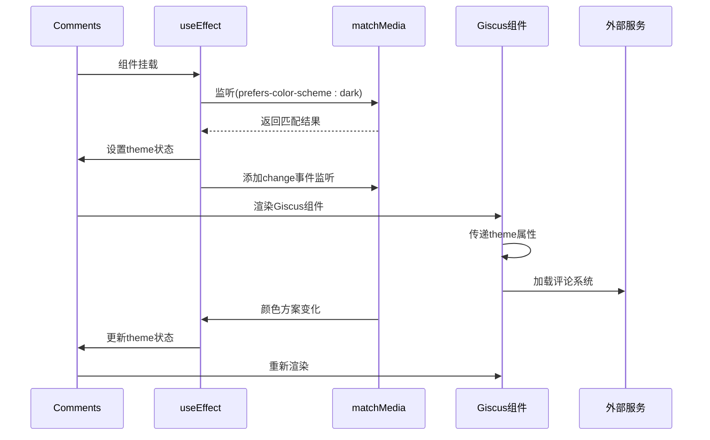

# UI组件

<cite>
**本文档中引用的文件**  
- [src/components/ThemeToggle/index.tsx](file://src/components/ThemeToggle/index.tsx)
- [src/components/Comments/index.tsx](file://src/components/Comments/index.tsx)
- [src/components/Navigation/index.tsx](file://src/components/Navigation/index.tsx)
- [src/pages/BlogListPage/components/BlogCard/index.tsx](file://src/pages/BlogListPage/components/BlogCard/index.tsx)
- [src/pages/BlogListPage/components/BlogGrid/index.tsx](file://src/pages/BlogListPage/components/BlogGrid/index.tsx)
- [src/pages/PhotoPage/components/PhotoCard/index.tsx](file://src/pages/PhotoPage/components/PhotoCard/index.tsx)
- [src/pages/BlogListPage/index.tsx](file://src/pages/BlogListPage/index.tsx)
- [src/pages/PhotoPage/index.tsx](file://src/pages/PhotoPage/index.tsx)
- [src/types/blog.ts](file://src/types/blog.ts)
- [src/types/photo.ts](file://src/types/photo.ts)
</cite>

## 目录
1. [简介](#简介)
2. [组件分层设计](#组件分层设计)
3. [核心原子组件](#核心原子组件)
4. [复合组件与组合关系](#复合组件与组合关系)
5. [样式隔离与CSS Modules](#样式隔离与css-modules)
6. [关键组件实现分析](#关键组件实现分析)
7. [可访问性与响应式设计](#可访问性与响应式设计)
8. [性能优化实践](#性能优化实践)
9. [结论](#结论)

## 简介
本项目构建了一套完整的UI组件体系，支持博客、照片墙、留言板等核心功能。组件体系遵循原子设计原则，通过CSS Modules实现样式隔离，并采用模块化方式组织代码。系统支持主题切换和第三方评论集成，具备良好的可维护性和扩展性。

## 组件分层设计
项目采用原子设计模式（Atomic Design）进行组件分层，分为原子组件和复合组件两个层级：

- **原子组件**：基础UI元素，如按钮、链接、图标等，具有高度复用性
- **复合组件**：由多个原子组件或低阶复合组件组合而成，完成特定业务功能

这种分层设计提高了组件的可维护性和可测试性，同时降低了组件间的耦合度。



**图示来源**
- [src/components/ThemeToggle/index.tsx](file://src/components/ThemeToggle/index.tsx#L5-L106)
- [src/pages/BlogListPage/components/BlogCard/index.tsx](file://src/pages/BlogListPage/components/BlogCard/index.tsx#L13-L89)
- [src/pages/PhotoPage/components/PhotoCard/index.tsx](file://src/pages/PhotoPage/components/PhotoCard/index.tsx#L12-L72)

## 核心原子组件
项目中的原子组件主要分布在`src/components/`目录下，为上层复合组件提供基础构建块。

### Navigation组件
导航组件提供站点主要路由入口和外部链接访问。

```mermaid
classDiagram
class Navigation {
+navItems : Array<{href : string, label : string}>
+externalLinks : Array<{href : string, label : string, icon : JSX.Element}>
+render() : JSX.Element
}
Navigation --> ThemeToggle : 包含
Navigation --> Link : 使用
```

**图示来源**
- [src/components/Navigation/index.tsx](file://src/components/Navigation/index.tsx#L33-L73)

**本节来源**
- [src/components/Navigation/index.tsx](file://src/components/Navigation/index.tsx#L1-L73)

### ThemeToggle组件
主题切换组件管理应用的整体视觉主题状态。



**图示来源**
- [src/components/ThemeToggle/index.tsx](file://src/components/ThemeToggle/index.tsx#L5-L106)

**本节来源**
- [src/components/ThemeToggle/index.tsx](file://src/components/ThemeToggle/index.tsx#L1-L108)

## 复合组件与组合关系
复合组件通过组合原子组件实现特定业务功能，形成更高层次的抽象。

### BlogCard与BlogGrid
文章卡片组件与文章网格组件构成典型的"单项-列表"关系。



**图示来源**
- [src/pages/BlogListPage/index.tsx](file://src/pages/BlogListPage/index.tsx#L1-L37)
- [src/pages/BlogListPage/components/BlogGrid/index.tsx](file://src/pages/BlogListPage/components/BlogGrid/index.tsx#L8-L25)
- [src/pages/BlogListPage/components/BlogCard/index.tsx](file://src/pages/BlogListPage/components/BlogCard/index.tsx#L13-L89)

**本节来源**
- [src/pages/BlogListPage/index.tsx](file://src/pages/BlogListPage/index.tsx#L1-L37)
- [src/pages/BlogListPage/components/BlogGrid/index.tsx](file://src/pages/BlogListPage/components/BlogGrid/index.tsx#L1-L25)
- [src/pages/BlogListPage/components/BlogCard/index.tsx](file://src/pages/BlogListPage/components/BlogCard/index.tsx#L1-L89)

### PhotoCard与PhotoGrid
照片卡片组件与照片网格组件实现照片墙的核心展示功能。



**图示来源**
- [src/pages/PhotoPage/index.tsx](file://src/pages/PhotoPage/index.tsx#L1-L84)
- [src/pages/PhotoPage/components/PhotoGrid/index.tsx](file://src/pages/PhotoPage/components/PhotoGrid/index.tsx#L1-L105)
- [src/pages/PhotoPage/components/PhotoCard/index.tsx](file://src/pages/PhotoPage/components/PhotoCard/index.tsx#L12-L72)

**本节来源**
- [src/pages/PhotoPage/index.tsx](file://src/pages/PhotoPage/index.tsx#L1-L84)
- [src/pages/PhotoPage/components/PhotoGrid/index.tsx](file://src/pages/PhotoPage/components/PhotoGrid/index.tsx#L1-L105)
- [src/pages/PhotoPage/components/PhotoCard/index.tsx](file://src/pages/PhotoPage/components/PhotoCard/index.tsx#L1-L72)

## 样式隔离与CSS Modules
项目采用CSS Modules实现样式隔离，避免全局样式污染。

### 实现机制
每个组件的CSS文件使用`*.module.css`命名约定，通过`import styles from './index.module.css'`导入，自动启用模块化。



**本节来源**
- 所有`*.module.css`文件的使用模式

## 关键组件实现分析
对项目中两个关键功能组件进行深入分析。

### ThemeToggle状态管理
主题切换组件实现了持久化的主题状态管理。



**图示来源**
- [src/components/ThemeToggle/index.tsx](file://src/components/ThemeToggle/index.tsx#L5-L106)

**本节来源**
- [src/components/ThemeToggle/index.tsx](file://src/components/ThemeToggle/index.tsx#L1-L108)

### Comments与Giscus集成
评论组件集成了Giscus第三方评论系统。



**图示来源**
- [src/components/Comments/index.tsx](file://src/components/Comments/index.tsx#L9-L45)

**本节来源**
- [src/components/Comments/index.tsx](file://src/components/Comments/index.tsx#L1-L45)

## 可访问性与响应式设计
项目在可访问性和响应式设计方面采用了多项最佳实践。

### 可访问性措施
- 所有交互元素提供`aria-label`属性
- 导航结构清晰，支持键盘导航
- 图片元素包含有意义的`alt`文本
- 足够的色彩对比度满足WCAG标准
- 语义化HTML标签使用

### 响应式设计策略
- 移动优先的CSS设计
- 弹性布局（Flexbox）和网格布局（Grid）
- 媒体查询适配不同屏幕尺寸
- 图片懒加载优化性能
- 触摸友好的点击区域

**本节来源**
- 所有组件的HTML结构和CSS样式

## 性能优化实践
项目在多个层面实施了性能优化措施。

### 图片加载优化
- 使用Next.js Image组件进行优化
- 启用懒加载（loading="lazy"）
- 错误处理：图片加载失败时隐藏占位区域
- 提供宽高属性避免布局偏移

### 组件渲染优化
- 条件渲染空状态和错误状态
- 使用`useMemo`和`useCallback`记忆化
- 避免不必要的重新渲染
- 分页加载大量数据

### 资源加载优化
- 主题切换使用CSS类而非加载新样式表
- 第三方脚本懒加载
- 静态资源CDN分发
- 本地存储减少重复计算

**本节来源**
- [src/pages/BlogListPage/components/BlogCard/index.tsx](file://src/pages/BlogListPage/components/BlogCard/index.tsx#L13-L89)
- [src/pages/PhotoPage/components/PhotoCard/index.tsx](file://src/pages/PhotoPage/components/PhotoCard/index.tsx#L12-L72)
- [src/components/Comments/index.tsx](file://src/components/Comments/index.tsx#L9-L45)

## 结论
my-blog项目的UI组件体系设计合理，遵循现代前端开发的最佳实践。通过原子设计原则构建的组件层级清晰，CSS Modules确保了样式隔离，关键功能组件实现了复杂的状态管理和第三方集成。项目在可访问性、响应式设计和性能优化方面均有良好表现，为用户提供流畅的交互体验，同时也为开发者提供了良好的维护性和扩展性。