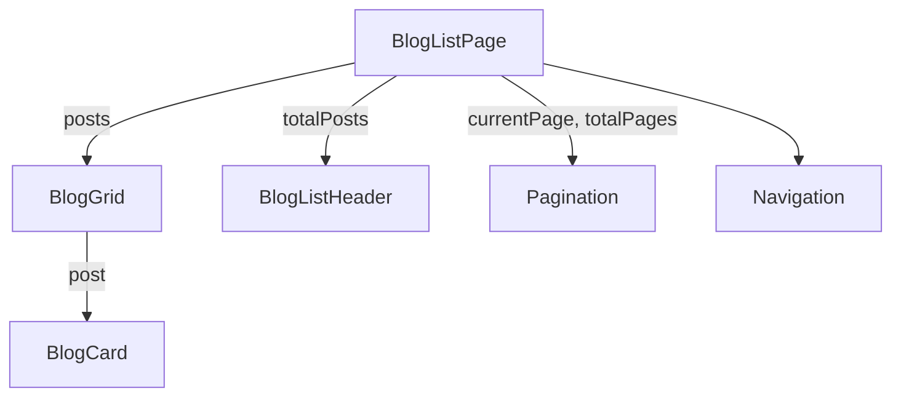

# 组件架构

<cite>
**本文档中引用的文件**  
- [HomePage/index.tsx](file://src/pages/HomePage/index.tsx)
- [BlogListPage/index.tsx](file://src/pages/BlogListPage/index.tsx)
- [BlogPostPage/index.tsx](file://src/pages/BlogPostPage/index.tsx)
- [_app.tsx](file://src/pages/_app.tsx)
- [BlogCard/index.tsx](file://src/pages/BlogListPage/components/BlogCard/index.tsx)
- [BlogGrid/index.tsx](file://src/pages/BlogListPage/components/BlogGrid/index.tsx)
- [PhotoGrid/index.tsx](file://src/pages/PhotoPage/components/PhotoGrid/index.tsx)
- [BlogList/index.tsx](file://src/components/BlogList/index.tsx)
- [HeroSection/index.tsx](file://src/components/HeroSection/index.tsx)
- [Navigation/index.tsx](file://src/components/Navigation/index.tsx)
</cite>

## 目录
1. [介绍](#介绍)
2. [页面组件与路由入口](#页面组件与路由入口)
3. [UI组件的分层设计](#ui组件的分层设计)
4. [_app.tsx 的全局作用](#_apptsx-的全局作用)
5. [CSS Modules 的样式隔离机制](#css-modules-的样式隔离机制)
6. [组件树与数据流示例](#组件树与数据流示例)
7. [结论](#结论)

## 介绍
本项目 my-blog 是一个基于 Next.js 的个人博客系统，采用 Pages Router 模式进行路由管理。前端组件架构清晰地划分为页面级组件和可复用的 UI 组件，通过模块化设计实现高内聚、低耦合的开发模式。本文将深入剖析其组件架构，重点分析页面组件作为路由入口和数据获取中心的角色，UI 组件的分层结构，以及全局布局与样式管理机制。

## 页面组件与路由入口

在 Next.js 的 Pages Router 架构中，`src/pages/` 目录下的每个文件或目录都对应一个 URL 路由。这些页面组件不仅是用户访问的入口点，也是数据获取和初始渲染的核心。

例如：
- `HomePage/index.tsx` 对应根路径 `/`，是网站的首页。
- `BlogListPage/index.tsx` 对应 `/blog` 路径，展示所有文章列表。
- `BlogPostPage/index.tsx` 结合动态路由 `[slug].tsx` 实现文章详情页，如 `/blog/nextjs-blog`。

这些页面组件通常负责从服务端获取数据（可通过 `getServerSideProps` 或 `getStaticProps`），并将数据作为 props 传递给下层 UI 组件。它们本身不包含复杂的 UI 逻辑，而是作为“容器”组织和协调子组件。

**组件示例：BlogListPage**
该组件接收 `posts`、`currentPage`、`totalPages` 等分页信息，并将其分发给 `BlogListHeader`、`BlogGrid` 和 `Pagination` 等子组件，形成完整的文章列表页面。

**组件示例：BlogPostPage**
当文章数据缺失时，该组件会渲染错误状态；否则，它组合 `BlogHeader`、`BlogContent`、`TableOfContents` 和 `Comments` 等组件，构建出结构丰富的文章详情页。

**组件示例：HomePage**
作为首页，它组合了 `HeroSection` 和 `BlogList`，展示作者介绍和推荐文章。

**本节来源**
- [HomePage/index.tsx](file://src/pages/HomePage/index.tsx#L9-L17)
- [BlogListPage/index.tsx](file://src/pages/BlogListPage/index.tsx#L14-L37)
- [BlogPostPage/index.tsx](file://src/pages/BlogPostPage/index.tsx#L13-L53)

## UI组件的分层设计

项目中的 UI 组件采用分层设计理念，位于 `src/components/` 和各页面的 `components/` 子目录中，形成原子化、可复用的组件体系。

### 原子组件
位于 `src/components/` 的组件如 `Navigation`、`HeroSection`、`ThemeToggle` 等，是跨页面复用的基础 UI 单元。例如：
- `Navigation` 提供全局导航栏，包含主菜单和外链图标。
- `HeroSection` 展示首页的个人介绍区域。

### 页面内组件
位于 `src/pages/*/components/` 的组件专用于特定页面，进一步拆分复杂 UI。例如在 `BlogListPage` 中：
- `BlogCard`：单篇文章的卡片展示，包含封面图、标题、元信息等。
- `BlogGrid`：以网格形式排列多个 `BlogCard`。
- `Pagination`：分页控件。

这种分层方式使得组件职责单一，易于维护和测试。`BlogGrid` 仅负责布局排列，`BlogCard` 仅负责单个条目渲染，二者通过 props 解耦。

**本节来源**
- [BlogCard/index.tsx](file://src/pages/BlogListPage/components/BlogCard/index.tsx#L1-L89)
- [BlogGrid/index.tsx](file://src/pages/BlogListPage/components/BlogGrid/index.tsx#L1-L25)
- [PhotoGrid/index.tsx](file://src/pages/PhotoPage/components/PhotoGrid/index.tsx#L1-L105)

## _app.tsx 的全局作用

`src/pages/_app.tsx` 是 Next.js 应用的自定义入口文件，用于提供全局布局、状态管理和样式注入。

### 全局布局
所有页面共享 `_app.tsx` 中定义的布局结构。例如，`Navigation` 组件被放置在 `<Component {...pageProps} />` 之前，确保每个页面顶部都显示导航栏。

### 样式注入
通过导入 `../styles/globals.css`，全局样式被统一加载，确保基础样式（如字体、颜色变量）在整个应用中生效。

### 元信息管理
使用 `next/head` 组件统一设置 `<title>`、`<meta>` 等 HTML 头部信息，提升 SEO 和用户体验。

### 字体加载
通过 CDN 引入“霞鹜文楷”字体，增强中文排版的美观性。

```mermaid
graph TD
A[_app.tsx] --> B[Head 元信息]
A --> C[全局 CSS]
A --> D[Navigation 导航]
A --> E[Component 页面组件]
B --> F[页面标题]
B --> G[描述信息]
C --> H[主题变量]
D --> I[主页 | 文章 | 照片墙]
E --> J[HomePage]
E --> K[BlogListPage]
E --> L[BlogPostPage]
```

**图示来源**
- [_app.tsx](file://src/pages/_app.tsx#L1-L20)

## CSS Modules 的样式隔离机制

项目广泛使用 CSS Modules（文件名以 `.module.css` 结尾）来实现样式的局部作用域，避免全局 CSS 污染。

### 工作原理
每个 `.module.css` 文件在构建时会被编译为唯一的类名（如 `blogItem__hash123`），确保样式仅作用于当前组件。

### 示例分析
在 `BlogCard/index.module.css` 中定义的 `.blogItem` 类，通过 `import styles from './index.module.css'` 导入后，以 `styles.blogItem` 的形式使用。这种方式彻底隔离了不同组件间的样式冲突。

### 响应式支持
CSS Modules 完全支持媒体查询，如 `BlogGrid/index.module.css` 中定义了移动端的间距调整，确保在不同设备上均有良好表现。

**本节来源**
- [BlogGrid/index.module.css](file://src/pages/BlogListPage/components/BlogGrid/index.module.css#L1-L23)
- [index.module.css](file://src/pages/BlogListPage/index.module.css#L1-L9)

## 组件树与数据流示例

以 `BlogListPage` 为例，展示数据和 props 在组件间的传递方式。

### 组件树结构
```
BlogListPage
├── Navigation
├── BlogListHeader (接收 totalPosts)
├── BlogGrid (接收 posts)
│   └── BlogCard (接收单个 post)
└── Pagination (接收 currentPage, totalPages)
```

### 数据流分析
1. `BlogListPage` 从服务端获取文章列表数据。
2. 数据通过 `posts` prop 传递给 `BlogGrid`。
3. `BlogGrid` 使用 `map` 遍历 `posts`，为每个 `post` 创建一个 `BlogCard` 实例，并将其作为 prop 传入。
4. `BlogCard` 渲染单篇文章的封面、标题、日期、标签等信息。

这种自上而下的单向数据流保证了状态的可预测性和调试的便利性。



**图示来源**
- [BlogListPage/index.tsx](file://src/pages/BlogListPage/index.tsx#L14-L37)
- [BlogGrid/index.tsx](file://src/pages/BlogListPage/components/BlogGrid/index.tsx#L1-L25)
- [BlogCard/index.tsx](file://src/pages/BlogListPage/components/BlogCard/index.tsx#L1-L89)

## 结论
my-blog 项目的前端组件架构体现了现代 React 应用的最佳实践。通过 Pages Router 模式明确路由与页面的映射关系，页面组件承担数据获取和组合职责，UI 组件实现分层复用，`_app.tsx` 提供全局基础设施，CSS Modules 保障样式隔离。整个架构清晰、可维护性强，为博客类应用提供了良好的扩展基础。