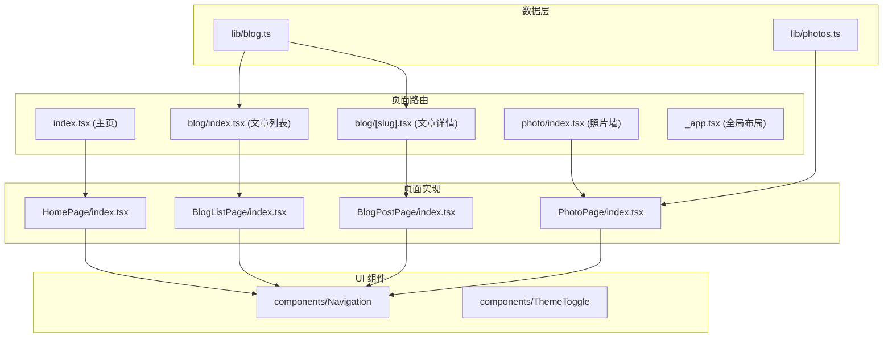
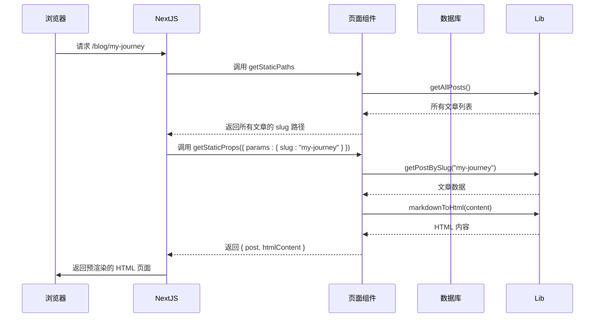
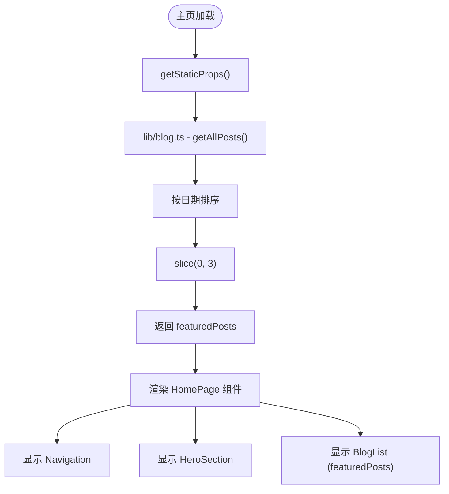
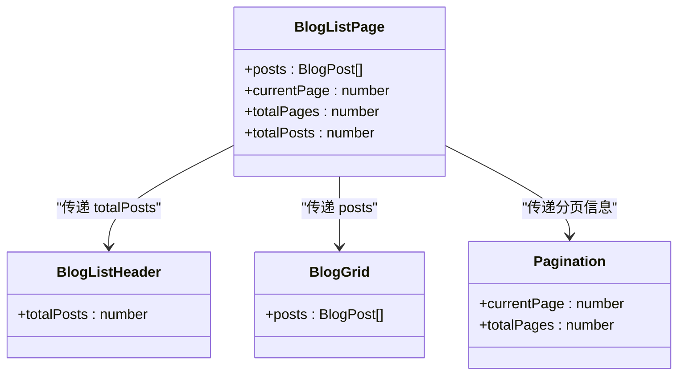
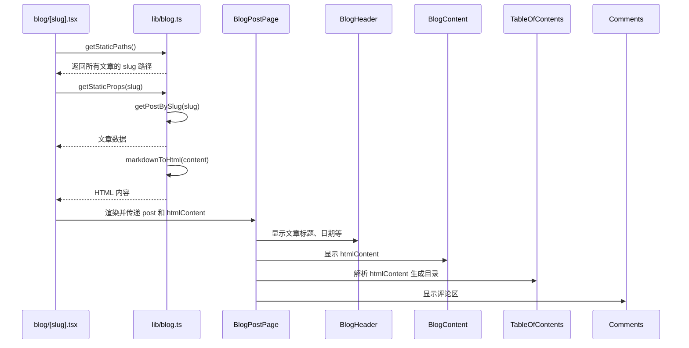
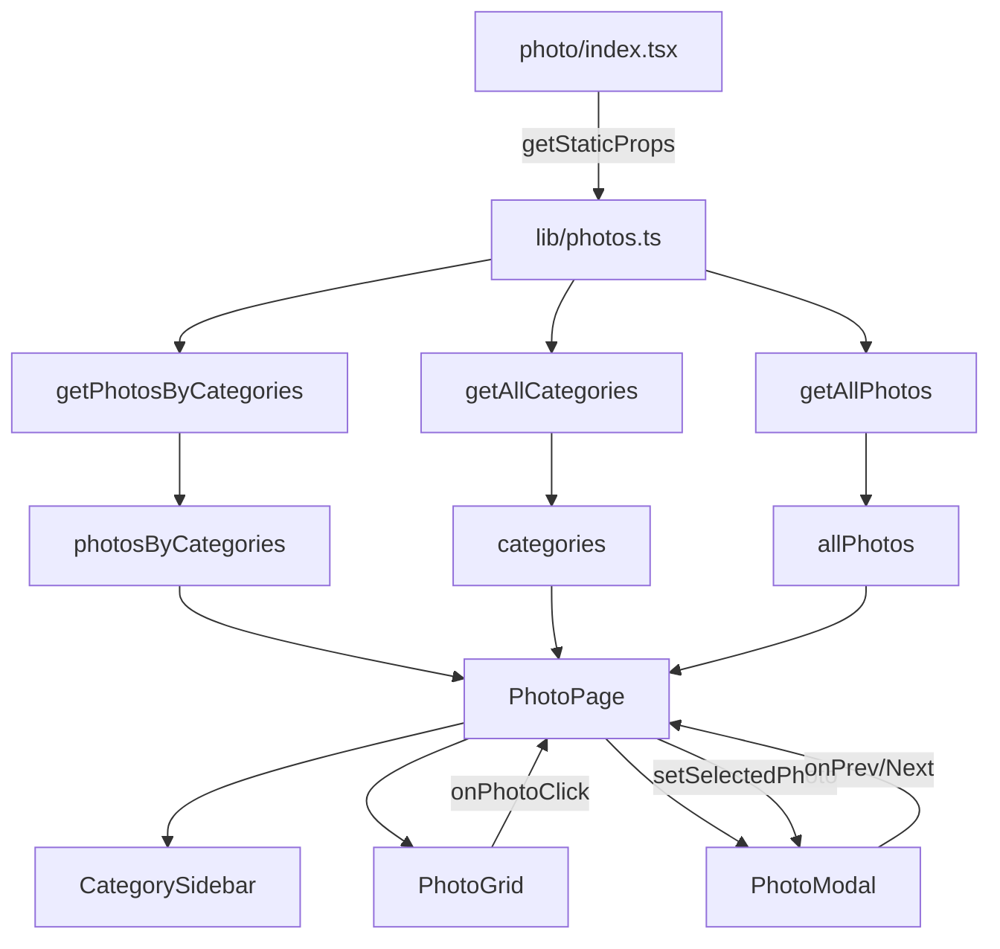
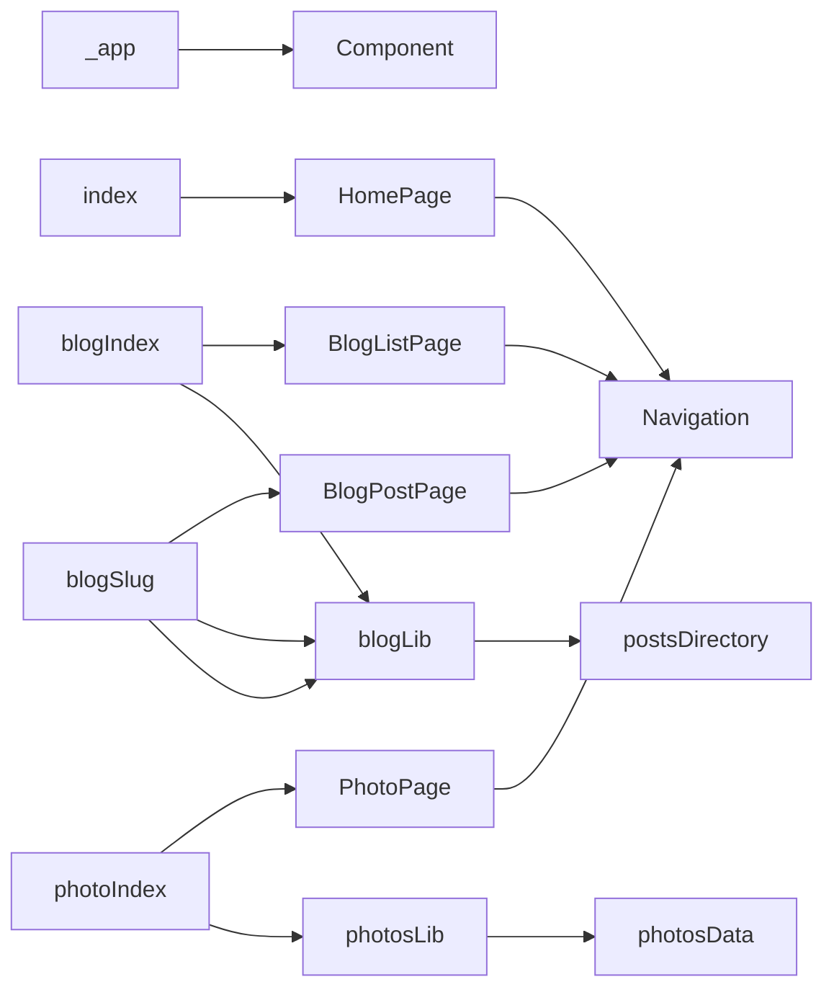

# 页面组件

<cite>
**本文档引用的文件**
- [src/pages/index.tsx](file://src/pages/index.tsx)
- [src/pages/blog/index.tsx](file://src/pages/blog/index.tsx)
- [src/pages/blog/\[slug\].tsx](file://src/pages/blog/[slug].tsx)
- [src/pages/PhotoPage/index.tsx](file://src/pages/PhotoPage/index.tsx)
- [src/pages/BlogListPage/index.tsx](file://src/pages/BlogListPage/index.tsx)
- [src/pages/_app.tsx](file://src/pages/_app.tsx)
- [src/lib/blog.ts](file://src/lib/blog.ts)
- [src/lib/photos.ts](file://src/lib/photos.ts)
- [src/pages/HomePage/index.tsx](file://src/pages/HomePage/index.tsx)
- [src/pages/BlogPostPage/index.tsx](file://src/pages/BlogPostPage/index.tsx)
- [src/components/Navigation/index.tsx](file://src/components/Navigation/index.tsx)
- [src/types/blog.ts](file://src/types/blog.ts)
- [src/types/photo.ts](file://src/types/photo.ts)
</cite>

## 目录
1. [介绍](#介绍)
2. [项目结构](#项目结构)
3. [核心组件](#核心组件)
4. [架构概述](#架构概述)
5. [详细组件分析](#详细组件分析)
6. [依赖分析](#依赖分析)
7. [性能考虑](#性能考虑)
8. [故障排除指南](#故障排除指南)
9. [结论](#结论)

## 介绍
本文档深入剖析 my-blog 项目中 `src/pages/` 目录下的页面组件架构。重点阐述 Next.js 的 Pages Router 模式如何将每个 `.tsx` 文件映射为路由路径，以及页面组件在数据获取、静态生成和 UI 组合中的核心作用。

## 项目结构

**图示来源**
- [src/pages/index.tsx](file://src/pages/index.tsx)
- [src/pages/blog/index.tsx](file://src/pages/blog/index.tsx)
- [src/pages/blog/[slug].tsx](file://src/pages/blog/[slug].tsx)
- [src/pages/PhotoPage/index.tsx](file://src/pages/PhotoPage/index.tsx)
- [src/lib/blog.ts](file://src/lib/blog.ts)
- [src/lib/photos.ts](file://src/lib/photos.ts)
- [src/components/Navigation/index.tsx](file://src/components/Navigation/index.tsx)

**本节来源**
- [src/pages/index.tsx](file://src/pages/index.tsx)
- [src/pages/blog/index.tsx](file://src/pages/blog/index.tsx)
- [src/pages/blog/[slug].tsx](file://src/pages/blog/[slug].tsx)
- [src/pages/PhotoPage/index.tsx](file://src/pages/PhotoPage/index.tsx)

## 核心组件

`src/pages/` 目录下的文件是 Next.js 应用的路由入口。每个 `.tsx` 文件对应一个 URL 路径，例如 `blog/[slug].tsx` 对应 `/blog/文章标题` 这样的动态路由。这些页面文件通常导出一个默认的 React 组件，并可选择性地使用 `getStaticProps` 和 `getStaticPaths` 等 Next.js 数据获取函数来实现静态生成（SSG）。

**本节来源**
- [src/pages/index.tsx](file://src/pages/index.tsx)
- [src/pages/blog/index.tsx](file://src/pages/blog/index.tsx)
- [src/pages/blog/[slug].tsx](file://src/pages/blog/[slug].tsx)

## 架构概述

**图示来源**
- [src/pages/blog/[slug].tsx](file://src/pages/blog/[slug].tsx)
- [src/lib/blog.ts](file://src/lib/blog.ts)

## 详细组件分析

### 主页分析

`HomePage` 组件是网站的入口。它通过 `getStaticProps` 从 `lib/blog.ts` 获取最新的三篇文章作为特色文章，并将这些数据作为 `featuredPosts` 传递给 `HomePage` 组件。`HomePage` 组件本身则负责组合 `Navigation`、`HeroSection` 和 `BlogList` 等 UI 组件来构建完整的页面。

**图示来源**
- [src/pages/index.tsx](file://src/pages/index.tsx)
- [src/lib/blog.ts](file://src/lib/blog.ts)
- [src/pages/HomePage/index.tsx](file://src/pages/HomePage/index.tsx)

**本节来源**
- [src/pages/index.tsx](file://src/pages/index.tsx)
- [src/pages/HomePage/index.tsx](file://src/pages/HomePage/index.tsx)

### 文章列表页分析

`BlogListPage` 组件负责展示所有博客文章。`blog/index.tsx` 文件作为路由入口，调用 `getStaticProps` 获取所有文章数据，并将其传递给 `BlogListPage` 组件。`BlogListPage` 组件接收 `posts`、`currentPage` 等 props，并将其传递给 `BlogListHeader`、`BlogGrid` 和 `Pagination` 等子组件，实现数据流的分发。

**图示来源**
- [src/pages/blog/index.tsx](file://src/pages/blog/index.tsx)
- [src/pages/BlogListPage/index.tsx](file://src/pages/BlogListPage/index.tsx)
- [src/pages/BlogListPage/components/BlogListHeader/index.tsx](file://src/pages/BlogListPage/components/BlogListHeader/index.tsx)
- [src/pages/BlogListPage/components/BlogGrid/index.tsx](file://src/pages/BlogListPage/components/BlogGrid/index.tsx)
- [src/pages/BlogListPage/components/Pagination/index.tsx](file://src/pages/BlogListPage/components/Pagination/index.tsx)

**本节来源**
- [src/pages/blog/index.tsx](file://src/pages/blog/index.tsx)
- [src/pages/BlogListPage/index.tsx](file://src/pages/BlogListPage/index.tsx)

### 文章详情页分析

`BlogPostPage` 组件用于展示单篇博客文章的完整内容。`blog/[slug].tsx` 是一个动态路由，其 `getStaticPaths` 函数会根据 `lib/blog.ts` 中的所有文章生成所有可能的路径。`getStaticProps` 函数则根据 `slug` 参数获取对应的文章数据和 Markdown 转换后的 HTML 内容。`BlogPostPage` 组件负责将这些数据与 `BlogHeader`、`BlogContent`、`TableOfContents` 和 `Comments` 等组件集成。

**图示来源**
- [src/pages/blog/[slug].tsx](file://src/pages/blog/[slug].tsx)
- [src/lib/blog.ts](file://src/lib/blog.ts)
- [src/pages/BlogPostPage/index.tsx](file://src/pages/BlogPostPage/index.tsx)

**本节来源**
- [src/pages/blog/[slug].tsx](file://src/pages/blog/[slug].tsx)
- [src/pages/BlogPostPage/index.tsx](file://src/pages/BlogPostPage/index.tsx)

### 照片墙页面分析

`PhotoPage` 是一个客户端组件（使用 `'use client'`），它管理着照片的交互状态，如选中的照片和活动分类。`photo/index.tsx` 路由文件负责通过 `getStaticProps` 预获取所有照片数据，并将其作为 `props` 传递给 `PhotoPage`。`PhotoPage` 组件内部使用 `useState` 来管理状态，并通过 `CategorySidebar` 和 `PhotoGrid` 组件实现分类筛选和照片展示，通过 `PhotoModal` 实现照片的模态框预览和切换。

**图示来源**
- [src/pages/PhotoPage/index.tsx](file://src/pages/PhotoPage/index.tsx)
- [src/lib/photos.ts](file://src/lib/photos.ts)

**本节来源**
- [src/pages/PhotoPage/index.tsx](file://src/pages/PhotoPage/index.tsx)

## 依赖分析

**图示来源**
- [src/pages/_app.tsx](file://src/pages/_app.tsx)
- [src/pages/index.tsx](file://src/pages/index.tsx)
- [src/pages/blog/index.tsx](file://src/pages/blog/index.tsx)
- [src/pages/blog/[slug].tsx](file://src/pages/blog/[slug].tsx)
- [src/pages/PhotoPage/index.tsx](file://src/pages/PhotoPage/index.tsx)
- [src/lib/blog.ts](file://src/lib/blog.ts)
- [src/lib/photos.ts](file://src/lib/photos.ts)
- [src/components/Navigation/index.tsx](file://src/components/Navigation/index.tsx)

**本节来源**
- [src/pages/_app.tsx](file://src/pages/_app.tsx)
- [src/lib/blog.ts](file://src/lib/blog.ts)
- [src/lib/photos.ts](file://src/lib/photos.ts)

## 性能考虑

- **静态生成 (SSG)**: 所有页面均采用 `getStaticProps` 和 `getStaticPaths` 进行静态生成，极大提升了页面加载速度和 SEO。
- **Markdown 处理**: `markdownToHtml` 函数在构建时将 Markdown 转换为 HTML，避免了客户端的解析开销。
- **图片处理**: 照片数据使用外部 CDN 链接，减轻了服务器负担。
- **代码分割**: Next.js 自动进行代码分割，确保用户只加载当前页面所需的代码。

## 故障排除指南

- **文章未找到**: `blog/[slug].tsx` 中的 `getStaticProps` 返回 `notFound: true`，确保 `posts/` 目录下的 Markdown 文件命名正确。
- **数据未加载**: 检查 `lib/blog.ts` 和 `lib/photos.ts` 中的数据读取逻辑，确保文件路径和格式正确。
- **样式问题**: 确认 CSS Module 的类名是否正确导入和使用。
- **路由错误**: 检查 `pages/` 目录下的文件名和路径是否符合 Next.js 的约定。

## 结论

my-blog 项目的页面组件架构清晰地体现了 Next.js Pages Router 的设计思想。通过将路由、数据获取和 UI 组件分离，实现了高内聚、低耦合的代码结构。`_app.tsx` 提供了全局布局，而各个页面文件则作为数据获取中心，通过 `getStaticProps` 和 `getStaticPaths` 实现高效的静态生成。这种架构不仅提升了性能和 SEO，也使得代码更易于维护和扩展。