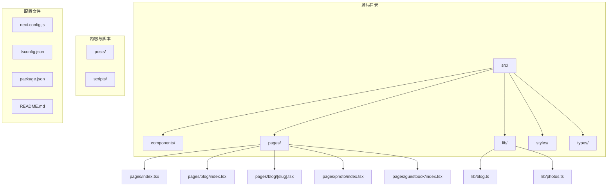
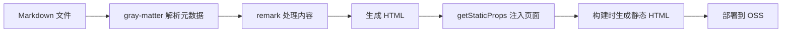
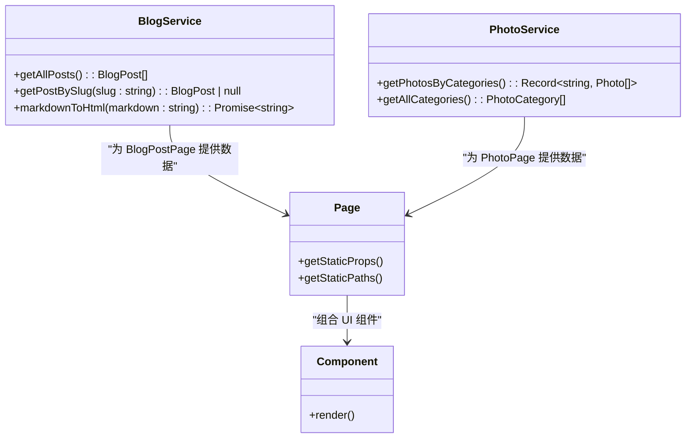
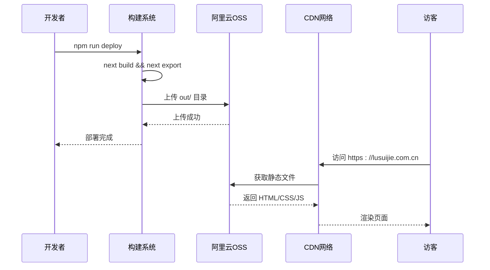

# 项目概述

<cite>
**本文档引用的文件**  
- [README.md](file://README.md)
- [next.config.js](file://next.config.js)
- [tsconfig.json](file://tsconfig.json)
- [package.json](file://package.json)
- [src/pages/_app.tsx](file://src/pages/_app.tsx)
- [src/pages/index.tsx](file://src/pages/index.tsx)
- [src/pages/blog/index.tsx](file://src/pages/blog/index.tsx)
- [src/pages/blog/[slug].tsx](file://src/pages/blog/[slug].tsx)
- [src/pages/photo/index.tsx](file://src/pages/photo/index.tsx)
- [src/pages/guestbook/index.tsx](file://src/pages/guestbook/index.tsx)
- [src/lib/blog.ts](file://src/lib/blog.ts)
- [src/lib/photos.ts](file://src/lib/photos.ts)
- [scripts/upload-oss.js](file://scripts/upload-oss.js)
- [posts/life/my-journey.md](file://posts/life/my-journey.md)
- [posts/tech/nextjs-blog.md](file://posts/tech/nextjs-blog.md)
</cite>

## 目录

1. [简介](#简介)
2. [项目结构](#项目结构)
3. [核心功能模块](#核心功能模块)
4. [技术架构与设计理念](#技术架构与设计理念)
5. [静态站点生成（SSG）实现机制](#静态站点生成ssg实现机制)
6. [目录职责划分与协作关系](#目录职责划分与协作关系)
7. [部署流程与阿里云OSS集成](#部署流程与阿里云oss集成)
8. [开发环境与构建配置](#开发环境与构建配置)
9. [总结](#总结)

## 简介

`my-blog` 是一个基于 Next.js 框架构建的现代化个人博客网站，采用静态站点生成（SSG）架构，旨在提供高性能、良好的搜索引擎优化（SEO）体验和高效的部署流程。项目通过 TypeScript 提供类型安全，使用 CSS Modules 实现样式隔离，并集成阿里云 OSS 实现静态资源的全球分发。

该博客系统支持博客文章管理、摄影作品展示、访客留言互动以及主题切换等核心功能，适用于个人品牌展示、技术分享和生活记录。其设计目标是为开发者提供清晰的项目结构和可维护的代码组织方式，同时为访客提供流畅的浏览体验。

## 项目结构

项目采用模块化设计，目录结构清晰，职责分明。主要目录包括：

- `posts/`：存放 Markdown 格式的博客文章，按分类组织（如 life、tech）
- `scripts/`：包含自动化脚本，如图片上传和 OSS 部署
- `src/`：源码主目录
  - `components/`：可复用的 UI 组件
  - `lib/`：业务逻辑和数据处理工具
  - `pages/`：Next.js 路由页面
  - `styles/`：全局样式
  - `types/`：TypeScript 类型定义
- 根目录包含构建配置文件（`next.config.js`、`tsconfig.json`）、依赖声明（`package.json`）和项目说明（`README.md`）

**图示来源**  
- [README.md](file://README.md)
- 项目结构信息

## 核心功能模块

### 博客文章管理

博客系统支持从 `posts/` 目录读取 Markdown 文件，自动解析元数据（如标题、日期、分类、标签）并生成静态页面。每篇文章通过 `getStaticProps` 在构建时预渲染为 HTML，确保快速加载和良好 SEO。

### 摄影作品展示

摄影作品模块通过 `src/lib/photos.ts` 定义静态数据，按分类（如“公园·春”、“庭园·夏”）组织，并在 `PhotoPage` 中以网格形式展示。支持分类筛选和模态框查看大图。

### 访客留言系统

通过 `GuestbookPage` 组件实现留言功能，结合第三方服务（如 Giscus）或自定义 API（`pages/api/guestbook.ts`）实现评论交互，增强用户参与度。

### 主题切换

`ThemeToggle` 组件支持浅色/深色模式切换，提升用户体验，尤其在不同光照环境下提供舒适的阅读体验。

**本节来源**  
- [README.md](file://README.md)
- [src/lib/blog.ts](file://src/lib/blog.ts)
- [src/lib/photos.ts](file://src/lib/photos.ts)
- [src/components/ThemeToggle/index.tsx](file://src/components/ThemeToggle/index.tsx)
- [src/pages/guestbook/index.tsx](file://src/pages/guestbook/index.tsx)

## 技术架构与设计理念

项目采用 Next.js 的 App Router 架构（尽管当前为 Pages Router），利用其内置的 SSG 能力实现全站静态化。技术选型如下：

- **Next.js**：提供路由、SSG、图像优化等核心功能
- **TypeScript**：增强代码可维护性和开发体验
- **CSS Modules**：避免样式冲突，实现组件级样式封装
- **阿里云 OSS**：低成本、高可用的静态资源托管
- **Markdown + gray-matter**：简化内容创作流程

设计上强调“内容即代码”，将博客文章视为源码的一部分，便于版本控制和协作。同时，通过 `getStaticPaths` 和 `getStaticProps` 实现动态路由的静态生成，兼顾灵活性与性能。

**图示来源**  
- [src/lib/blog.ts](file://src/lib/blog.ts)
- [src/pages/blog/[slug].tsx](file://src/pages/blog/[slug].tsx)

## 静态站点生成（SSG）实现机制

SSG 是本项目的核心架构决策。在构建阶段，Next.js 会执行以下流程：

1. **路径生成**：`getStaticPaths` 读取所有博客文章，生成 `/blog/[slug]` 的具体路径列表
2. **数据获取**：`getStaticProps` 读取 Markdown 文件内容，解析为结构化数据
3. **HTML 预渲染**：将数据注入页面组件，生成静态 HTML 文件
4. **导出静态站点**：`next export` 命令生成 `out/` 目录，包含所有静态资源

此模式的优势包括：
- **高性能**：无需服务器端渲染，直接由 CDN 提供 HTML
- **SEO 友好**：搜索引擎可轻松抓取完整内容
- **高可用性**：静态文件托管在 OSS，无服务器故障风险
- **低成本**：OSS 存储费用远低于服务器运维

**本节来源**  
- [next.config.js](file://next.config.js)
- [src/pages/blog/[slug].tsx](file://src/pages/blog/[slug].tsx)
- [src/lib/blog.ts](file://src/lib/blog.ts)

## 目录职责划分与协作关系

### src/pages

作为 Next.js 的路由入口，`pages/` 目录下的文件直接映射到 URL 路径：
- `index.tsx`：首页，展示最新文章
- `blog/index.tsx`：博客列表页
- `blog/[slug].tsx`：博客详情页，支持动态路由
- `photo/index.tsx`：摄影作品展示页
- `guestbook/index.tsx`：留言板

### src/lib

存放业务逻辑和数据处理函数：
- `blog.ts`：提供 `getAllPosts`、`getPostBySlug`、`markdownToHtml` 等核心方法
- `photos.ts`：管理摄影作品数据和分类

### src/components

包含可复用的 UI 组件，如 `BlogItem`、`BlogList`、`Comments`、`ThemeToggle` 等，采用 CSS Modules 实现样式隔离。

### posts

存放 Markdown 格式的博客内容，按分类组织，便于内容管理。

### scripts

包含部署脚本 `upload-oss.js`，用于将构建后的静态文件上传至阿里云 OSS。

**图示来源**  
- [src/lib/blog.ts](file://src/lib/blog.ts)
- [src/lib/photos.ts](file://src/lib/photos.ts)
- [src/pages/blog/[slug].tsx](file://src/pages/blog/[slug].tsx)
- [src/pages/photo/index.tsx](file://src/pages/photo/index.tsx)

## 部署流程与阿里云OSS集成

项目通过 `scripts/upload-oss.js` 实现自动化部署。流程如下：

1. 执行 `npm run export` 生成 `out/` 目录
2. 运行 `upload-oss.js`，读取 `.env.production` 中的 OSS 配置
3. 遍历 `out/` 目录，按文件类型设置 `Content-Type` 和 `Cache-Control`
4. 上传文件至 OSS，HTML 文件缓存 1 小时，静态资源缓存 30 天
5. 输出访问地址

OSS 需配置静态网站托管，设置默认首页为 `index.html`，并绑定自定义域名 `lusuijie.com.cn`。

**图示来源**  
- [scripts/upload-oss.js](file://scripts/upload-oss.js)
- [package.json](file://package.json)
- [README.md](file://README.md)

## 开发环境与构建配置

### 开发环境

- Node.js ≥ 18.x
- npm ≥ 8.x
- 启动命令：`npm run dev`

### 构建配置

- `next.config.js`：设置 `output: 'export'` 启用 SSG，`trailingSlash: true` 统一路径格式
- `tsconfig.json`：配置 TypeScript 编译选项，支持模块路径别名 `@/*`
- `package.json`：定义构建和部署脚本

### 环境变量

- `.env.local`：本地开发配置
- `.env.production`：生产环境配置，包含 OSS 凭据

**本节来源**  
- [next.config.js](file://next.config.js)
- [tsconfig.json](file://tsconfig.json)
- [package.json](file://package.json)
- [README.md](file://README.md)

## 总结

`my-blog` 项目通过 Next.js 的 SSG 能力，构建了一个高性能、易维护的个人博客系统。其核心优势在于：
- **架构清晰**：模块化设计，职责分明
- **性能卓越**：全站静态化，CDN 加速
- **SEO 友好**：预渲染 HTML 便于搜索引擎抓取
- **部署高效**：一键部署至阿里云 OSS
- **开发体验佳**：TypeScript + CSS Modules 提升代码质量

该项目既适合初学者学习 Next.js 和 SSG 模式，也适合经验丰富的开发者作为个人博客的生产级模板。通过合理的架构设计和自动化流程，实现了内容创作与技术实现的高效协同。